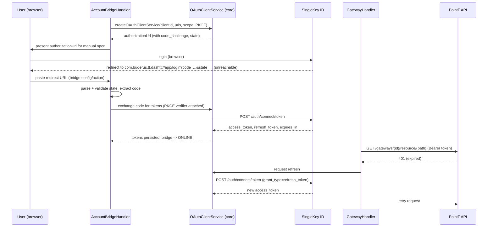

# ADR-002: OAuth2 PKCE Authorization Flow via Manual Redirect Paste

## Status

> Accepted

## Context

SingleKey ID (`singlekey-id.com`) is Bosch's group-wide OIDC identity provider. Login uses the Authorization Code Flow with PKCE (S256), against a fixed public `client_id` that belongs to Bosch's own DashApp. The registered redirect URI for that client is a non-HTTP custom scheme, `com.buderus.tt.dashtt://app/login`, which openHAB cannot register a competing handler for and cannot intercept with a local HTTP servlet.

This is different from bindings like Spotify or Netatmo, where the binding's own `redirect_uri` points back to an openHAB HTTP servlet and the whole exchange is automatic. Here, after login, the browser is redirected to an address that does not resolve to anything — the authorization `code` and `state` only exist in the browser's address bar.

The reference Home Assistant integration (`buderus_ha`) solves this by asking the user to copy that unreachable URL out of their browser and paste it back into the integration UI, per `buderus-reverse.md` section 2 (steps 2–4). This was accepted as the MVP approach during `$Concept` review (see `docs/CONCEPT.md`, open question 1) rather than building a friendlier relay page up front.

We also decided (same review, open question 2) to request a reduced OAuth scope rather than the full DashApp scope list:

```text
openid offline_access pointt.gateway.list pointt.gateway.resource.dashapp
```

instead of the full DashApp set (`email profile pointt.gateway.claiming pointt.gateway.removal pointt.gateway.users pointt.castt.flow.token-exchange bacon hcc.tariff.read`), since claiming/removal/user-management/tariff/Castt-flow features are explicit non-goals.

**Update (tested during `$Dev` implementation):** the reduced scope was tried against a real SingleKey ID login and rejected immediately with a "Misconfigured Application" error page from `singlekey-id.com` - before any login form was shown. This points to an app/scope registration check at the identity provider (the public DashApp `client_id` is not authorized for an arbitrary scope subset), not a runtime authorization error. This confirms the risk flagged in the original Consequences section below. The binding now requests the full DashApp scope list; the unused scopes (claiming, removal, users, tariff, Castt-flow) are requested but never exercised by any binding feature.

## Decision

1. **Bridge-owned OAuth client.** The `account` Bridge (`AccountBridgeHandler`) owns one `OAuthClientService` instance, created via openHAB core's `OAuthFactory` (`org.openhab.core.auth.client.oauth2`), configured with:
   - `authorizationUrl` = `https://singlekey-id.com/auth/connect/authorize`
   - `tokenUrl` = `https://singlekey-id.com/auth/connect/token`
   - `clientId` = `762162C0-FA2D-4540-AE66-6489F189FADC` (Bosch DashApp's public client ID — not a secret, per `buderus-reverse.md` section 8)
   - `scope` = the reduced scope list above
   - PKCE enabled (core generates and stores the code verifier/challenge for the session)

   Using core's OAuth2 client means token persistence, expiry tracking, and refresh-token rotation are handled by the framework instead of hand-rolled binding code — the same mechanism other cloud bindings already rely on.

1. **Manual redirect capture.** `AccountBridgeHandler` auto-populates a read-only `authUrl` configuration parameter on the bridge during `initialize()` with the authorization URL - visible right in the Thing configuration form of any UI, no log-digging required. (An earlier iteration surfaced it via a Thing property and the status description instead; moved to a config parameter for a clearer, single place to look.) It accepts the pasted redirect URL through the bridge's `pasteAuthorizationRedirectUrl` configuration parameter. On receipt, the handler parses `code` and `state` from the pasted URL, validates `state` against the value used to build the authorization URL, and calls the OAuth client service's authorization-code exchange (PKCE verifier supplied automatically since it originated from the same client service instance). The `authUrl` parameter is cleared once login succeeds.

1. **Token refresh and failure handling**, mirroring `buderus-reverse.md` section 2 steps 6–8:
   - Every `PointTApiClient` request attaches the current access token; the OAuth client service refreshes proactively before expiry.
   - On HTTP 401/403 from the PointT API, retry once after forcing a refresh.
   - If the token endpoint itself rejects the refresh token (400/401/403), set the bridge to `OFFLINE` / `CONFIGURATION_ERROR` and require the user to repeat the manual login — no silent retry loop.

## Consequences

### Positive

- No hand-rolled PKCE crypto or token-storage code — reuses openHAB core's existing, tested OAuth2 client SDK.
- Behavior matches a known-working reference implementation, reducing the risk of subtle PKCE/state-handling bugs.
- Reduced scope limits what happens if a token is ever leaked or mishandled.

### Negative

- Manual copy/paste step is real UX friction for non-developer users; flagged and accepted as an MVP trade-off in `docs/CONCEPT.md`.
- ~~Reduced scope list is unverified...~~ **Confirmed rejected** — see the Update note above. The binding now requests the full DashApp scope list instead, which means it holds permissions (gateway claiming/removal/user management, tariff data, Castt-flow token exchange) it never uses. This is an accepted trade-off of piggybacking on a public client we do not control, not a design choice.
- If SingleKey ID ever revokes or rotates the public DashApp `client_id`, the binding breaks with no self-service fix — this is inherent to using an unofficial, reverse-engineered public client and cannot be mitigated by the binding itself.

## Implementation Note (added during `$Dev`)

Decision point 1 above assumed openHAB core's `OAuthClientService` could be configured for PKCE. This could not be verified offline against this project's exact core version while implementing `AccountBridgeHandler`. To avoid silently shipping a possibly-wrong PKCE wiring, the implementation instead uses a small dedicated `SingleKeyIdAuthClient` (in `internal/api/`) that performs the code verifier/challenge generation and the token exchange/refresh calls directly via `HttpClient` + `Gson`, following the exact flow in `buderus-reverse.md` section 2. Token persistence for surviving openHAB restarts uses `Thing` properties on the account bridge rather than core's OAuth token store - this is a known limitation (refresh token stored in plain text) flagged for `$QA` review before release. The rest of the decision (reduced scope, manual redirect paste, refresh-on-401 with fallback to re-login) is implemented as designed.

## Diagram


