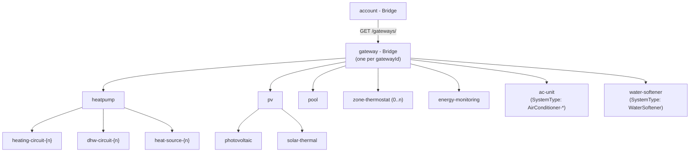

# ADR-005: Split the Monolithic `gateway` Thing into a `gateway` Bridge with Type-Specific Child Things

## Status

> Accepted. The `ventilation-zone` open question is resolved in ADR-006, which also defines the
> concrete discovery algorithm, package structure, and handler design for this split.

## Context

The current implementation (see ADR-004 and `src/main/resources/OH-INF/thing/thing-types.xml`) models exactly one `gateway` thing-type per physical device, with a fixed set of channel groups: `system`, `heating-circuit` (hardcoded to `hc1`), `dhw` (hardcoded to `dhw1`), `heat-source`, `notifications`. This matches the MVP scope from `docs/CONCEPT.md`.

A reverse-engineering pass over the official MyBuderus Android app's decompiled Retrofit interfaces (`myapp-api-analysis.md`, compared against `buderus_ha`'s `buderus-reverse.md`) showed the PointT API's actual surface is far larger and more heterogeneous than the MVP scope assumed:

- Multiple heating/DHW/solar circuits can exist on one gateway (`hc1`, `hc2`, ...; `dhw1`, `dhw2`, ...; `sc1`, ...), and the app's `SystemType.isCascade` flag confirms multi-heat-source cascade installations exist.
- Whole subsystems most installations do not have at all: pool, photovoltaic, room air-conditioning (RAC), ventilation (HRV).
- A structurally separate multi-zone RF-thermostat subsystem (`zones/`, `devices/device{n}`) with no relation to the `hc{n}` resource tree.
- Historical energy-monitoring data (`recordings/*`, `EMONPointtService`) as a distinct, higher-volume, lower-frequency data domain.
- A device-classification enum in the app (`SystemType`: `Boiler-*`, `HeatPump-*`, `HeatPump-With-Ventilation-*`, `AirConditioner-*`, `WaterSoftener`, `Icom-*`, `ConnectKey`, `K30`/`K40`, `RRC`, ...) showing that one Bosch/Buderus account can have several independently paired gateways of different hardware classes, each with its own `gatewayId` from `GET /gateways/`.

The current one-thing-fits-all `gateway` model cannot represent any of this: it has no notion of multiple circuits, it would show permanently-`UNDEF` channels for subsystems a given installation does not have, and it has no place at all for the multi-zone RF-thermostat subsystem or for a second gateway of a different hardware class under the same account.

## Decision

`gateway` becomes a **bridge-type** instead of a plain thing-type. It keeps only channels that genuinely belong to the physical box itself, regardless of hardware class: serial number, firmware/hardware version, brand, country, outdoor temperature, season optimizer, silent mode, away mode, and active notifications (plus, optionally, a single read-only "current holiday mode" summary channel — see below).

Everything functional is split into separate, sibling thing-types, all children of the same `gateway` bridge (not nested inside one another):

- **`heatpump`** — replaces the current fixed `heating-circuit`/`dhw`/`heat-source` channel groups. Hosts dynamically-repeated channel groups `heating-circuit-{n}`, `dhw-circuit-{n}`, `heat-source-{n}` so multiple circuits and cascade heat sources are representable.
- **`pv`** — photovoltaic channels plus the solar-thermal (`solar-circuit`) channels, grouped together per team decision even though they are technically distinct systems (solar-thermal heats water, PV generates electricity). Kept as two distinctly named channel groups (`photovoltaic`, `solar-thermal`) inside the same thing so the two are not conflated in the UI.
- **`pool`** — new.
- **`zone-thermostat`** (0..n) — new; represents the multi-zone RF-thermostat subsystem.
- **`energy-monitoring`** — new; historical `recordings/*` data, kept separate from `heatpump` because of its different polling frequency and data volume.
- **`ac-unit`** — new; for gateways whose `SystemType` is `AirConditioner-*`. In practice this is usually the only child discovered under that particular `gateway` bridge, since RAC units are typically paired as their own gateway rather than as a subsystem of a heat-pump gateway.
- **`water-softener`** — new; for gateways whose `SystemType` is `WaterSoftener`, same reasoning as `ac-unit`.

Discovery under each `gateway` bridge proposes only the child things the gateway actually supports, determined via:

- List endpoints where the API provides them: `GET .../resource/heatingCircuits`, `.../dhwCircuits`, `.../solarCircuits`, `.../zones/list`, `.../pv/list`.
- Existence probing where no list endpoint exists: `pool` has none in the app's Retrofit interfaces; a probe read (treating 404/error as absence) is the only available signal.
- The `SystemType`/device-classification family for `ac-unit` and `water-softener`.

Deliberately **not** modeled as channels at all: holiday-mode create/update/delete, gateway pairing/unpairing (`DELETE /gateways/{id}`), factory reset (`PUT gateway/factoryReset`), and firmware-update trigger (`PUT gateway/update/triggerRequest`). These are destructive or account-structure-changing operations; exposing them as regular read/write channels risks an accidental Item command triggering one. This is consistent with the existing MVP non-goal in `docs/CONCEPT.md` ("no gateway claiming/removal"). At most, a single read-only summary channel for the currently active holiday mode may live on `gateway`.

**Left open for `$Architect`:** whether `ventilation-zone` attaches as a child of a `HeatPump-With-Ventilation-*`-classified `gateway`, or is discovered as its own standalone `gateway` bridge instance for older/standalone HRV hardware. The `SystemType` naming suggests both configurations exist in the field; this needs verification against a live gateway (or further static analysis of the app) before the discovery service is implemented.

## Consequences

### Positive

- The channel set shown to a user matches what their specific hardware actually has — no more permanently-`UNDEF` channels for subsystems they don't own.
- Multiple heating/DHW circuits and cascade heat sources become representable, which the current hardcoded `hc1`/`dhw1` model cannot do.
- The multi-zone RF-thermostat subsystem becomes representable at all — it is entirely unsupported today.
- Destructive/account-structure-changing operations stay structurally outside the channel/Item model, reducing the risk of an accidental Item command causing a factory reset or gateway unpairing.
- A single account with heterogeneous hardware (e.g. a heat pump plus a separately paired RAC unit) is now representable, instead of being forced into one gateway's fixed channel set.

### Negative

- Significant rework of the existing implementation: `GatewayDiscoveryService` and `AccountBridgeHandler` (ADR-004) and the current `gateway` thing-type/handler must be split across eight thing-types and their handlers. Existing users upgrading from the current single-`gateway` model face a breaking Thing migration — their existing `gateway` Things and linked Items will need to be recreated.
- Discovery gets materially more expensive: instead of one `GET /gateways/` call, every `gateway` bridge going `ONLINE` now triggers several additional list/probe calls to decide which child things to propose.
- `pool` discovery relies on probing a resource path and treating 404/error as absence — a weaker signal than the list-based checks used for the other subsystems, and unverified against a live gateway.
- The exact `SystemType` to child-thing mapping — in particular for `ventilation-zone`, and for the older bus generations (`Icom-*`, `ConnectKey`, `K30`/`K40`, `RRC`) — is not yet fully verified and needs confirmation before the discovery service is finalized.

## Diagram

---

_Source material: `myapp-api-analysis.md` (MyBuderus Android app reverse-engineering) and `buderus-reverse.md` (buderus_ha Home Assistant integration reverse-engineering), both reviewed with `$Concept` prior to this ADR._
