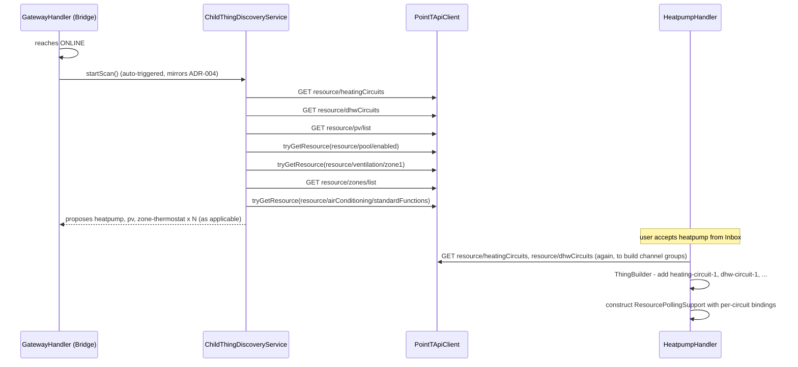

# ADR-006: Child-Thing Discovery Algorithm and Handler Design for the Gateway Bridge Split

## Status

> Proposed

## Context

ADR-005 decided to convert `gateway` into a bridge-type and split its current fixed channel set
into eight sibling thing-types (`heatpump`, `pv`, `pool`, `zone-thermostat`, `energy-monitoring`,
`ac-unit`, `water-softener`, plus `gateway` itself keeping only box-level system channels), but
left two things unresolved: how `ventilation-zone` is discovered, and how discovery/handlers are
actually implemented on top of the existing code (`GatewayHandler`, `GatewayDiscoveryService`,
`BoschThermotechnologyHandlerFactory`, `PointTApiClient`). This ADR resolves both.

## Decision

### `ventilation-zone` placement — resolved

No special case is needed. `GET .../resource/ventilation/zone1` is probed exactly like `pool`
(see below); if it resolves, a `ventilation-zone` thing is proposed as a child of whichever
`gateway` bridge reported it — regardless of whether that same gateway also has a `heatpump`
child (the `HeatPump-With-Ventilation-*` `SystemType` case) or is a dedicated standalone HRV unit
with its own `gatewayId` and no other children at all (the `Ventilation` `SystemType` case). Both
hardware configurations are already covered by the same "propose whichever children this gateway
reports" algorithm used for every other child thing-type - there is nothing `ventilation-zone`
specific to design.

### Discovery algorithm

`GatewayDiscoveryService` (`account` → `gateway`) is unchanged. A new `ChildThingDiscoveryService`
is registered per `gateway` bridge, following the exact same pattern
`BoschThermotechnologyHandlerFactory` already uses for `GatewayDiscoveryService` per `account`
bridge (ADR-004): triggered automatically once the `gateway` bridge reaches `ONLINE`, plus
available for a manual Inbox scan.

`ChildThingDiscoveryService.startScan()` performs, per gateway:

| Child thing-type | Discovery signal | Cardinality |
|---|---|---|
| `heatpump` | `GET resource/heatingCircuits` or `GET resource/dhwCircuits` returns at least one entry | 0..1 (one `heatpump` thing hosts all discovered circuits as dynamic channel groups, see below) |
| `pv` | `GET resource/pv/list` returns at least one entry, or `GET resource/solarCircuits` returns at least one entry | 0..1 |
| `pool` | probe `GET resource/pool/enabled`; 404/error = absent | 0..1 |
| `ventilation-zone` | probe `GET resource/ventilation/zone1`; 404/error = absent | 0..1 (all zones of one gateway, if the API ever supports more than `zone1`, become dynamic channel groups the same way `heatpump` handles multiple circuits) |
| `zone-thermostat` | `GET resource/zones/list` returns N entries → one thing per entry | 0..n |
| `energy-monitoring` | proposed whenever `heatpump` is proposed - no separate probe, since energy recordings require a heat source to exist | 0..1 |
| `ac-unit` | probe `GET resource/airConditioning/standardFunctions`; 404/error = absent | 0..1 |
| `water-softener` | probe a water-softener resource path - **TODO ($Dev): exact path not found in `myapp-api-analysis.md`; the app only confirms the device-type string `watersoftener` (`PointtConstants.POINT_DEVICE_TYPE_WATER_SOFTENER`), not its resource-tree prefix. Must be captured from a live gateway or further app analysis before this probe can be implemented.** | 0..1 |

All probes are plain `GET` calls through the already-generic `PointTApiClient.getResource(...)`;
no new API surface is needed there beyond treating a 404 response as "resource absent" rather
than throwing `PointTApiException` (currently every non-2xx status throws - `getResource` needs a
new `tryGetResource(...)` variant, or `PointTApiException` needs an HTTP-status field so
`ChildThingDiscoveryService` can distinguish "404, thing does not exist" from "500, retry later
and don't decide either way").

### Package and class structure

```text
org.openhab.binding.boschthermotechnology.internal
  .config
    GatewayConfiguration          (existing, unchanged: gatewayId, refreshInterval)
    SubThingConfiguration         (new: gatewayId, refreshInterval - shared by heatpump, pv,
                                   pool, ventilation-zone, energy-monitoring, ac-unit,
                                   water-softener)
    ZoneThermostatConfiguration   (new: gatewayId, zoneId, refreshInterval)
  .discovery
    GatewayDiscoveryService       (existing, unchanged: account -> gateway)
    ChildThingDiscoveryService    (new: gateway -> the eight child thing-types above)
  .handler
    AccountBridgeHandler          (existing, unchanged)
    GatewayHandler                (changed: BaseThingHandler -> BaseBridgeHandler; keeps only
                                   its own slimmed system channels; registers
                                   ChildThingDiscoveryService the same way AccountBridgeHandler
                                   registers GatewayDiscoveryService)
    HeatpumpHandler                (new; builds dynamic channel groups, see below)
    PvHandler                     (new)
    PoolHandler                   (new)
    VentilationZoneHandler        (new)
    ZoneThermostatHandler         (new)
    EnergyMonitoringHandler       (new)
    AcUnitHandler                 (new)
    WaterSoftenerHandler          (new)
    support
      ResourcePollingSupport      (new; see below)
      ChannelResourceBinding      (new; small record: channelId, resourcePath, State reader,
                                   optional Command writer)
  .dto
    GatewayDto                    (existing; deviceType field already present but unverified -
                                   remains unused by discovery per the decision above, which
                                   probes resources directly instead of trusting deviceType)
    ResourceDto                   (existing)
    ResourceListEntryDto          (new: minimal {id} shape for heatingCircuits/dhwCircuits/
                                   solarCircuits/zones/list responses)
  .api
    PointTApiClient                (extended: tryGetResource(...) returning Optional<ResourceDto>
                                    for discovery probes, listResourceIds(...) for the
                                    heatingCircuits/dhwCircuits/solarCircuits/zones/list family)
```

`GatewayHandler` becoming a bridge-type handler cannot extend the same `BaseThingHandler`-derived
class the eight child handlers use (Java has no multiple inheritance, and openHAB's
`BaseBridgeHandler`/`BaseThingHandler` are distinct classes). Rather than duplicating the polling
boilerplate a second time for the bridge, the shared logic is factored into a plain (non-handler)
helper, **`ResourcePollingSupport`**, held as a field and driven by both `GatewayHandler` and every
child handler via composition instead of inheritance:

- `ResourcePollingSupport` owns: the `List<ChannelResourceBinding>` for its handler, the polling
  `ScheduledFuture`, `poll()` (iterates the bindings, calls `PointTApiClient.getResource`, applies
  each binding's reader, calls back into the handler's `updateState`/`updateStatus`), and
  `handleCommand()` (looks up the binding for a channel, applies its writer, calls
  `PointTApiClient.putResource`).
- Every handler constructs one `ResourcePollingSupport` in `initialize()` with its own bindings
  list and delegates `handleCommand()`/`dispose()` to it. This is the same logic
  `GatewayHandler.poll()`/`handleCommand()` already implements today (`updateChannelFromResource`,
  `toTemperatureState`, `toOnOffState`, etc.) - ADR-006 does not change that logic, only moves it
  out of `GatewayHandler` so it is written once and reused by all nine handlers instead of copied
  into each of the eight new ones.

### `heatpump`'s dynamic channel groups

`heatpump` is the one thing-type whose channel groups are not fixed in `thing-types.xml`. Because
a gateway can report an arbitrary number of heating/DHW/heat-source circuits (`hc1`, `hc2`, ... /
`dhw1`, `dhw2`, ... / cascade heat sources), `thing-types.xml` defines the channel-group-_types_
(`heating-circuit-group`, `dhw-circuit-group`, `heat-source-group`) but not fixed group
_instances_. `HeatpumpHandler.initialize()`:

1. Reads `resource/heatingCircuits`, `resource/dhwCircuits` (and, for cascade systems, however
   multiple heat sources enumerate - `hs{n}` needs the same live-gateway confirmation already
   flagged as a TODO in `BoschThermotechnologyBindingConstants`) to get the list of circuit ids.
1. Builds one channel group per discovered id (`heating-circuit-1` typed as
   `heating-circuit-group`, `heating-circuit-2`, ...) via `ThingBuilder`/`editThing()`, then
   updates the Thing.
1. `ResourcePollingSupport`'s bindings list is built from the same discovered ids, substituting
   the circuit id into each resource path template (e.g.
   `/heatingCircuits/{circuitId}/manualRoomSetpoint`).

This mirrors the existing `hc1`/`dhw1` hardcoding in `BoschThermotechnologyBindingConstants.ResourcePaths`
today, generalized to N ids instead of a fixed one.

### `BoschThermotechnologyHandlerFactory` changes

- `SUPPORTED_THING_TYPES_UIDS` gains the eight new `ThingTypeUID`s.
- `createHandler()` gains one branch per new thing-type, each constructing its handler with the
  `PointTApiClient` obtained the same way `GatewayHandler` does today (via the parent bridge
  handler - `AccountBridgeHandler` for `gateway`, `GatewayHandler` for the eight children).
- `registerDiscoveryService`/`removeHandler` gain the `ChildThingDiscoveryService` registration
  path, mirroring the existing `GatewayDiscoveryService` one but keyed per `gateway` bridge UID
  instead of per `account` bridge UID.

## Consequences

### Positive

- The polling/write-command logic that today only exists once, in `GatewayHandler`, stays written
  once (`ResourcePollingSupport`) instead of being copied into eight new handler classes - avoids
  a maintenance trap where a bug fix in one handler's `poll()` gets forgotten in the other seven.
- `ventilation-zone`'s placement is no longer an open question; the same uniform discovery
  algorithm covers both hardware configurations `SystemType` revealed.
- `heatpump`'s dynamic channel groups make multiple heating/DHW circuits and cascade heat sources
  representable without a fixed, arbitrary circuit-count limit baked into `thing-types.xml`.

### Negative

- `water-softener` discovery cannot be implemented yet - its resource path prefix is unconfirmed
  by either reverse-engineering source this project has (`buderus-reverse.md`,
  `myapp-api-analysis.md`). `$Dev` must either capture it from a live gateway or this thing-type
  ships without working auto-discovery in the first release (manual Thing creation only).
- `PointTApiClient` needs a new "does this resource exist" contract (`tryGetResource` /
  HTTP-status-aware exception) that does not exist today - every current call site treats any
  non-2xx response as a hard failure. This is a small but real API contract change to a class
  `GatewayHandler` already depends on.
- Dynamic channel groups (`heatpump`) are more complex to implement and test than the fully static
  channel groups every other thing-type uses, and are a newer pattern in this codebase than the
  static `thing-types.xml` approach used so far.
- `ResourcePollingSupport` via composition (rather than a shared abstract base class) means each
  handler's `initialize()` has slightly more boilerplate (constructing the helper and wiring
  `dispose()`/`handleCommand()` to it) than a clean single-inheritance base class would - accepted
  because Java's single inheritance rules out a base class shared between the bridge (`gateway`)
  and the plain-Thing handlers.

## Diagram



---

_Builds on ADR-005. Source material: `myapp-api-analysis.md`, `buderus-reverse.md`, and the
current implementation (`GatewayHandler`, `GatewayDiscoveryService`,
`BoschThermotechnologyHandlerFactory`, `PointTApiClient`, `GatewayDto`)._
