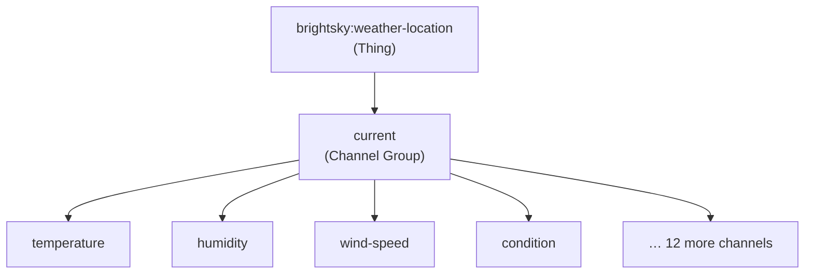

# ADR-001: Single Thing Type with Channel Group; No Forecast Thing in MVP

## Status

`Accepted`

## Context

BrightSky exposes three relevant endpoints for an openHAB binding:

- `/current_weather` — latest observation, polled every ~10–30 min
- `/forecast` — hourly MOSMIX forecast up to 10 days (~240 data points)
- `/alerts` — active DWD weather warnings

The question was how to model these in the openHAB Thing/Channel hierarchy. Options considered:

1. One Thing, multiple channel groups (`current`, `forecast-hourly`, `alerts`)
1. Multiple Thing types (`weather-location` for current, `forecast-location` for forecast)
1. One Thing, current only (MVP), extend later

## Decision

We will use **one Thing type** (`brightsky:weather-location`) with **one channel group** (`current`) for the MVP. Forecast and alerts are deferred to v2 as separate channel groups on the same Thing type.

Reasons:

- The `/forecast` endpoint returned empty results during architecture validation — it requires further investigation before exposing it to users.
- Repeating channel groups (one entry per forecast hour) have limited UI support in openHAB 4.x MainUI and would produce 240 channels, most of which users would never use.
- Current weather alone satisfies the primary automation use cases (rain detection, wind protection, temperature-based heating).
- One Thing type keeps the `thing-types.xml` and handler simple for the initial contribution review.

## Consequences

### Positive

- Simple handler with a single polling loop.
- Minimal `thing-types.xml` — easy to review and extend.
- No risk of exposing broken forecast data before it is validated.
- Users get a working binding fast.

### Negative

- Forecast-dependent automations (e.g. "if rain forecast in next 6 h, close skylight") require a v2 release.
- Alert notifications are not available until v2.
- If the Thing type needs structural changes for forecast (e.g. new config params), a migration path will be needed.

## Diagram

