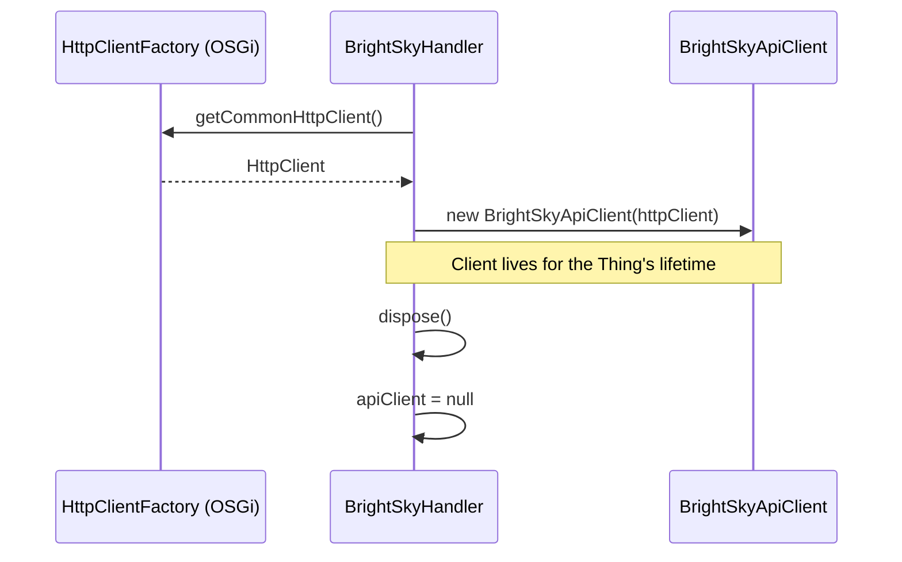

# ADR-002: BrightSkyApiClient as a Plain Class Owned by the Handler

## Status

`Accepted`

## Context

openHAB bindings that make HTTP calls have two structural options for the API client:

1. OSGi `@Component` service — registered in the service registry, injected via `@Reference`
1. Plain class instantiated by the handler — created in `initialize()`, held as a field, discarded in `dispose()`

The BrightSky API requires no authentication and has no shared connection pool concerns across multiple Things. The binding has exactly one Thing type and one handler class.

Additionally, openHAB guidelines require that `HttpClient` instances be obtained from the `HttpClientFactory` OSGi service (injected into the handler's `@Component`), not created with `new HttpClient()`.

## Decision

`BrightSkyApiClient` will be a **plain class, not an OSGi component**. The handler instantiates it in `initialize()` using the `HttpClient` obtained from the injected `HttpClientFactory`. The handler holds it as a `@Nullable` field and sets it to `null` in `dispose()`.

```java
// In BrightSkyHandler.initialize():
this.apiClient = new BrightSkyApiClient(httpClientFactory.getCommonHttpClient());
```

Reasons:

- The API client has no state that needs to survive across Thing lifecycle events.
- Making it an OSGi component would create an awkward lifecycle mismatch (component lives longer than the Thing).
- Shared `HttpClient` from `HttpClientFactory` already handles connection pooling — no need for a component-scoped client.
- Simpler to test: the plain class can be constructed with a mock `HttpClient` in unit tests.

## Consequences

### Positive

- Handler fully owns the client lifecycle — no orphaned connections.
- No OSGi wiring complexity; easier for community contributors to understand.
- Unit-testable without OSGi container.

### Negative

- `BrightSkyApiClient` cannot be injected into other components if future use cases require it (e.g. a discovery service). If that arises, promote to `@Component` at that point.
- The handler class must hold both the `HttpClientFactory` reference and the `apiClient` field, slightly increasing its size.

## Diagram


