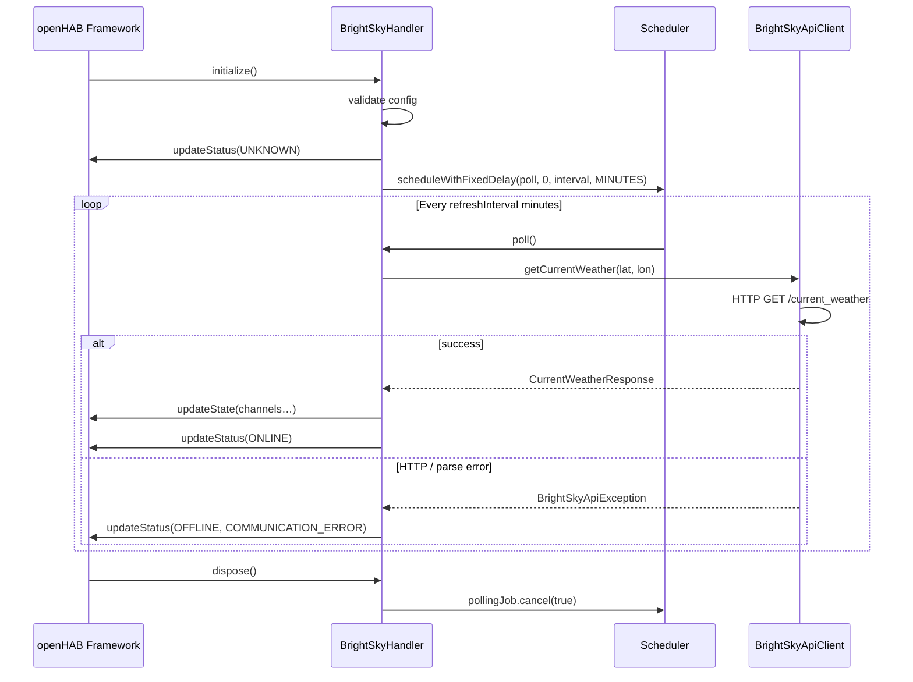

# BrightSky Binding — Architecture

**Role:** $Architect (System Designer)
**Date:** 2026-05-30
**Status:** Draft — pending human review before implementation begins

---

## Package Tree

```text
org.openhab.binding.brightsky
  ├── BrightSkyBindingConstants          ← Thing type UIDs, channel IDs, config keys
  │
  └── internal
        ├── handler
        │     └── BrightSkyHandler       ← extends BaseThingHandler; owns polling lifecycle
        │
        ├── api
        │     ├── BrightSkyApiClient     ← HTTP calls via HttpClientFactory; returns DTOs
        │     └── BrightSkyApiException  ← checked exception wrapping HTTP/parse errors
        │
        ├── config
        │     └── BrightSkyConfiguration ← POJO; bound via getConfigAs()
        │
        └── dto
              ├── CurrentWeatherResponse ← Gson DTO — root of /current_weather response
              ├── WeatherRecord          ← single observation (shared by current + weather)
              ├── Source                 ← station metadata inside every response
              ├── AlertsResponse         ← root of /alerts response
              └── Alert                  ← single DWD warning entry
```

**Note:** DTOs live outside `internal` would require OSGi export; keeping them in `internal` is correct — they are never consumed by other bundles.

---

## Class Responsibilities

### `BrightSkyBindingConstants`

- Declares `THING_TYPE_WEATHER_LOCATION` (`UID: brightsky:weather-location`)
- Declares all channel IDs as `String` constants (e.g. `CHANNEL_TEMPERATURE = "temperature"`)
- Declares channel group IDs: `GROUP_CURRENT = "current"`
- Declares config key constants: `CONFIG_LATITUDE`, `CONFIG_LONGITUDE`, `CONFIG_STATION_ID`, `CONFIG_REFRESH_INTERVAL`

### `BrightSkyConfiguration`

- Plain POJO with public fields matching `camelCase` config parameter names
- Fields: `double latitude`, `double longitude`, `@Nullable String stationId`, `int refreshInterval` (default 30)
- No business logic; no annotations except `@Nullable` where needed

### `BrightSkyApiClient`

- `@NonNullByDefault` component, **not** an OSGi `@Component` — instantiated by the handler
- Constructor receives `HttpClient` (obtained by handler from `HttpClientFactory`)
- Methods:
  - `CurrentWeatherResponse getCurrentWeather(double lat, double lon) throws BrightSkyApiException`
  - `CurrentWeatherResponse getCurrentWeatherByStation(String stationId) throws BrightSkyApiException`
- Uses Gson for deserialization (`new Gson()` — no custom adapters needed for MVP)
- Logs response body at `TRACE` level for debugging API changes
- Throws `BrightSkyApiException` for non-2xx responses and `JsonParseException`

### `BrightSkyHandler`

- Extends `BaseThingHandler`
- Owns `@Nullable ScheduledFuture<?> pollingJob`
- `initialize()`:
  1. Validates config (lat/lon range, refresh interval > 0)
  1. Sets thing `UNKNOWN` status
  1. Schedules `pollingJob` with `scheduleWithFixedDelay`
- `poll()` (private, called by scheduler):
  1. Calls `BrightSkyApiClient.getCurrentWeather(…)`
  1. Maps `WeatherRecord` fields → `updateState(channelId, state)`
  1. On success: `updateStatus(ThingStatus.ONLINE)`
  1. On `BrightSkyApiException`: `updateStatus(OFFLINE, COMMUNICATION_ERROR, message)`
- `dispose()`: cancels `pollingJob`
- `handleCommand()`: supports `RefreshType.REFRESH` — triggers immediate poll; ignores all other commands (read-only binding)
- Channel ID construction: `GROUP_CURRENT + "#" + CHANNEL_TEMPERATURE` etc.

---

## State Mapping

| DTO field | openHAB Item Type | State class | Unit |
|---|---|---|---|
| `temperature` | `Number:Temperature` | `QuantityType<Temperature>` | `SIUnits.CELSIUS` |
| `dew_point` | `Number:Temperature` | `QuantityType<Temperature>` | `SIUnits.CELSIUS` |
| `relative_humidity` | `Number:Dimensionless` | `QuantityType<Dimensionless>` | `Units.PERCENT` |
| `pressure_msl` | `Number:Pressure` | `QuantityType<Pressure>` | `SIUnits.PASCAL` (×100 for hPa) |
| `wind_speed_10` | `Number:Speed` | `QuantityType<Speed>` | `Units.KILOMETRE_PER_HOUR` |
| `wind_direction_10` | `Number:Angle` | `QuantityType<Angle>` | `Units.DEGREE_ANGLE` |
| `wind_gust_speed_10` | `Number:Speed` | `QuantityType<Speed>` | `Units.KILOMETRE_PER_HOUR` |
| `wind_gust_direction_10` | `Number:Angle` | `QuantityType<Angle>` | `Units.DEGREE_ANGLE` |
| `precipitation_10` | `Number:Length` | `QuantityType<Length>` | `SIUnits.METRE` (×0.001 for mm) |
| `cloud_cover` | `Number:Dimensionless` | `QuantityType<Dimensionless>` | `Units.PERCENT` |
| `visibility` | `Number:Length` | `QuantityType<Length>` | `SIUnits.METRE` |
| `sunshine_30` | `Number:Time` | `QuantityType<Time>` | `Units.MINUTE` |
| `solar_30` | `Number:Intensity` | `QuantityType<Intensity>` | `Units.KILOWATT_HOUR` (per m²) |
| `condition` | `String` | `StringType` | — |
| `icon` | `String` | `StringType` | — |
| `timestamp` | `DateTime` | `DateTimeType` | — |

> hPa → Pa: multiply by 100. mm → m: multiply by 0.001. openHAB UoM handles display conversion.

**Null handling:** BrightSky may return `null` for some fields (e.g. `precipitation_probability`). Any `null` DTO field must map to `UnDefType.UNDEF` — never skip the `updateState` call, or stale values persist.

---

## Lifecycle Sequence



---

## Resource Files

```text
src/main/resources/OH-INF/
  addon/
    addon.xml                  ← binding id="brightsky", name, description
  thing/
    thing-types.xml            ← weather-location Thing; channel group "current"; all channels
  i18n/
    brightsky.properties       ← English labels for thing, channels, config params
```

---

## Decisions Made (→ ADRs)

| # | Decision | File |
|---|---|---|
| 001 | Single Thing type with channel group; no separate forecast Thing in MVP | `docs/ADR/ADR-001-thing-model.md` |
| 002 | `BrightSkyApiClient` is a plain class (not OSGi component); handler owns its lifecycle | `docs/ADR/ADR-002-http-client-design.md` |
| 003 | Gson used for JSON deserialization (already provided by openHAB core) | `docs/ADR/ADR-003-json-deserialization.md` |

---

## Dependencies

All required libraries are **already provided by openHAB core** — no new `pom.xml` entries needed for MVP:

| Library | Provided by | Used for |
|---|---|---|
| `org.eclipse.jetty.client` | openHAB core | HTTP GET requests |
| `com.google.gson` | openHAB core | JSON deserialization |
| `org.eclipse.jdt.annotation` | openHAB core | `@NonNullByDefault`, `@Nullable` |
| `org.openhab.core.*` | openHAB core | `BaseThingHandler`, UoM, etc. |

> No dependency proposal required. $Architect confirms: pom.xml changes will only be needed if forecast parsing requires a date-time library beyond `java.time` (unlikely — Java 21 `java.time` handles ISO-8601 directly).

---

## Open Questions Resolved

| Question (from CONCEPT.md) | Resolution |
|---|---|
| Repeating groups vs. separate Things for forecast | Deferred to v2; MVP uses one static channel group `current` |
| Auto-discover nearest station and log name | `initialize()` logs resolved `station_name` from the first successful response at `INFO` level |
| `condition` channel type | Plain `String` channel with `StateDescription` options populated from known values; no custom type |
| Alerts i18n | Deferred to v2 |
| Canonical units in channel definitions | Declare canonical units in `thing-types.xml`; UoM handles display conversion per item config |
