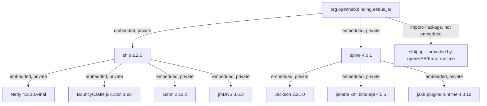

# ADR-001: Embed jEEBus.SHIP/SPINE and Their Transitive Dependencies Instead of Importing Them as OSGi Bundles

## Status

> Accepted

## Context

`org.openhab.binding.eebus` depends on `org.openmuc.jeebus:ship:2.2.0` and
`org.openmuc.jeebus:spine:4.0.1` (see `pom.xml`). Both artifacts are published
as proper OSGi bundles (bnd-built, with `Bundle-SymbolicName` and
`Export-Package`), so the default openHAB add-on build treats them as
`Import-Package` dependencies rather than embedding them in the binding jar.

That default behavior surfaced two cascading `karaf-feature-verification`
failures:

1. `org.openhab.binding.eebus` itself failed to resolve because no bundle in
   `src/main/feature/feature.xml` provided `org.openmuc.jeebus.ship.api` /
   the `org.openmuc.jeebus.spine.*` packages.
1. After adding `ship`/`spine` as explicit `<bundle>` entries to
   `feature.xml`, resolution failed one level deeper: `ship-2.2.0` itself
   requires `io.netty.bootstrap` (and, transitively, BouncyCastle, Gson,
   jmDNS, Jackson, and JAXB tooling packages for `spine`) as further OSGi
   bundles, none of which are provided by openHAB core's feature repository.

Declaring every one of these transitive libraries as a separate `<bundle>`
entry in `feature.xml` was considered (see Option A below) but rejected.

## Decision

We embed `ship`, `spine`, and their full transitive runtime dependency graph
directly into the `org.openhab.binding.eebus` bundle. `feature.xml` reverts
to declaring only the binding's own bundle.

`org.slf4j:slf4j-api` is explicitly excluded from embedding and stays on
`Import-Package`, so all logging continues to flow through the single,
shared SLF4J binding provided by the openHAB/Karaf runtime instead of a
private, bundle-local copy.

### Correction (2026-07-31): the actual embedding mechanism

The first version of this ADR assumed embedding was configured via a
`bnd.bnd` file (`Embed-Dependency`/`Embed-Transitive` instructions read by
`bnd-maven-plugin`). That turned out to be wrong and had **no effect** -
the `karaf-feature-verification` failure reappeared identically after that
change, which is what surfaced the mistake.

The `openhab-addons` reactor (`bundles/pom.xml`) does not use bnd's
`Embed-Dependency` for this at all. Embedding is done by the
**`maven-dependency-plugin`**, execution id `embed-dependencies`
(`unpack-dependencies` goal), which unpacks every `runtime`-scope
dependency's `.class` files straight into `target/classes` _before_ `bnd`
runs - `bnd` then simply packages whatever is in `target/classes` as the
bundle's own (private) content; nothing separate needs an `Embed-Dependency`
instruction. Two things control this, both project-level, not `bnd.bnd`:

1. **A marker file disables it entirely.** If `noEmbedDependencies.profile`
   exists in the module root, the reactor's `no-embed-dependencies` Maven
   profile activates and turns the `embed-dependencies` execution off
   (`<phase>none</phase>`) - this file existed (empty) in this module from
   the original binding scaffold and silently disabled all embedding the
   entire time. **Removed** as part of this correction.
1. **Per-dependency exclusion is a `pom.xml` property**, not a `bnd.bnd`
   instruction: `excludeArtifactIds=${dep.noembedding}` in the reactor's
   `embed-dependencies` execution. To keep `slf4j-api` external (as
   originally intended), `org.openhab.binding.eebus/pom.xml` sets
   `<dep.noembedding>slf4j-api</dep.noembedding>`.

A third, related fix: `ship`/`spine` had briefly been declared with
`<scope>provided</scope>` in `pom.xml` (left over from an earlier,
since-abandoned Import-Package-based approach). `provided`-scope
dependencies are excluded from Maven's `runtime` scope entirely, so
`embed-dependencies` (which filters on `includeScope=runtime`) would never
have picked them up regardless of the marker file. Reverted to the default
(`compile`) scope so they participate in the `runtime` classpath the
embedding step scans.

`bnd.bnd` was deleted at this point in the investigation - it described a
mechanism (`Embed-Dependency`) that was never actually in effect. See the
2026-07-31 correction below for why a `bnd.bnd` file was later
reintroduced, for a different, legitimate purpose.

### Correction (2026-07-31): `excludeTransitive=true` - every embedded artifact must be a direct dependency

After the fixes above, `karaf-feature-verification` progressed past
`org.openmuc.jeebus.ship.api`, then failed again on exactly one package
with an unversioned filter (unlike every prior failure, which carried a
version range):

```text
missing requirement [org.openhab.binding.eebus/...] osgi.wiring.package;
filter:="(osgi.wiring.package=com.fasterxml.jackson.module.jakarta.xmlbind)"
```

The first hypothesis was that this one artifact's `<packaging>bundle</packaging>`
(Apache Felix `maven-bundle-plugin`) made it fall through the
`embed-dependencies` execution's `<includeTypes>jar</includeTypes>` filter.
Adding it as an explicit direct dependency with `<type>jar</type>` "fixed"
that specific error - but the exact same failure shape then reappeared for
`io.netty.bootstrap`, an artifact with completely ordinary `<packaging>jar</packaging>`.
That ruled out the packaging theory.

Re-fetching the reactor's `bundles/pom.xml` directly showed the real cause:
the `embed-dependencies` execution sets

```xml
<excludeTransitive>true</excludeTransitive>
```

This means **only dependencies declared directly in this module's own
`pom.xml`** are ever unpacked/embedded - never anything pulled in only
transitively through `ship` or `spine`. This is a reactor-wide setting we
cannot change from this binding's `pom.xml`. It explains all three
successive failures (`ship.api`, then `jackson-module-jakarta-xmlbind`,
then `netty-bootstrap`) as the same root cause surfacing one package at a
time, gated by the karaf-maven-plugin's `<fail>first</fail>` configuration
(it stops at the first unresolved requirement rather than reporting all of
them at once).

**Fix:** declare the entire transitive runtime dependency closure of
`ship`/`spine` as explicit direct dependencies in `pom.xml`, each pinned to
the exact version resolved on this module's `runtime` classpath. Rather
than keep discovering these one Karaf error at a time, the full list was
obtained authoritatively by running, on a machine with a working `mvn`:

```text
mvn dependency:tree -Dscope=runtime
```

against this module, giving the complete, verified tree in one pass. Every
artifact reported there (except `org.lastnpe.eea:eea-all` and
`org.apache.karaf.features:framework`, already excluded via
`excludeGroupIds`, and `org.slf4j:slf4j-api`, deliberately kept off
`Import-Package`) was added as a direct `pom.xml` dependency with
`<type>jar</type>`:

- via `spine`: `jackson-databind:2.21.0`, `jackson-annotations:2.21`,
  `jackson-core:2.21.0`, `jackson-module-jakarta-xmlbind-annotations:2.21.0`,
  `jakarta.xml.bind-api:4.0.5`, `jakarta.activation-api:2.1.0`,
  `jaxb-plugins-runtime:4.0.12`, `jaxb-core:4.0.6`, `txw2:4.0.6`,
  `angus-activation:2.0.3`, `istack-commons-runtime:4.1.2`.
- via `ship`: `gson:2.13.2`, `error_prone_annotations:2.41.0`,
  `jmdns:3.6.3`, `bcpkix-jdk18on:1.83`, `bcutil-jdk18on:1.83`,
  `bcprov-jdk18on:1.83`, `jsr305:3.0.2`, `netty-common:4.2.10.Final`,
  `netty-buffer:4.2.10.Final`, `netty-codec-base:4.2.10.Final`,
  `netty-codec-http:4.2.10.Final`, `netty-codec-compression:4.2.10.Final`,
  `netty-resolver:4.2.10.Final`, `netty-transport:4.2.10.Final`,
  `netty-transport-native-unix-common:4.2.10.Final`,
  `netty-handler:4.2.10.Final`.

None of these are referenced directly by binding code - they exist in
`pom.xml` purely so the reactor's `excludeTransitive=true` embedding step
picks them up. See `docs/LICENSE_CHECK.md` for the license check on the
artifacts newly discovered this way (`error_prone_annotations`,
`angus-activation`, `txw2`, `istack-commons-runtime`, and the additional
Netty submodules not caught by the earlier, manual dependency-graph
walk-through).

This was verified against a real `mvn dependency:tree` run (unlike earlier
fixes in this ADR, which were hypotheses only) - still pending: a full
`mvn clean install` / `karaf-feature-verification` run to confirm the
bundle actually resolves end-to-end.

### Correction (2026-07-31): `bnd.bnd` reintroduced - for manifest control, not embedding

The very next `karaf-feature-verification` run failed again, this time on
`com.aayushatharva.brotli4j` (unversioned filter, same shape as the earlier
`jackson-module-jakarta-xmlbind` failure). The cause here is different from
every prior fix in this ADR: `netty-codec-compression` (embedded
transitively as a mandatory dependency of `netty-codec-http`, which is
needed for the WebSocket handshake) contains encoder/decoder classes for
six _optional_ compression backends - Brotli, Zstd, LZ4, LZMA, JZlib/zlib,
and LZF - each guarded by its own optional Maven dependency in Netty's own
POM. None of these backend libraries are embedded here (this binding never
uses HTTP content-encoding; SHIP is a raw WebSocket/TLS protocol), which is
correct - but because the _whole_ `netty-codec-compression` jar is
embedded, bnd's static bytecode analysis sees all six optional-backend
class references and defaults to generating a **mandatory**
`Import-Package` for each one, one of which (`com.aayushatharva.brotli4j`,
confirmed against Netty's own `4.2` branch source) was the first to
surface. Left alone, this would have produced five more of the same
failure, one at a time, gated by `<fail>first</fail>`.

Package names for all six were confirmed against Netty's actual `4.2`
branch source (`BrotliEncoder.java`, `ZstdEncoder.java`,
`Lz4FrameEncoder.java`, `LzmaFrameEncoder.java`, `JZlibEncoder.java`,
`LzfEncoder.java`): `com.aayushatharva.brotli4j`, `com.github.luben.zstd`,
`net.jpountz.lz4`, `lzma.sdk`, `com.jcraft.jzlib`, `com.ning.compress`.

**Fix:** a `bnd.bnd` file was reintroduced - for a different purpose than
the one deleted earlier in this ADR. It does **not** attempt to control
embedding (that remains the reactor's `maven-dependency-plugin`, unrelated
to `bnd.bnd`). It only overrides bnd's automatically generated
`Import-Package` to mark these six package patterns
`resolution:=optional`, so `karaf-feature-verification` no longer requires
them to be present:

```text
Import-Package: \
    com.aayushatharva.brotli4j.*;resolution:=optional, \
    com.github.luben.zstd.*;resolution:=optional, \
    net.jpountz.lz4.*;resolution:=optional, \
    lzma.sdk.*;resolution:=optional, \
    com.jcraft.jzlib.*;resolution:=optional, \
    com.ning.compress.*;resolution:=optional, \
    *
```

Not verified with a real `mvn` build in this environment - flagged as a
follow-up, same as the other unverified items in this ADR. If a real build
still fails resolving one of these six packages, the likely cause is that
`bnd-maven-plugin` is not picking up `bnd.bnd` from the module root as
expected.

### Correction (2026-07-31): GraalVM native-image support classes, same pattern

`bnd.bnd` was picked up correctly (the six compression-codec packages no
longer appear as failures), but the next `karaf-feature-verification` run
hit the same underlying issue in a different place:
`com.oracle.svm.core.annotate` (GraalVM Substrate VM's `@TargetClass`/
`@Substitute` annotation package) showed up as a missing, unversioned
`Import-Package` requirement. Same root cause as the compression codecs:
one or more embedded jars from the JAXB/Jackson/Netty ecosystem carry
optional GraalVM native-image support code (`angus-activation`, for
example, declares an optional/provided dependency on
`org.graalvm.sdk:graal-sdk`), and embedding the whole jar exposes that code
to bnd's manifest generation even though this binding is never built as a
GraalVM native image.

**Fix:** extended the same `bnd.bnd` `Import-Package` override, broadened
to the full `com.oracle.svm.*` / `org.graalvm.*` namespace (rather than
just the one sub-package that surfaced) to avoid discovering further
GraalVM-only sub-packages one `karaf-feature-verification` run at a time.

### Correction (2026-07-31): all remaining optional Netty integrations, found proactively

The next failure was `io.netty.internal.tcnative` (embedded transitively via
`netty-handler`, needed for TLS) - Netty's optional native-OpenSSL TLS
engine, guarded in Netty's own build by an optional dependency on
`netty-tcnative-classes`/a platform-specific `netty-tcnative-*` artifact.
Same root cause as the compression codecs and GraalVM support: standard JDK
TLS is sufficient here, so the native engine is deliberately not embedded.

Rather than fix this one and wait for the next one, `netty-handler`,
`netty-common`, `netty-buffer`, `netty-codec-base`,
`netty-transport-native-unix-common`, and `netty-resolver`'s POMs (all
embedded artifacts) were fetched from Maven Central and checked for every
remaining `<optional>true</optional>` dependency. This turned up, beyond
`io.netty.internal.tcnative`:

- `org.bouncycastle.jsse` - optional BouncyCastle TLS engine. `netty-handler`'s
  own POM has an extensive comment explaining it is loaded via
  `Class.forName(String)` reflection, and that `bctls-jdk18on` being declared
  `optional` in their POM is what lets their own build (Felix
  `maven-bundle-plugin`) mark it `resolution:=optional` automatically -
  since we regenerate the manifest for embedded content with
  `bnd-maven-plugin` instead, that automatic behavior does not carry over
  and had to be replicated explicitly here.
- `org.conscrypt` - optional Google Conscrypt TLS provider.
- `sun.misc`, `sun.nio.ch`, `jdk.jfr` - JDK-internal packages that
  `netty-common`'s and `netty-buffer`'s own (Felix-based) manifests already
  mark `resolution:=optional`; same reasoning as above for why that has to
  be replicated here.
- `org.apache.commons.logging`, `org.apache.logging.log4j.*` - alternative
  logging backends `netty-common`'s `InternalLoggerFactory` can optionally
  detect and use (SLF4J, which this binding does use, is unaffected).
- `reactor.blockhound` - optional integration with Project Reactor's
  BlockHound blocking-call detector, used only in Netty's own test suite.

**Fix:** all of the above added to the same `bnd.bnd` `Import-Package`
override as `resolution:=optional`. Not verified with a real `mvn` build in
this environment - if any of these turns out to be wrong (e.g. a package
name that doesn't match what bnd actually reports), the next
`karaf-feature-verification` run will show it as an unresolved package,
same as every other fix in this ADR.

One item was missed in that pass despite being in the same `netty-handler`
POM already reviewed: `netty-pkitesting`, an optional
self-signed-certificate testing helper (package `io.netty.pkitesting`),
surfaced as the next failure and was added to `bnd.bnd` the same way. This
is now believed to be the complete set of `netty-handler`'s optional
dependencies.

### Correction (2026-07-31): `net.jpountz.lz4.*` too narrow - broadened to `net.jpountz.*`

Next failure: `net.jpountz.xxhash` - a second, sibling top-level package
inside the same `lz4-java` artifact (alongside `net.jpountz.lz4`, already
marked optional), used for the XXHash hashing algorithm LZ4 depends on.
The original `bnd.bnd` pattern `net.jpountz.lz4.*` only matched the one
package, not its sibling. **Fix:** broadened to `net.jpountz.*` to cover
the whole artifact in one pattern instead of enumerating its internal
package structure.

### Correction (2026-07-31): JDK-internal `sun.security.*` packages, same as `sun.misc`/`sun.nio.ch`

Next failure: `sun.security.ssl` - another JDK-internal package (part of
`java.base`, not a separate Maven artifact), referenced by Netty's optional
ALPN/TLS support code. `netty-handler`'s own POM already hints at this
category of dependency: it sets
`--add-exports java.base/sun.security.x509=ALL-UNNAMED` in its compiler
args specifically "for SelfSignedCertificate" support - so `sun.security.x509`
was added proactively alongside `sun.security.ssl` rather than waiting for
it to surface as a separate failure. Same fix pattern as `sun.misc`/
`sun.nio.ch`/`jdk.jfr` above: `resolution:=optional` in `bnd.bnd`, since
this binding never needs Netty's JDK-internals-dependent TLS code paths
(standard `SSLContext`/`SSLEngine` via the public JDK API is sufficient).

### Correction (2026-08-01): `bnd.bnd` was also stripping `org.openhab.core.*` version ranges

`karaf-feature-verification` eventually passed, but installing the built
jar into a _running_ openHAB 5.1.3 instance failed at bundle start with:

```text
Unresolved requirement: Import-Package: org.openhab.core; version="[5.3.0,6.0.0)"
```

(plus every other `org.openhab.core.*` package the binding imports, all
carrying the same range). This looked at first like an expected,
structural consequence of building against the `openhab-addons` reactor's
current `5.3.0-SNAPSHOT` version - every add-on is normally coupled 1:1 to
the exact core minor version it is built against. But the user reported
that _other_ `5.3.0-SNAPSHOT` add-ons they build from the same reactor
install and run fine on both openHAB 5.1 and 5.2 - so this binding was
behaving differently from a normal add-on, and the version coupling itself
was not actually the (whole) problem.

Diffing this bundle's generated `MANIFEST.MF` against
`org.openhab.binding.mercedesme`'s (a binding with no local `bnd.bnd`)
found the real cause: MercedesMe's `Import-Package` lists every
`org.openhab.core.*` package with **no version attribute at all**
(`org.openhab.core.thing,org.openhab.core.types,...`), while every other
provided-scope package it imports (Gson, `javax.measure`, Jetty, SLF4J)
_does_ get a normal bnd-computed version range. This binding's manifest,
by contrast, had `org.openhab.core;version="[5.3,6)"` and the same for
every other `org.openhab.core.*` package it imports.

Since both bindings compile against the exact same reactor checkout, the
difference cannot come from `org.openhab.core`'s own exported package
metadata - it has to come from something specific to this binding's build.
The only structural difference is the `bnd.bnd` file introduced earlier in
this ADR (for the optional-package overrides): by writing our own
`Import-Package:` instruction, we replaced whatever default instruction
the reactor normally supplies (an instruction that evidently lists
`org.openhab.core.*` deliberately without a version, letting these imports
resolve against _any_ currently-active core version rather than pinning to
the exact build version) - a module with no local `bnd.bnd` still gets that
default; ours, once we defined our own `Import-Package:` key, did not.

**Fix:** added `org.openhab.core.*` (bare, no version, no
`resolution:=optional`) as the first entry in `bnd.bnd`'s `Import-Package`
list, ahead of the optional-package overrides and the trailing `*`. This
restores versionless `org.openhab.core.*` imports, matching every other
add-on built from this reactor, so the binding is no longer pinned to the
exact `5.3.0-SNAPSHOT` build and should install on any openHAB 5.x release
that actually provides the APIs it uses. This is the most solidly verified
fix in this ADR - the previous ones were hypotheses about generated
manifests; this one is a direct, evidence-based diff against a known-good
manifest from a real, working add-on.

### Correction (2026-08-01): embedded, shaded jctools packages were being exported

The same manifest diff against `org.openhab.binding.mercedesme` turned up
a second, unrelated discrepancy: this bundle's manifest has an
`Export-Package` section (five `io.netty.util.internal.shaded.org.jctools.*`
packages, version `4.2.10`) and _also_ re-imports the same packages
(`version="[4.2,5)"`) - MercedesMe's manifest has no `Export-Package`
section at all, matching the intent stated in this ADR's Consequences
section ("nothing from the embedded jars is added to `Export-Package`").

Cause: `netty-common` shades and relocates `org.jctools` to
`io.netty.util.internal.shaded.org.jctools.*` at its own build time and
stamps OSGi `@Version` package-info annotations onto the relocated
packages (to give the shaded copy a stable identity). Once those classes
are embedded here, bnd's default `Export-Package` computation picks up
those baked-in annotations and exports the package - the only one among
everything embedded that carries such metadata, which is why it was the
only package affected.

This was not itself causing a resolution failure, but it directly
contradicts the design intent of Option B (private embedding, nothing
exported) and is a latent risk: if any other installed bundle also embeds
`netty-common` and ends up exporting the same shaded package/version, both
would offer the same capability, which is at best redundant and at worst a
source of non-deterministic wiring.

**Fix:** added explicit `Export-Package: !io.netty.util.internal.shaded.org.jctools.*, *`
and excluded the same pattern from `Import-Package`, forcing it fully
private like every other embedded package - this binding always uses its
own embedded copy and never needs it satisfied externally.

### Correction (2026-08-01): the jctools fix's trailing `*` exported everything, not nothing

The previous correction's `Export-Package: !io.netty.util.internal.shaded.org.jctools.*, *`
line was itself wrong: bnd instruction lists are evaluated in order, and a
bare trailing `*` does not mean "leave everything else as bnd's default
would" - it means "export every package bnd's build-path scan can see,
except what was already excluded." That swept in content unrelated to this
binding entirely, surfacing as `mvn` warnings like `Invalid package name:
'repository.org.apache.felix.org.apache.felix.converter.1.0.14'` and
`'resources.system.org.apache.karaf.org.apache.karaf.client.4.4.11'` -
Karaf distribution directory paths, not Java packages, picked up because
they were reachable from bnd's scan path. Worse, it caused a hard build
failure: `Same component name org.openhab.addons used in multiple
component implementations: [org.openhab.core.addon.eclipse.internal.EclipseAddonService,
org.openhab.core.karaf.internal.FeatureInstaller]` - two unrelated openHAB
core SCR components, coincidentally sharing a component name, both got
swept into this bundle's component analysis by the same overly broad
wildcard.

This directly contradicts the design intent restated twice already in this
ADR (Option B, and the previous correction): nothing embedded should be
exported, full stop. **Fix:** changed the trailing `*` to `!*` -
`Export-Package: !io.netty.util.internal.shaded.org.jctools.*, !*` - which
excludes everything instead of exporting everything. The explicit jctools
exclusion is now redundant (nothing is exported regardless) but is kept in
`bnd.bnd` as documentation of the specific known-bad case.

### Options considered

**Option A — declare every transitive dependency as a `feature.xml` bundle.**
Rejected: the dependency graph is deep (Netty, BouncyCastle, Gson, jmDNS,
Jackson, JAXB tooling — see `docs/LICENSE_CHECK.md`), not all of it is
guaranteed to publish clean OSGi metadata, and it risks `uses`-constraint
version conflicts with other bindings/features that might embed or import
different versions of the same libraries (e.g. Netty, Jackson).

**Option B — embed everything (chosen).** Produces one self-contained
bundle. No dependency on external feature repositories for third-party
libraries. No risk of colliding with another binding's copy of the same
library, because embedded classes are not exported (`Private-Package`
already limited to `OH-INF.addon`, `OH-INF.thing`,
`org.openhab.binding.eebus.internal`; nothing from the embedded jars is
added to `Export-Package`).

## Consequences

### Positive

- `feature.xml` stays minimal (one bundle) and does not need to be kept in
  sync with `ship`/`spine`'s own dependency versions.
- No risk of OSGi `uses`-constraint conflicts with other bindings/features
  over Netty, Jackson, BouncyCastle, or Gson versions, since embedded
  packages are never exported.
- The binding is deployable standalone (e.g. dropped into `addons/`) without
  manually installing extra `mvn:` bundles first, since everything it needs
  is embedded.

### Negative

- The compiled binding jar is significantly larger (Netty, BouncyCastle,
  Jackson, and JAXB tooling are all bundled in).
- Because the reactor's embedding step sets `excludeTransitive=true`, every
  transitive runtime dependency of `ship`/`spine` must be listed explicitly
  in `pom.xml` (see the 2026-07-31 correction above) - a `ship`/`spine`
  version bump can add, remove, or re-version transitive dependencies, and
  `pom.xml` must be updated to match (re-run `mvn dependency:tree -Dscope=runtime`
  and diff) or the build will fail one missing package at a time via
  `karaf-feature-verification`. This is the exact kind of maintenance burden
  Option A was rejected for, just moved from `feature.xml` to `pom.xml`.
- `pom.xml` version bumps for `ship`/`spine` now also change what gets
  embedded (transitively) without a corresponding, separately reviewable
  `feature.xml` diff — the dependency surface is less visible at a glance
  than explicit `<bundle>` entries would be. Mitigated by keeping
  `docs/LICENSE_CHECK.md` up to date with the resolved transitive graph on
  every version bump.
- Two dependencies in the transitive graph needed a licensing exception /
  provisional acceptance rather than a clean match against the standard
  approved-license list (Apache-2.0 / EPL-1.0 / MIT / BSD) — see
  `docs/LICENSE_CHECK.md` for details:
  - `org.bouncycastle:bcprov-jdk18on` / `bcpkix-jdk18on` / `bcutil-jdk18on`
    (1.83): licensed under the **Bouncy Castle Licence**, an OSI-approved,
    MIT-derivative permissive license not literally on the standard list.
    Accepted as an explicit exception.
  - `org.jvnet.jaxb:jaxb-plugins-runtime` (4.0.12) and its transitive
    compile-scope dependency `org.glassfish.jaxb:jaxb-core`: license could
    not be resolved from the immediately available POM metadata in this
    environment (inherited several parent-POM levels deep). Provisionally
    assumed EDL-1.0/BSD, consistent with the rest of the Eclipse EE4J-based
    JAXB stack (`jakarta.xml.bind-api`, `jakarta.activation-api`). **Follow-up:**
    confirm with `mvn license:add-third-party` once a full build environment
    with network access is available, before the next release.

## Diagram



---
