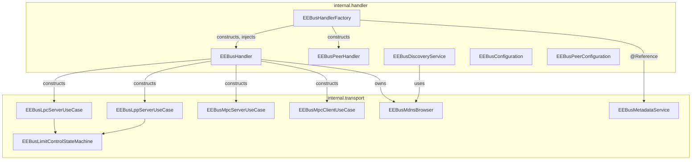

# ADR-002: Split `internal` into `internal.transport` / `internal.handler` (No Second Bundle)

## Status

> Accepted

## Context

`$Concept` raised the question whether `org.openhab.binding.eebus` should be split into two
OSGi bundles: a shared `org.openhab.io.transport.eebus` bundle owning the jEEBus.SHIP/SPINE
dependency (and the whole dependency tree embedded per ADR-001), and a thin
`org.openhab.binding.eebus` that only implements `ThingHandler`s against that transport
bundle's API.

The deciding question was reuse: is a second EEBus-based binding (heat pump, wallbox/EVSE, PV
inverter, ...) actually planned, which would justify the cross-bundle API contract and the
OSGi coordination cost (bundle versioning, `uses`-constraint risk between bindings depending on
the same transport bundle at potentially different versions - the same class of problem
ADR-001 deliberately avoided by embedding instead of importing)? The answer, for now: no
second binding is planned. Splitting into a second bundle today would be speculative
(YAGNI) and would reintroduce exactly the inter-bundle coupling risk ADR-001 moved away from.

At the same time, all 14 Java classes lived flat in a single `internal` package, with SPINE/
SHIP-facing `UseCase` implementations, the mDNS browser, and the Item/Metadata bridge mixed
together with the openHAB `ThingHandlerFactory`/`ThingHandler`/`DiscoveryService` classes. That
made the actual coupling between "talks to SPINE/SHIP" and "talks to the openHAB Thing/Item
APIs" hard to see from the package structure alone.

## Decision

Keep a single bundle (`org.openhab.binding.eebus`), but split the `internal` package into two
sub-packages along the same seam a future bundle split would use:

- **`internal.transport`** - everything that talks to jEEBus.SPINE/SHIP directly, plus the
  openHAB Item/Metadata adapter the transport-layer code needs:
  `EEBusMetadataService`, `EEBusMdnsBrowser`, `EEBusLimitControlState`,
  `EEBusLimitControlStateMachine`, `AbstractEEBusLimitControllableSystemUseCase`,
  `EEBusLpcServerUseCase`, `EEBusLppServerUseCase`, `EEBusMpcServerUseCase`,
  `EEBusMpcClientUseCase`.
- **`internal.handler`** - the openHAB Thing/Bridge/Discovery layer:
  `EEBusHandlerFactory`, `EEBusHandler`, `EEBusConfiguration`, `EEBusPeerConfiguration`,
  `EEBusPeerHandler`, `EEBusDiscoveryService`.
- **`internal`** (root, unchanged) - `EEBusBindingConstants`, shared by both.

Dependency direction is one-way: `internal.handler` imports from `internal.transport`
(`EEBusHandlerFactory`/`EEBusHandler` construct and inject `EEBusMetadataService` and the
`UseCase` implementations), never the reverse. This mirrors exactly what a real
`org.openhab.io.transport.eebus` → `org.openhab.binding.eebus` bundle boundary would look
like, so a future promotion to a second bundle - if a second EEBus-based binding is ever
actually built - is a mostly mechanical move of the `internal.transport` package into its own
Maven module, not a redesign.

### Known compromise: `EEBusHandler` is not yet fully transport-free

`EEBusHandler` (in `internal.handler`) still directly imports and drives jEEBus.SHIP/SPINE
types (`ShipNodeConfiguration`, `ShipCommunication`, `Device`) in `startShipSpine()`/
`dispose()` - it is simultaneously the openHAB `BaseBridgeHandler` and the SPINE/SHIP session
owner. A fully clean split would extract that session-management logic into a dedicated
`internal.transport` class (e.g. `EEBusService`) that `EEBusHandler` merely delegates to.
That was deliberately **not** done in this pass: it changes `EEBusHandler`'s internal control
flow (not just its package), and this environment has no `mvn`/compiler available to verify
such a change compiles and behaves correctly. Doing it without compilation feedback was judged
too risky for an unreviewed refactor. Flagged as a follow-up if/when a second binding makes
the transport boundary load-bearing rather than aspirational.

## Consequences

### Positive

- The transport/handler seam is now visible in the package structure, not just in comments -
  new code has an obvious home ("does this talk to SPINE/SHIP, or to openHAB Things?").
- One-way `handler` → `transport` dependency direction matches what a real bundle boundary
  would enforce, so the option to promote `internal.transport` to a separate
  `org.openhab.io.transport.eebus` bundle later stays open and cheap, without committing to
  the OSGi coordination cost today.
- No change to `pom.xml`, `feature.xml`, or `bnd.bnd` - this is a pure Java package
  reorganization within the existing single-bundle structure from ADR-001.

### Negative

- `EEBusHandler` remains a hybrid (openHAB Bridge lifecycle + direct SPINE/SHIP session code) -
  the package split is not yet a complete architectural separation, see "Known compromise"
  above.
- This environment has no Maven/compiler access, so this refactor was verified by static
  grep-based inspection (package declarations, cross-package imports, Javadoc `{@link}`
  resolution) rather than an actual `mvn compile`. **Follow-up:** run a real build before
  merging to catch anything the static check missed (e.g. package-private visibility edge
  cases not covered by the manual review).

## Diagram

---
