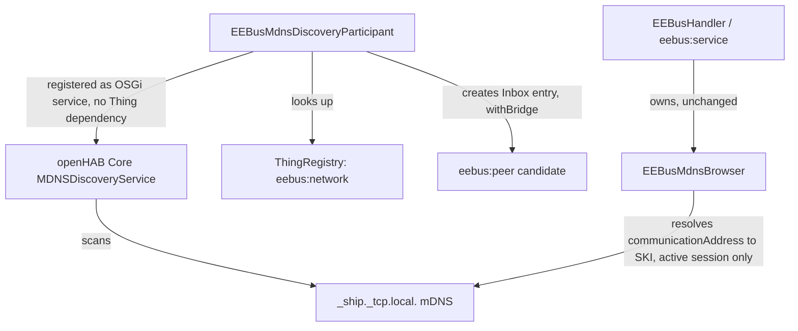

# ADR-003: Decouple real-device mDNS discovery from the eebus:service Bridge lifecycle

## Status

> Proposed

## Context

Real-device discovery (`_ship._tcp.local.` mDNS) is currently implemented by
`EEBusDiscoveryService extends AbstractThingHandlerDiscoveryService<EEBusHandler>`
(`PROTOTYPE`-scoped, registered via `EEBusHandler#getServices()`). It only becomes active once
an `eebus:service` Bridge Thing exists and its `initialize()` has successfully run
`startShipSpine()` — which requires a valid local SHIP identity (certificate, port,
`vendorCode`/`deviceModel`/`serialNumber`/`mdnsServiceInstance`) to be configured first. Until
then, `EEBusHandler#getMdnsBrowser()` returns `null` and `EEBusDiscoveryService#startScan()` is
a no-op.

Consequence, confirmed against the code: installing the binding alone produces no visible
effect. A first-time user has nothing to add yet (no Thing exists), and nothing on the network
becomes visible until a full local identity is configured — even though a real, nearby EEBUS
device is actively broadcasting its presence over mDNS the whole time. See the delta spec at
`docs/changes/eebus-network-discovery/specs/discovery/spec.md`, requirement "Background scanning
starts without any configured Thing".

Protocol-wise, this coupling is unnecessary: `_ship._tcp.local.` mDNS announcements are read
passively and require no certificate, no trust relationship, and no active SHIP session. The
existing `EEBusMdnsBrowser` already demonstrates this — it never touches `ShipCommunication`,
only openHAB core's shared `MDNSClient`. Its lifecycle is tied to the Bridge only incidentally,
because `EEBusHandler#startShipSpine()` happens to be where it was instantiated.

openHAB core offers a purpose-built extension point for this: `MDNSDiscoveryParticipant`
(`org.openhab.core.config.discovery.mdns`). A component registered as this service type is
picked up automatically by core's own `MDNSDiscoveryService` — no Bridge or Thing handler
involved at all (verified against the openHAB Core javadoc,
<https://www.openhab.org/javadoc/latest/org/openhab/core/config/discovery/mdns/mdnsdiscoveryparticipant>,
2026-08-01). This is the same pattern used by other mDNS-discovered device bindings in the
openHAB add-ons repository.

## Decision

We will:

1. Introduce a new, lightweight Bridge Thing type `eebus:network`
   (`EEBusBindingConstants.THING_TYPE_NETWORK`) with no mandatory configuration parameters. Its
   only role is to act as the parent Bridge for discovered `eebus:peer` Inbox entries.
1. Implement `EEBusMdnsDiscoveryParticipant implements MDNSDiscoveryParticipant`, an OSGi
   component with no dependency on any Thing handler — registered from binding activation, not
   from `EEBusHandler#getServices()`. It resolves an existing `eebus:network` Thing via
   `ThingRegistry`; if none exists yet, `createResult()`/`getThingUID()` return `null` (no Inbox
   entry is produced).
1. Remove `EEBusDiscoveryService` (the `AbstractThingHandlerDiscoveryService<EEBusHandler>`
   class) — its "list unpaired real devices" responsibility moves entirely to
   `EEBusMdnsDiscoveryParticipant`.
1. Keep `EEBusMdnsBrowser` unchanged and still scoped to an active `eebus:service` local
   identity. Its remaining job — resolving a SPINE `communicationAddress` back to a peer's SKI
   for an established SHIP session (CONCEPT.md §5.4 TODO 2) — is a runtime concern of an active
   session, genuinely distinct from Inbox population, and cannot be satisfied without a running
   `ShipCommunication`.

## Consequences

### Positive

- Background discovery of real devices starts the moment the binding is installed, matching
  both user expectation and standard openHAB behavior for mDNS-discovered devices.
- `eebus:network` is a one-click add (no certificate/port/vendor fields), giving first-time
  users an immediate, low-friction starting point.
- Removes the bespoke `AbstractThingHandlerDiscoveryService` wiring for this responsibility;
  openHAB core's `MDNSDiscoveryService` now owns scan scheduling for it.
- Clean separation of concerns going forward: "seeing" a device (no local identity needed) and
  "connecting/pairing" with it (needs an `eebus:service` identity) become independent code
  paths, matching how the SHIP protocol actually works.

### Negative

- Two independent mDNS listeners for `_ship._tcp.local.` now exist side by side
  (`EEBusMdnsDiscoveryParticipant`, driven by core's `MDNSDiscoveryService`; and
  `EEBusMdnsBrowser`, registered directly against the shared `MDNSClient`, scoped to an active
  `eebus:service`). Both use the same shared `MDNSClient`/JmDNS instance set — no duplicate
  network traffic or second JmDNS responder is created — but this must be documented clearly in
  both classes so it is not mistaken for redundant code later.
- TXT record parsing (`ski`/`brand`/`model`/`type`) now has two call sites; a shared helper is
  needed so the two implementations do not silently drift apart.
- The relationship between `eebus:network` and the existing `eebus:service` Bridge (e.g.
  whether `eebus:service` becomes a child of `eebus:network`) is intentionally left open —
  out of scope for this change, see `docs/changes/eebus-network-discovery/proposal.md`.
- This design assumes exactly one `eebus:network` Thing exists. With zero, behavior is defined
  (no results). With more than one, behavior is unspecified for v1 (first match returned by
  `ThingRegistry` lookup) — an accepted scope limit, not a resolved design.

## Diagram (optional)

---

_References requirements in `docs/changes/eebus-network-discovery/specs/discovery/spec.md`._
