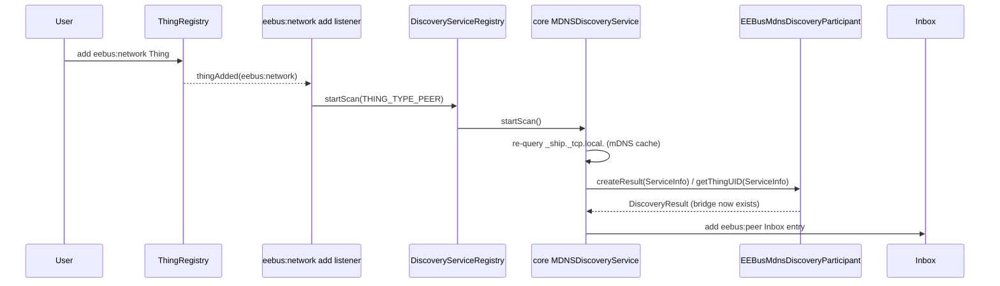

# ADR-004: Retry mDNS Discovery When an eebus:network Bridge Is Added

## Status

> Proposed

## Context

ADR-003 introduced `EEBusMdnsDiscoveryParticipant`, decoupling real-device discovery from any
`eebus:service` identity, but its "Discovered devices require an existing eebus:network Bridge"
requirement (`docs/changes/eebus-network-discovery/specs/discovery/spec.md`) has a documented
consequence: `createResult()`/`getThingUID()` return `null` for a device seen before any
`eebus:network` Bridge Thing exists, and nothing re-evaluates that device later. Confirmed
against real hardware: a device that announced itself before the Bridge was added stays
invisible in the Inbox until the user manually triggers a "Scan" — at which point it appears
immediately, because a manual scan forces openHAB core's `MDNSDiscoveryService` to actively
re-query `_ship._tcp.local.`, and by then the Bridge exists, so the same `createResult()` call
that previously returned `null` now succeeds.

`docs/changes/mdns-discovery-retry/specs/discovery/spec.md` (this change) requires that adding
an `eebus:network` Bridge Thing surfaces any device mDNS still has cached, without a manual scan
— see "Device seen before the Bridge existed becomes discoverable once it is added".

## Decision

We will register a listener for `eebus:network` Thing additions and, when one is added, ask
openHAB core's `DiscoveryServiceRegistry` to start a scan for `THING_TYPE_PEER`
(`discoveryServiceRegistry.startScan(THING_TYPE_PEER, null)`) — the exact same call openHAB core
itself makes when a user clicks "Scan" in the Inbox UI for that Thing type. This re-queries
`_ship._tcp.local.` and re-evaluates `EEBusMdnsDiscoveryParticipant.createResult()`/
`getThingUID()` for every service still present in the shared `MDNSClient`/JmDNS record cache -
which now succeeds, since the `eebus:network` Bridge exists by the time the scan runs.

No new cache of "orphaned" discoveries is introduced. The "memory" that makes a previously-seen
device discoverable again is JmDNS's own record cache (bounded by each record's advertised TTL),
not binding-owned state.

### Options considered

**Option A — maintain our own backlog of orphaned discoveries.** Have
`EEBusMdnsDiscoveryParticipant` keep an in-memory map of SKI → last-seen `ServiceInfo` for every
device seen while no `eebus:network` Bridge existed, and replay it once one is added. Rejected:
`MDNSDiscoveryParticipant` is a passive callback interface with no method to submit a
`DiscoveryResult` outside of the `MDNSDiscoveryService`'s own scan/event pipeline, so replaying
the backlog would still need to trigger a scan (or duplicate the Inbox-publishing machinery
directly) - the backlog itself would add nothing but a second, hand-rolled cache with its own TTL
and expiry logic to keep in sync with JmDNS's, for no behavioral benefit over Option B.

**Option B — trigger `DiscoveryServiceRegistry.startScan(THING_TYPE_PEER)` on Bridge add
(chosen).** Reuses the exact, already-working "manual scan" code path - no new Inbox-publishing
logic, no new cache, no TTL/expiry bookkeeping to maintain. The only new component is a listener
that reacts to `eebus:network` Things being added.

## Consequences

### Positive

- No new caching layer: correctness follows directly from the already-relied-upon behavior of a
  manual scan, which this binding's own spec already requires to work correctly.
- Small, isolated change: one new listener registration plus one `startScan()` call; no changes
  to `EEBusMdnsDiscoveryParticipant`'s existing `createResult()`/`getThingUID()` logic.
- Naturally extends to multiple pending devices: a single triggered scan re-evaluates every
  service currently in the mDNS cache, not just one.

### Negative

- Bounded by JmDNS's own record cache TTL: if a device's mDNS announcement has already expired
  from the cache by the time the `eebus:network` Bridge is added, it will not be found
  automatically - the same limitation a manual scan already has at that point, not a new one
  introduced by this change (see the delta spec's "Device's mDNS announcement has expired before
  the Bridge is added" scenario).
- Requires a new OSGi reference to `DiscoveryServiceRegistry` and a `ThingRegistry` change
  listener registration/deregistration, with the usual lifecycle care (`@Activate`/`@Deactivate`)
  to avoid leaking the listener.
- Only reacts to `eebus:network` Things being added, not to broader mDNS cache changes (e.g. a
  device re-announcing while a Bridge already exists) - already covered by
  `EEBusMdnsDiscoveryParticipant`'s normal event-driven path and out of scope here.

## Diagram

---

_References `docs/changes/mdns-discovery-retry/specs/discovery/spec.md`, requirement "Discovered
devices require an existing eebus:network Bridge" (MODIFIED)._
