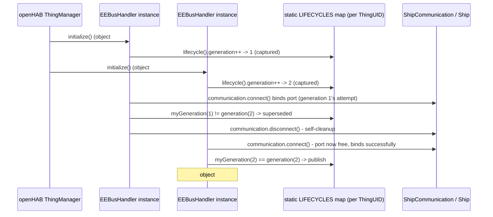

# ADR-005: Supersede Stale Start Attempts via a Per-Thing, Not Per-Instance, Generation Counter

## Status

> Proposed

## Context

`EEBusHandler.initialize()` does not bind the SHIP server synchronously - it schedules
`startShipSpine()` on the openHAB `scheduler` and returns immediately, because certificate
generation and the actual socket bind can take a moment and must not block the framework thread
that calls `initialize()`.

Confirmed against a live openHABian instance: when `dispose()` runs while that background task is
still in flight (e.g. the user edits the Thing's `port` in the UI, which openHAB applies as a
`dispose()` + `initialize()` cycle), unsynchronized access to `this.shipCommunication` (and
`device`/`mdnsBrowser`) let the two paths interleave. Reproduced directly: a port verified free
with `ss -tulpn`, configured on the Thing, immediately logged as
`BindException: Address already in use`, while `ss` afterwards showed that same port bound by the
openHAB process - the fingerprint of two overlapping bind attempts within the same JVM, one of
which won and was never reachable again to close.

This ADR went through three iterations, each disproven or refined by a live reproduction. The
final section under "Decision" is what is actually implemented; the earlier attempts are kept
here because each rules out a plausible-looking alternative for a concrete, evidenced reason.

### First attempt (rejected after live testing): join a `Future` in `dispose()`

Made `initialize()` use `scheduler.submit(...)` instead of `execute(...)`, kept the returned
`Future<?>`, and had `dispose()` call `future.get(10, TimeUnit.SECONDS)` before tearing down
`shipCommunication`/`device`/`mdnsBrowser` - i.e. make `dispose()` wait for whatever
`startShipSpine()` was doing to actually finish before touching its output.

Deployed and re-tested live: the exact same `BindException` still occurred, and the log
additionally now showed two `Ship: shutDown() was called after already being shut down` warnings
five milliseconds apart, immediately before the `BindException`:

```text
17:51:41.251 WARN  Ship - shutDown() was called after already being shut down
17:51:41.256 WARN  Ship - shutDown() was called after already being shut down
17:51:42.032 WARN  EEBusHandler - Failed to start EEBus service instance ... BindException
```

Two `dispose()`-triggered shutdowns racing each other 5 ms apart, followed 780 ms later by a bind
failure, is best explained by openHAB's `SafeCaller`: it wraps `ThingHandler` callback methods
(including `dispose()`) with its own timeout and, when that timeout is exceeded, interrupts the
call and lets the framework proceed regardless - it does not actually stop the underlying thread.
Blocking inside `dispose()` for up to 10 seconds is well within range of colliding with that
timeout.

**Lesson: `dispose()` must never block on the async start task.**

### Second attempt (rejected after live testing): generation counter as a plain instance field

Replaced the `Future`-join with a `startGeneration` counter kept as a plain `long` field (guarded
by a `lifecycleLock` instance field). `initialize()`/`dispose()` bump it; `startShipSpine()`
re-checks it immediately after `communication.connect()` returns, under the same lock, and
self-disconnects instead of publishing if it finds itself superseded. `dispose()` itself never
blocks - it just bumps the counter and closes whatever is currently published.

Deployed and re-tested live, including a full `systemctl restart openhab` immediately beforehand
(`ss -tulpn` confirmed a completely clean slate - no eebus port bound at all) and only a single
`eebus:service` Thing existing (`things list` confirmed no duplicate Bridges). The exact same
`BindException` still occurred, 42 seconds into a fresh boot, on the Thing's very first-ever
`initialize()` call. With `DEBUG` logging enabled, the log showed:

```text
18:35:36.093 TRACE ShipCommunication - Connecting to SHIP
18:35:36.807 INFO  ShipNodeImpl       - Key Management initialized. SKI ...c2871f...
18:35:37.392 INFO  ShipServer         - SHIP server (port 4724) started
18:35:37.689 TRACE ShipCommunication - Connecting to SHIP
18:35:37.929 INFO  ShipNodeImpl       - Key Management initialized. SKI ...c2871f... (same SKI)
18:35:38.011 INFO  ShipServer         - SHIP server (port 4724) started
18:35:38.019 WARN  EEBusHandler       - Failed to start EEBus service instance ... BindException
```

(`ShipServer`'s "started" line is logged at the _start_ of `ShipServer.start()`, before the actual
`bind()` call - so its second appearance does not mean the second bind succeeded; the
`BindException` 8 ms later is that second `bind()` failing against the first one, which is still
holding the port.)

This proves `communication.connect()` - and therefore `startShipSpine()` - ran twice for the same
Thing, with the same SKI, 1.6 seconds apart, on a Thing that had never been touched before this
boot. Crucially, **neither** attempt logged the "was disposed/reconfigured while starting"
message that the generation check emits on the losing side. If both calls had gone through the
same `EEBusHandler` object, the earlier one's post-`connect()` check should have found itself
superseded by the later one's generation bump and disconnected - it did not.

The only explanation consistent with this evidence: openHAB ended up with **two separate
`EEBusHandler` objects for the same Thing**, each independently calling `initialize()` and each
carrying its own, unrelated `startGeneration`/`lifecycleLock` instance fields. Two unrelated
objects cannot supersede each other via state that is private to each of them - the generation
counter design was sound, but keeping it as an instance field defeated its own purpose the moment
more than one instance existed for the same Thing.

**Lesson: the coordination state must be shared by Thing identity, not by object instance.**

## Decision

Keep the generation-counter/supersede design from the second attempt, but key its state by
`ThingUID` in a `static final Map<ThingUID, Lifecycle> LIFECYCLES` (a `ConcurrentHashMap`), where
`Lifecycle` is a small holder of a lock object plus the `long generation` counter. Every
`EEBusHandler` object - regardless of how many happen to exist for the same Thing - looks up the
same `Lifecycle` via `LIFECYCLES.computeIfAbsent(thing.getUID(), ...)` before touching the
counter. The check-then-publish-or-disconnect logic in `startShipSpine()` and the
bump-then-close logic in `dispose()` are otherwise unchanged from the second attempt.

`handleRemoval()` removes the Thing's entry from `LIFECYCLES` (mirrored on the
`StorageService`-lifecycle pattern in `rules/java-coding-rules.md`: cleanup on actual deletion,
not on every `dispose()`/update cycle), so the map does not grow unbounded across a long-running
instance's lifetime as Things get created and deleted.

This does not prevent a stale attempt from still finishing its bind a moment after `dispose()`
ran, nor does it explain _why_ openHAB ends up with two `EEBusHandler` objects for one Thing in
the first place - that remains open, see "Negative" below. What it guarantees is that whichever
attempt loses the race - whether it is a stale task on the same object or a completely separate
object for the same Thing - always cleans up after itself instead of leaking the port.

### Options considered

**Option A - block `dispose()` on a `Future` until the background task finishes (tried, rejected).**
See "First attempt": live-tested, did not fix the bug, and collided with openHAB's `SafeCaller`
timeout on `dispose()`.

**Option B - synchronize `initialize()`/`dispose()`/`startShipSpine()` on the handler instance for
their entire duration (rejected).** Holding a lock across `communication.connect()` - blocking
network I/O - would serialize `dispose()` behind it, reintroducing the Option A problem. Also
would not have helped even if adopted: an instance-level lock has exactly the same "doesn't apply
across two different instances" blind spot the second attempt hit.

**Option C - generation counter as a plain instance field (tried, rejected).** See "Second
attempt": correct logic, wrong scope. Disproven live by a reproduction with a single Thing, a
freshly booted, verified-clean JVM, and a debug log showing two `connect()` calls with neither
side detecting the other.

**Option D - generation counter keyed by `ThingUID` in a static map (chosen).** Same check-then-
publish-or-disconnect logic as Option C, but the state it checks is shared by every object that
has ever existed for that Thing, not private to one of them. Directly explains and fixes what
Option C's live reproduction exposed.

## Consequences

### Positive

- Closes the leaked-port race even when openHAB creates more than one `EEBusHandler` object for
  the same Thing - the actual failure mode observed live, which a purely instance-scoped fix
  cannot address by construction.
- `dispose()` remains O(1) and non-blocking (unchanged from the second attempt) - no risk of
  colliding with `SafeCaller`'s timeout.
- Small, localized change confined to `EEBusHandler`; no changes to `jeebus.ship`/`jeebus.spine`
  needed (those remain human-approval-gated per project rules).
- `handleRemoval()` bounds the static map's size to currently-existing Things.

### Negative

- A superseded attempt still performs a full (wasted) certificate-generation-plus-connect cycle
  before discovering it should discard its result - unchanged from the second attempt, still
  considered acceptable (bounded, self-limiting work, not a leak).
- Briefly opens the port twice in immediate succession in the overlap case rather than avoiding
  the second bind outright - unchanged trade-off from the second attempt.
- Static, class-level shared state is a heavier tool than a binding handler would normally need,
  and is only justified here by the live evidence that instance-level state was insufficient. If
  a future investigation finds _why_ openHAB creates two objects for one Thing and that turns out
  to be preventable (a bug elsewhere, e.g. in `EEBusHandlerFactory` or a duplicate Thing-storage
  entry), the static map could potentially be simplified back to an instance field - but doing so
  without that root cause in hand would just reintroduce the second attempt's failure mode.
- Does **not** explain why two `EEBusHandler` objects exist for the same Thing in the first
  place. Everywhere else in the binding that could plausibly cause this was checked and ruled
  out: `EEBusHandlerFactory.createHandler()` has a single, unconditional `new EEBusHandler(...)`
  per matching Thing type; `EEBusNetworkHandler` and `EEBusPeerHandler` never touch
  `ShipCommunication`/ports at all; `things list` confirmed only one `eebus:service` Thing
  existed. The remaining candidates are all in openHAB core's `ThingManager`/bulk-startup path or
  OSGi component lifecycle, outside this binding's code - out of scope for this ADR, which fixes
  the consequence rather than the trigger.

## Diagram



---

_Confirmed via three live reproductions on openHABian: first, a verified-free port failing with
`BindException` while immediately showing as bound by the openHAB process afterward; second,
after the join-based fix, the same failure recurring alongside two `Ship: shutDown()` warnings
5 ms apart; third, after the instance-field generation-counter fix and a full process restart
with a verified-clean port and a single existing Thing, a debug log proving `connect()` ran twice
with neither side detecting the other - the evidence that motivated moving the generation counter
from an instance field to a `ThingUID`-keyed static map._
