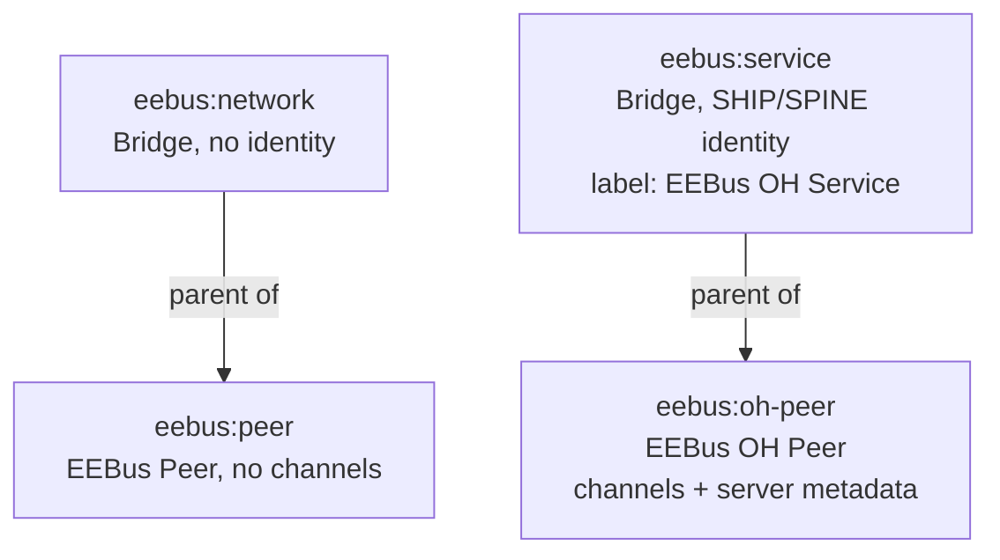

# ADR-009: Split eebus:peer Into eebus:peer (Real, Network-Scoped) and eebus:oh-peer (OH-Managed, Service-Scoped)

## Status

Accepted

> Note: the trust-computation part of this decision ("creating an `eebus:oh-peer` Thing performs
> pairing") is amended by [ADR-012](012-pairing-trust-property-and-actions.md) — Thing existence
> alone no longer implies trust. The Thing-type split itself (this ADR's core decision) is
> unaffected.

## Context

`eebus:peer`'s `supported-bridge-type-refs` in `thing-types.xml` lists both `eebus:service` and
`eebus:network` as valid parent Bridges, with identical `ski`/`shipId` configuration in both
cases. `EEBusPeerHandler`'s own Javadoc states that pairing (trusted-SKI computation) is the
responsibility of the parent `EEBusHandler` (`eebus:service`); `EEBusNetworkHandler` explicitly
holds no SHIP/SPINE identity and unconditionally reports `ONLINE`. A `eebus:peer` Thing
configured under `eebus:network` is therefore accepted by the configuration schema but
functionally inert: it never joins a trusted-SKI set, never opens a SHIP connection, and can
never carry the dynamically generated channels described for client-role use-case consumption
(CONCEPT.md §4.2/§5.4).

This shape predates the introduction of `eebus:network` (ADR-003): `eebus:peer` was never
revisited when `eebus:network` was split out as a separate, identity-less discovery anchor. See
CONCEPT.md §4.5 (`$Concept` discussion, 2026-08-04) for the full trade-off discussion, including
a rejected alternative (nesting `eebus:service` under `eebus:network`) and the resolution of an
existing ambiguity in server-role Item metadata resolution (CONCEPT.md §4.2a "Offener Punkt").

Requirements driving this decision: `docs/changes/separate-real-and-oh-peer-things/specs/thing-model/spec.md`
and `docs/changes/separate-real-and-oh-peer-things/specs/server-metadata/spec.md`.

## Decision

Split the single `eebus:peer` Thing type into two Thing types with disjoint parent Bridges:

- `eebus:peer` ("EEBus Peer"): child of `eebus:network` only. Represents a real EEBus device,
  ideally populated via mDNS discovery. No channels. `ski` labeled "SKI".
- `eebus:oh-peer` ("EEBus OH Peer"): child of `eebus:service` only. Represents an
  openHAB-managed pairing; creating this Thing performs pairing (adds its `ski` to the parent
  Bridge's trusted-SKI set, unchanged mechanism from the current `eebus:peer`-under-
  `eebus:service` behavior). Carries dynamically generated channels for client-role use cases
  once implemented. `ski` labeled "Trusted SKI".

No automatic link is created between an `eebus:peer` and an `eebus:oh-peer` Thing; the existing
manual SKI copy-paste pairing workflow (CONCEPT.md §5.2) is unchanged, and remains the only
verified way to pair, pending the still-tentative `pairWith` Thing Action (CONCEPT.md §4.4).

Server-role Item metadata values gain a mandatory `<oh-service-id>:` prefix
(`eebus="<oh-service-id>:<UseCase>.<Datapoint>"`), where `oh-service-id` is the offering
`eebus:service` Thing's UID segment. This disambiguates metadata resolution when more than one
`eebus:service` Bridge offers the same use case/datapoint (previously an open point in
CONCEPT.md §4.2a), without introducing a new configuration parameter or switching away from the
existing `eebus` Metadata namespace to Item Tags (Tags were considered and rejected — they share
the Semantic Model's namespace and have no built-in isolation).

`eebus:service` remains a top-level Bridge, not nested under `eebus:network` — a nesting
proposal was considered (would give an automatic `BRIDGE_OFFLINE` cascade to all paired peers
and their channels when `eebus:network` is disabled) and rejected, because it would also force
disabling all local pairings whenever mDNS discovery/browsing is paused, which is considered too
broad a coupling. Its Bridge type label changes to "EEBus OH Service" (cosmetic only).

## Consequences

### Positive

- The Main UI "Add Thing" list self-documents the difference between a real, discovered EEBus
  device and an openHAB-managed pairing — no configuration exists anymore that looks valid but
  is functionally inert.
- Server-role metadata resolution is unambiguous with multiple `eebus:service` Bridges, without
  adding a new configuration parameter.
- `EEBusNetworkHandler`'s design constraint (no SHIP/SPINE identity) is now enforced by the
  Thing type schema itself (`eebus:oh-peer` cannot be added under it), rather than only by the
  historically inert runtime behavior of `eebus:peer` there.

### Negative

- Two Thing types and two handler classes to maintain instead of one, with parallel `ski`
  config classes/logic (`EEBusPeerConfiguration` may need to stay shared or be duplicated — left
  to `$Dev` to decide during implementation).
- No automatic promotion from a discovered `eebus:peer` to a paired `eebus:oh-peer` — a user
  still manually re-enters the SKI, same friction as today, deferred to the still-tentative
  `pairWith` Action (CONCEPT.md §4.4).
- Existing `eebus:peer` Things configured under `eebus:service` (if any exist in a test/dev
  environment) will need manual recreation as `eebus:oh-peer` — acceptable because the binding
  is pre-release (CONCEPT.md "Status: Entwurf"), no migration path is provided.

## Diagram

---

_Supersedes the parent-Bridge portion of `eebus:peer` as originally described in CONCEPT.md §4
(pre-2026-08-04)._
