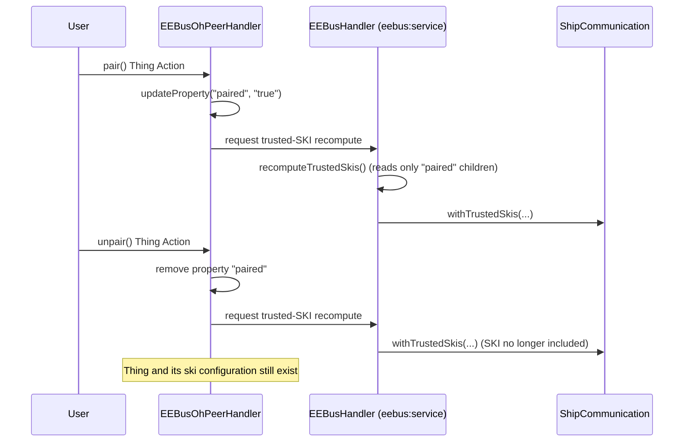

# ADR-012: Pairing Trust as a Persisted Thing Property, Granted via pair()/unpair() Thing Actions

## Status

> Accepted

## Context

ADR-009 established that creating and initializing an `eebus:oh-peer` Thing under an
`eebus:service` Bridge immediately adds its `ski` to the parent Bridge's trusted-SKI set
(`EEBusHandler.recomputeTrustedSkis()`, triggered by `childHandlerInitialized`). CONCEPT.md §4.6
(2026-08-05) revised this: saving a Thing's configuration should not silently perform a trust
decision — most visible when pairing two local `eebus:service` Bridges with each other
(CONCEPT.md §4.4), where both sides need to review their SKI before granting trust, not commit
to it the moment the Thing is saved.

This ADR implements that revision technically, covering four requirements from
`docs/changes/decouple-oh-peer-config-from-pairing/specs/thing-model/spec.md`: "Creating an
eebus:oh-peer Thing does not perform pairing", "eebus:oh-peer provides a pair() Thing Action",
"eebus:oh-peer provides an unpair() Thing Action", "Pairing state persists across openHAB
restarts".

It amends part of ADR-009: the "eebus:oh-peer removed from a running service" trust-revocation
behavior is unchanged, but "eebus:oh-peer added to a running service" (Thing existence alone
implying trust) no longer holds.

## Decision

1. `eebus:oh-peer` gains a Thing property (e.g. `paired`, value `"true"`/absent) recording
   whether `pair()` has been invoked and not since undone by `unpair()`.
1. `EEBusOhPeerHandler` exposes two parameterless Thing Actions:
   - `pair()`: sets the property, then requests a trusted-SKI recompute on the parent
     `eebus:service` Bridge.
   - `unpair()`: clears the property, then requests the same recompute. The Thing itself is not
     removed.

   Both are declared with `@RuleAction` and no `@ActionInput`, rendering as a plain button in
   Main UI's Thing Actions list — the same, already community-verified mechanism CONCEPT.md §4.4
   identified for `reboot()`/`permitJoin()`-style actions, avoiding the Options-list-parameter
   rendering risk that the earlier cross-Bridge `pairWith` idea left under test reservation.
1. `EEBusHandler.recomputeTrustedSkis()` changes its source query: instead of every child
   `eebus:oh-peer` Thing's `ski`, it reads the `ski` only of children whose `paired` property is
   set. `childHandlerInitialized`/`childHandlerDisposed` continue to trigger the recompute
   (unchanged from ADR-009), so removing a Thing still revokes trust regardless of its pairing
   state.

### Options considered for persistence

**Option A — `StorageService` (project default per `rules/java-coding-rules.md` for
lifecycle-spanning state) — rejected for this case.** `StorageService` is the right default for
state with no other natural home. Here, the state is a single boolean scoped 1:1 to one Thing's
lifecycle — exactly what a Thing property already models, and this binding already has a
working, restart-safe precedent for that (`PROPERTY_LOCAL_SKI`, ADR-008). Introducing
`StorageService` alongside would mean two parallel persistence mechanisms for the same class of
"small fact about this Thing" data, for no behavioral gain — `StorageService` entries and Thing
properties are both persisted by openHAB core (the storage layer and `ManagedThingProvider`
respectively), so this is a choice between two framework mechanisms, not "custom vs. framework"
persistence.

**Option B — Thing property (chosen).** Consistent with `PROPERTY_LOCAL_SKI`. Survives restarts
because Thing properties are part of the Thing's own persisted state, read back by the framework
before `initialize()` runs — no explicit read-back code needed in `EEBusOhPeerHandler`, unlike
`StorageService`, which requires an explicit `getStorage(...)` call and lookup in `initialize()`.

## Consequences

### Positive

- No new persistence dependency; reuses the exact mechanism `PROPERTY_LOCAL_SKI` already
  established and that ADR-008 already relies on being restart-safe.
- `pair()`/`unpair()` are parameterless, so this avoids both technical risks CONCEPT.md §4.4
  flagged for the earlier cross-Bridge `pairWith` idea (Options-list Action parameter rendering;
  simultaneous writes to two `EEBusHandler` instances) — each Action only ever touches its own
  Thing's property and its single parent Bridge.
- Symmetric `pair()`/`unpair()` gives a "soft revoke" (keep the SKI configuration, just distrust
  it) distinct from Thing removal (ADR-009's "hard forget"), without a second Thing type or
  approve/reject API.

### Negative

- `recomputeTrustedSkis()` gains a second condition to check (property, not just child
  existence) — a small increase in complexity over ADR-009's pure "list child Things" query.
- Two Thing Actions with no visible enabled/disabled state: `pair()` on an already-paired Thing
  and `unpair()` on an already-unpaired Thing are both harmless no-ops (per spec), because Main
  UI cannot conditionally hide a Thing Action based on runtime Thing state — accepted, not
  solved, consistent with CONCEPT.md §4.6.
- A newly created `eebus:oh-peer` Thing shows as configured but not yet trusted until `pair()`
  is invoked — needs a clear `ThingStatus`/status-detail distinction from "paired and connected",
  left to `$Dev` to choose from the existing `ThingStatus`/`ThingStatusDetail` vocabulary (not
  itself a new architectural decision).

## Diagram

---

_Amends ADR-009: "eebus:oh-peer added to a running service" no longer holds as originally
written — see CONCEPT.md §4.6 and `docs/changes/decouple-oh-peer-config-from-pairing/`._
