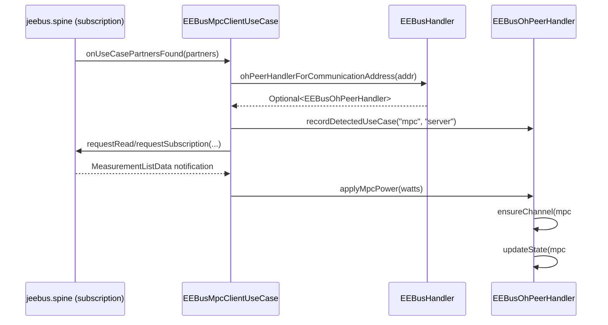

# ADR-014: Dynamic Channels for Client-Role Use Cases (MPC First)

## Status

Accepted

## Context

CONCEPT.md §4.2 established that Client-role use case data (openHAB reading a paired peer's
values) belongs on dynamically created Channels on the `eebus:oh-entity` Thing, not on Item
metadata (metadata stays Server-role only, CONCEPT.md §4.5). §4.2.2 resolved four open design
questions (mechanism, gating, persistence, structure) but left no code behind them:
`EEBusMpcClientUseCase#applyMeasurement()` already reliably resolves a paired peer's total power
value, but only logs it. `docs/changes/dynamic-client-role-channels/` (the `$Spec` deliverable
for this change) turns those decisions into testable Requirement/Scenario specs, scoped to MPC -
the only Client-role use case implemented so far.

This ADR is the `$Architect` design pass on top of that spec: concrete package/class structure,
channel-type declarations, and the `EEBusMpcClientUseCase` → `EEBusOhPeerHandler` wiring needed
to close the gap.

## Decision

**Channel-type declarations are static XML, channel instances are created at runtime.**
`thing-types.xml` gains a `channel-group-type id="mpc"` containing one
`channel-type id="mpc-power"` (`Number:Power`, read-only). Neither is referenced from
`oh-entity`'s own `<channel-groups>` list - if it were, every `eebus:oh-entity` Thing would show an
`mpc` group unconditionally, which contradicts the gating requirement (only create the Channel
once MPC is both configured on the Bridge and detected for that specific peer,
`docs/changes/dynamic-client-role-channels/specs/dynamic-channels/spec.md` Scenario "Channel
created for a use case that is both configured and detected"). Instead, `EEBusOhPeerHandler`
references the `ChannelTypeUID` programmatically and builds the `Channel` itself via
`ChannelBuilder`/`editThing()`/`updateThing()` - the same split between "declared shape" and
"instantiated on demand" openHAB uses for any binding with per-device-discovered channels.

**`EEBusOhPeerHandler` owns channel creation and state updates, not the `UseCase` class.**
Only the handler can call `editThing()`/`updateThing()`/`updateState()` on its own Thing. A new
package-private method, `ensureChannel(ChannelUID, ChannelTypeUID, String acceptedItemType,
String label)`, creates the Channel if `thing.getChannel(channelUID) == null`, otherwise no-ops -
this is what makes repeated calls (one per measurement notification) safe without a separate
"already created" flag. A thin, MPC-specific `applyMpcPower(double watts)` wraps it: ensure the
`mpc#power` Channel, then `updateState(...)` with a `QuantityType<>(watts, Units.WATT)` - mirrors
the existing `QuantityType`/`Units.WATT` pattern already used in `EEBusMpcServerUseCase`.

**`EEBusMpcClientUseCase`'s constructor takes a `Function<String, Optional<EEBusOhPeerHandler>>`
instead of `Function<String, Optional<String>>`.** The previous `ohPeerThingUidResolver`
returned a Thing UID string, which was enough for logging but not for calling `applyMpcPower()`.
`EEBusHandler` gains `ohPeerHandlerForSki`/`ohPeerHandlerForCommunicationAddress` (parallel to
the existing `ohPeerThingUidForSki`/`ohPeerThingUidForCommunicationAddress`, which are removed -
no other caller depends on them, confirmed by search) that resolve all the way to the live
`EEBusOhPeerHandler` instance (`child.getHandler() instanceof EEBusOhPeerHandler`), not just its
UID.

**Use-case visibility is a generic Thing property write, not a dedicated method per use case.**
`EEBusOhPeerHandler#recordDetectedUseCase(String useCaseKey, String actorRole)` just calls
`updateProperty(useCaseKey, actorRole)` - reusable by LPC/LPP/MGCP later without new handler
methods. `EEBusMpcClientUseCase` passes a new constant, `EEBusBindingConstants.USE_CASE_KEY_MPC`
(`"mpc"`), and the literal `"server"` (see proposal.md "Open Questions" for why the peer's actor
role was chosen over openHAB's own role - still needs `$Review`/user confirmation before a second
use case relies on the same reading).

## Consequences

### Positive

- Channel creation is idempotent and centralized in one small method, reusable by every future
  Client-role use case (LPC, LPP, MGCP, ...) without duplicating `editThing()`/`ChannelBuilder`
  boilerplate in each `UseCase` class.
- The XML channel-type catalog stays a plain, hand-maintained list (per CONCEPT.md §4.2.2 point 1
  - a full `ChannelTypeProvider` is explicitly deferred), while still keeping per-peer creation
  fully dynamic/gated.
- `EEBusOhPeerHandlerTest`'s existing `CallbackMock` needs no changes: `updateThing()` already
  updates `this.thing` regardless of what the mock's `thingUpdated()` no-op does, and
  `updateState()` is already captured via `stateUpdated()` - both new methods are testable with
  the current fixture.

### Negative

- `EEBusMpcClientUseCase` (package `internal.transport`) now imports `EEBusOhPeerHandler`
  (package `internal.handler`) - a transport → handler dependency that did not exist before.
  This is a deliberate, spec-mandated trade-off (proposal.md "Open Questions" / CONCEPT.md §4.2.2
  point 1: only the handler may touch `editThing()`/`updateState()`), not an oversight, but it
  does mean `internal.transport` is no longer purely handler-agnostic. Future Client-role
  `UseCase` classes will carry the same dependency.
- The async `subscribe()`/`applyMeasurement()` chain in `EEBusMpcClientUseCase` now closes over a
  live `EEBusOhPeerHandler` reference instead of an immutable UID string. If that Thing is
  removed/disposed while a read/subscription callback is in flight, `applyMpcPower()` would run
  against a disposed handler. Not solved by this change - same class of risk already accepted
  elsewhere in this binding for in-flight SPINE callbacks racing Thing lifecycle events; flagged
  here rather than silently ignored.

## Diagram

---

_Supersedes the `ohPeerThingUidResolver`/UID-string design implied by the pre-existing
`EEBusMpcClientUseCase` javadoc. Builds on `docs/changes/dynamic-client-role-channels/` ($Spec)
and CONCEPT.md §4.2.2/§5.4.3._
