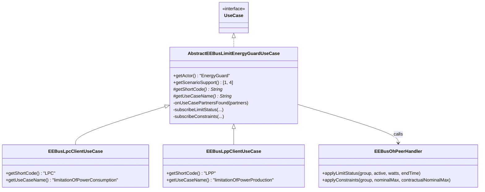

# ADR-015: LPC/LPP Client-Role Monitoring Channels

## Status

Superseded by ADR-031

> **2026-08-27 update:** every decision in this ADR (the LPC/LPP Client-role monitoring
> Channel mechanism, Scenario 1) is removed by `docs/ADR/031-remove-energyguard-monitoring-
> channels.md` per an explicit user correction - the EnergyGuard only ever writes a limit via
> a tagged Item, it does not need to read the peer's own status back into a Channel. The
> sibling write path (`registerWriteListeners`/`sendLimitWrite`) this ADR's classes also
> carry was added independently afterward (not part of this ADR's own Decision) and is
> unaffected.

## Context

`docs/changes/lpc-lpp-client-role-channels/` (`$Spec`) scopes a read-only Client-role monitoring
implementation for LPC and LPP - the mirror, for these two use cases, of what
`dynamic-client-role-channels`/ADR-014 built for MPC. Unlike MPC, this binding already has a
**Server-role** implementation for LPC/LPP (`AbstractEEBusLimitControllableSystemUseCase` +
`EEBusLpcServerUseCase`/`EEBusLppServerUseCase`), which is a valuable, verified reference for
wire-format actor strings, SPINE feature/function names, and the LPC/LPP-mirroring pattern - but
it is a Server-role class using the local `FeatureWrapper` API (openHAB owns the feature), which
does not directly apply to a Client-role class reading a **remote** feature (the pattern
`EEBusMpcClientUseCase` already established via raw `NodeManagement.requestRead`/
`requestSubscription` + `CmdType`).

## Decision

**One shared abstract base class, two thin subclasses - mirrors the existing Server-role split.**
`AbstractEEBusLimitEnergyGuardUseCase` (package `internal.transport`) holds all detection/
subscription logic; `EEBusLpcClientUseCase`/`EEBusLppClientUseCase` supply only
`getShortCode()`/`getUseCaseName()`, identical in shape to
`AbstractEEBusLimitControllableSystemUseCase` + `EEBusLpcServerUseCase`/`EEBusLppServerUseCase`.
This was chosen over two independent ~150-line classes because LPC/LPP are spec-confirmed
structurally identical (CONCEPT.md §5.4.2) and the codebase already has a working precedent for
this exact split on the Server-role side - reusing an established pattern is lower-risk than
inventing a new one.

**Client actor `"EnergyGuard"`, expected peer actor `"ControllableSystem"` - reused, not
re-derived.** Both strings are taken directly from
`AbstractEEBusLimitControllableSystemUseCase`'s own javadoc (which cites
`EEBus_UC_IG_GeneralGuidelines_V1.0.0.pdf`), not re-verified independently - this avoids a
second, potentially inconsistent primary-source reading of the same fact.

**Scope cut to Scenario 1 (limit status) + Scenario 4 (constraints); Scenario 2 (Failsafe) and
Scenario 3 (Heartbeat mechanics) deferred - see proposal.md "Scope"/"Open Questions" for the
full reasoning.** In short: Scenario 2 is a close structural analog of Scenario 4 (another
list-data read+parse) and is a small, low-risk follow-up; Scenario 3's _Channel_ was already
ruled out by CONCEPT.md §5.4.3, but its _protocol mechanics_ (mutual heartbeat, requiring this
entity to expose its own `DeviceDiagnosis` Server feature) are materially new plumbing, not a
read - deferring it keeps this change's diff reviewable and its risk profile close to MPC's.

**`EEBusOhPeerHandler` gets two new methods, each parameterized by Channel Group ID, not four.**
`applyLimitStatus(String channelGroup, boolean active, double watts, @Nullable Instant endTime)`
and `applyConstraints(String channelGroup, double nominalMaxWatts, double
contractualNominalMaxWatts)` serve both `"lpc"` and `"lpp"` - avoids the 1:1 duplication a naive
`applyLpc*`/`applyLpp*` pair-per-scenario split would produce, consistent with
`java-coding-rules.md`'s "duplicate code refactored where possible" (openHAB review checklist)
and this ADR's own reuse-over-reinvention theme.

**Field-level `CmdType`/`*ListDataType` names are inferred by structural analogy, not verified
against the compiled jar - flagged explicitly, not silently assumed.** This sandbox has no
Maven/local `.m2` repository (same limitation noted in ADR-014's review), so
`LoadControlLimitListDataType`/`DeviceConfigurationKeyValueListDataType`/
`ElectricalConnectionCharacteristicListDataType` and their corresponding `CmdType.withXxx(...)`
methods cannot be confirmed to exist with those exact names before this code compiles for the
first time. The inference is well-grounded (every SPINE function already seen in this codebase -
`Measurement`, and the type names directly imported by
`AbstractEEBusLimitControllableSystemUseCase` for the Server-role read of the same functions -
follows the same `withXxxListData(XxxListDataType)` naming convention with no exception found so
far), but "well-grounded inference" is not "verified". `tasks.md` §6.3 makes an actual `mvn
compile` pass (once available) an explicit, tracked prerequisite for considering this change
done - not an optional nicety.

## Consequences

### Positive

- Reuses three already-proven patterns in one change (Server-role Abstract+2-subclass split,
  MPC's Client-role raw-`CmdType` read pattern, `EEBusOhPeerHandler#ensureChannel`) instead of
  inventing new ones, keeping the review surface familiar.
- Scope cut (Scenario 2/3 deferred) keeps this diff a similar order of magnitude to MPC's,
  despite covering two use cases instead of one.
- `applyLimitStatus`/`applyConstraints` being group-parameterized means a third mirrored use
  case (if one is ever added) reuses them directly with no new handler methods.

### Negative

- The unverified `CmdType` field-name inference is a real risk this ADR does not eliminate, only
  documents. If any of the inferred names is wrong, `EEBusLpcClientUseCase`/
  `EEBusLppClientUseCase` will fail to compile - caught at the next `mvn compile`, not silently
  wrong at runtime, but this change should not be considered "done" (and definitely not
  `$Release`d) until that compile has actually happened.
- Shipping without Scenario 3 (Heartbeat) mechanics means this binding does not yet behave as a
  fully spec-compliant `EnergyGuard` - real-device interop risk, not just a documentation gap,
  deferred deliberately (see proposal.md "Open Questions").
- `AbstractEEBusLimitEnergyGuardUseCase` and `AbstractEEBusLimitControllableSystemUseCase` will
  look similar (both LPC/LPP Abstract+subclass splits) but solve different problems (Client read
  vs. Server serve) - a future reader could mistakenly assume they share more than they do
  (they do not share a common superclass; both independently implement `UseCase`). Mitigated by
  cross-referencing javadoc on both classes, not a structural fix.

## Diagram

---

_Builds on ADR-014 (`dynamic-client-role-channels`) and
`docs/changes/lpc-lpp-client-role-channels/` ($Spec). References
`AbstractEEBusLimitControllableSystemUseCase` (Server-role precedent, unchanged by this ADR)._
