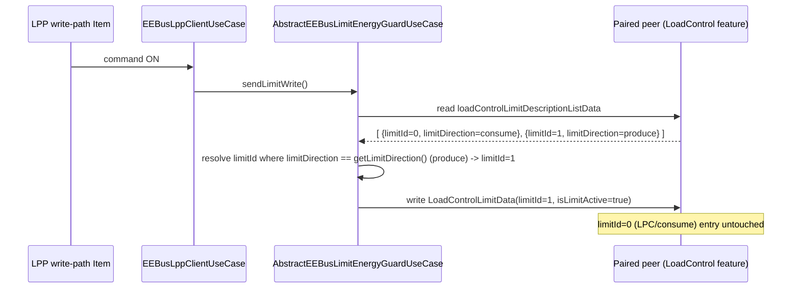

# ADR-018: Distinct limitId assignment for LPC/LPP LoadControl

## Status

Accepted (2026-08-21)

## Context

`AbstractEEBusLimitControllableSystemUseCase` (Server role) and
`AbstractEEBusLimitEnergyGuardUseCase` (Client role) both hardcode a shared
`private static final long LIMIT_ID = 0L;`, used identically by the LPC
(limitationOfPowerConsumption) and LPP (limitationOfPowerProduction) use
cases. Confirmed live on 2026-08-21: toggling the LPC Client-role
`limitActive` Item also flipped the LPP read-back status Channel on the same
paired peer, because both use cases read and write the exact same
`limitId=0` entry.

`jeebus.spine`'s `LimitDescriptionFunction` keys its list-data store by
`limitId` (`DataIdDescription<>(LoadControlLimitDescriptionDataType.class,
List.of("limitId"))`), so a second `addData()` call with the same `limitId`
overwrites rather than appends — this is the collision mechanism, confirmed
by direct source read.

`EEBus_SPINE_TS_LoadControl.xsd` shows `LoadControlLimitDescriptionDataType`
carries `limitId`, `limitType`, `limitCategory`, `limitDirection`,
`measurementId`; `LoadControlLimitDescriptionListDataSelectorsType` supports
filtering/selecting by `limitDirection`. `EnergyDirectionEnumType` has
exactly two literal values, `"consume"` and `"produce"`. No SPINE-mandated
convention fixes the actual `limitId` _value_ — the spec only requires that
distinct limits within one `LoadControl` feature carry distinct `limitId`s
and that a reader can disambiguate them via `limitDirection`.

Confirmed against a real Hager Energy S10 discovery capture
(`discovery-d__i_52158_S10-1.json`) that LPC and LPP genuinely share one
SPINE Entity and one `LoadControl` Feature on certified hardware — this is
not itself a bug and is out of scope for this decision. The discovery
snapshot is structure-only and does not reveal the S10's actual `limitId`
values, so no real-hardware convention can be copied; the binding must
choose its own stable pair for its Server role.

On the Server role, `EEBusLpcServerUseCase`/`EEBusLppServerUseCase` already
correctly implement `protected EnergyDirectionEnumType getLimitDirection()`,
returning `CONSUME`/`PRODUCE` respectively — this abstraction already
exists and is not being changed. On the Client role, no equivalent
`getLimitDirection()` exists yet, and no description-read-then-resolve step
exists for `limitId` — unlike `EEBusMpcClientUseCase#resolvePowerMeasurementId()`,
which already resolves `measurementId` this same way for the MPC use case.

This ADR resolves the two Open Questions recorded in
`docs/changes/lpc-lpp-limitid-resolution/proposal.md`, addressing the
requirements "Server-role LPC and LPP limits use distinct limitId values"
and "Client-role LPC/LPP resolve limitId by limitDirection instead of
assuming it" in
`docs/changes/lpc-lpp-limitid-resolution/specs/lpc-lpp-limit-control/spec.md`.

## Decision

**1. Server role — distinct, stable `limitId` per direction, mirroring the
existing `getLimitDirection()` pattern.**

Replace the shared `LIMIT_ID` constant in
`AbstractEEBusLimitControllableSystemUseCase` with a new abstract accessor:

```java
protected abstract long getLimitId();
```

`EEBusLpcServerUseCase` returns `0L`, `EEBusLppServerUseCase` returns `1L` —
the same values already implicitly in use for LPC (`0`, unchanged, so no
behavior change for existing LPC-only deployments) with LPP moved off the
collision. Any distinct, stable pair satisfies the spec; `0`/`1` is chosen
because it requires no migration for existing LPC consumers and mirrors the
two-literal `EnergyDirectionEnumType` domain (`consume`→`0`,
`produce`→`1`) in the most legible way. These values MUST NOT change once
released, since Client-role peers that fall back to a remembered `limitId`
(rather than re-resolving on every notification) would otherwise silently
break.

**2. Client role — resolve `limitId` by `limitDirection`, mirroring
`resolvePowerMeasurementId()`; no match means no status, never a guess.**

Add a parallel abstract accessor to `AbstractEEBusLimitEnergyGuardUseCase`:

```java
protected abstract EnergyDirectionEnumType getLimitDirection();
```

`EEBusLpcClientUseCase` returns `CONSUME`, `EEBusLppClientUseCase` returns
`PRODUCE`. Add a description-read/resolve step that reads
`loadControlLimitDescriptionListData` from the peer and selects the
`limitId` whose `limitDirection` matches `getLimitDirection()`, structurally
identical to `resolvePowerMeasurementId()`'s existing read-and-filter
pattern. `subscribeLimitStatus`, `applyLimitStatus`, and `sendLimitWrite`
use this resolved `limitId` instead of the removed `LIMIT_ID` constant.

Confirmed failure mode: if the description read fails, or returns no entry
whose `limitDirection` matches, the use case reports no limit status for
that peer and does not process the corresponding
`loadControlLimitListData` value notification — it never falls back to a
guessed or previously-cached `limitId` from a different direction. This
matches the existing convention elsewhere in this class family (e.g. an
`ohPeerHandlerResolver` miss in `AbstractEEBusLimitEnergyGuardUseCase` is
already handled by skipping rather than guessing) and is what
`docs/changes/lpc-lpp-limitid-resolution/specs/lpc-lpp-limit-control/spec.md`'s
Scenario "Peer's description read fails or contains no matching direction"
requires.

## Consequences

### Positive

- LPC and LPP Server-role limit entries coexist in `LimitDescriptionFunction`'s
  data store without overwriting each other; LPC keeps its current
  `limitId=0`, so no behavior change for LPC-only setups.
- Client-role resolution now matches the same spec-intended,
  description-then-value pattern already proven by `EEBusMpcClientUseCase`,
  instead of relying on an assumption that happened to work only by
  accident before LPP was added.
- Toggling one direction's write-path Item can no longer affect the other
  direction's read-back status — the originally reported symptom is
  structurally impossible after this change, not just less likely.
- Both roles gain symmetrical `getLimitId()`/`getLimitDirection()`
  abstractions across Server and Client, keeping the four LPC/LPP subclasses
  consistent with each other.

### Negative

- Two additional abstract methods (`getLimitId()` on the Server base class,
  `getLimitDirection()` on the Client base class) increase the surface every
  future limit-based use case subclass must implement.
- The Client role now depends on a successful description-list read before
  it can report any status; a peer that is slow or fails to answer that read
  will show no LPC/LPP status at all until it succeeds, rather than an
  optimistic (but possibly wrong) guess — an intentional trade-off per the
  spec's "no status reported, don't guess" requirement.
- The chosen Server-side `limitId` values (`0`/`1`) are a binding-internal
  convention, not a SPINE-mandated one; a future real-world peer that
  expects different fixed values would need its own resolution logic, but
  that is exactly what the Client-role fix in this ADR already provides.

## Diagram



---

_Stored at `org.openhab.binding.eebus/docs/ADR/018-lpc-lpp-limitid-assignment.md`._
