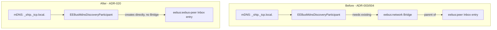

# ADR-020: Merge eebus:network and eebus:peer into a Bridgeless eebus:eebus-peer Thing

## Status

> Accepted

## Context

ADR-003 introduced `eebus:network`, a lightweight Bridge Thing with no mandatory configuration,
as the parent for `eebus:peer` Inbox entries - reasoning that a Bridge was needed for discovered
devices to attach to. In practice this Bridge never became more than that: its handler
(`EEBusNetworkHandler`) holds no SHIP/SPINE identity, defines no channels, and goes `ONLINE`
unconditionally in `initialize()`. CONCEPT.md §4.5 already documented the resulting
`eebus:peer` child as "funktional inert" when this design was revised on 2026-08-04, and its
§7(15) records a 2026-08-21 user proposal to merge the two Thing types away, deferred at the
time until the (unrelated) LPC/LPP limitId bug-fix chain was verified live.

Requiring `eebus:network` to be added manually before any discovered device can appear in the
Inbox is friction with no corresponding benefit, and it undercuts ADR-003's own stated goal -
"background discovery starts the moment the binding is installed" - since discovery results
still cannot surface without this extra step. ADR-004 was written to compensate for the gap this
creates (a device seen via mDNS before the Bridge existed staying invisible until a manual scan),
but its Bridge-add retry listener was never implemented
(`docs/changes/mdns-discovery-retry/tasks.md`, 0/12 tasks). On 2026-08-23 the user asked to
proceed with the full merge now, ahead of the pending live retest for ADR-018/019, rather than
wait further.

## Decision

We will:

1. Remove the `eebus:network` Bridge Thing type and `EEBusNetworkHandler` entirely.
1. Replace the `eebus:peer` Thing type with a bridgeless (top-level) `eebus:eebus-peer` Thing
   type - same `ski` configuration parameter, same "seen, not trusted" semantics, no channels.
   The identifier changes from `peer` to `eebus-peer` (not merely dropping the bridge-type-ref
   from the existing `peer` type) to mark this as a clean replacement rather than a silent
   reinterpretation of the old type's meaning, matching CONCEPT.md §7(15)'s own plan.
1. `EEBusPeerHandler` goes `ONLINE` directly once `ski` is non-blank, instead of mirroring a
   parent Bridge's status that was itself always `ONLINE` unconditionally - a strictly simpler,
   behaviorally equivalent replacement.
1. `EEBusMdnsDiscoveryParticipant` creates Inbox entries unconditionally - no Bridge lookup, no
   Bridge-missing `null` result - while keeping the existing already-known-SKI (CONCEPT.md §4.5)
   and own-service (ADR-008) exclusions unchanged.
1. Retire ADR-004 and the `mdns-discovery-retry` change proposal in full: the gap they addressed
   only existed because of the Bridge this decision removes.
1. Finally delete `EEBusDiscoveryService.java`, the ADR-003 stub pending manual deletion since
   this sandbox's filesystem mount rejects delete/unlink (still true - moved to `_to_delete/`
   again, alongside `EEBusNetworkHandler.java`, for the user to delete manually).

**Explicitly not changed:** `eebus:service` stays a top-level, independently multi-instantiable
Bridge - CONCEPT.md §4.5 already rejected nesting it under `eebus:network` (disable-cascade via
`BRIDGE_OFFLINE` propagation was considered and rejected there), and §7(15) explicitly carries
that rejection forward. This decision does not revisit it. Target Thing-type count is 3
(`eebus:service`, `eebus:eebus-peer`, `eebus:oh-entity`), not 2.

## Consequences

### Positive

- One fewer manual step before discovered devices are usable: no `eebus:network` Bridge to add
  first. This is what ADR-003's own "background discovery starts the moment the binding is
  installed" was aiming for, achieved directly instead of through a mandatory anchor Thing.
- ADR-004 and the entire `mdns-discovery-retry` change (0/12, never started) become unnecessary
  rather than needing to be finished - net reduction in scope, not just moved work.
- One fewer OSGi-managed class (`EEBusNetworkHandler`) and one fewer Thing-type branch in
  `EEBusHandlerFactory` to maintain.
- `EEBusOhPeerSkiOptionProvider` needs no change: it already filters by `THING_TYPE_PEER`
  (renamed constant, same semantics) regardless of parent Bridge, so it keeps working unmodified
  once `THING_TYPE_PEER` points at the new bridgeless type.

### Negative

- No migration path for already-provisioned `eebus:network`/`eebus:peer` Things - accepted
  because this binding has no released users yet (CONCEPT.md's real-hardware testing is a
  single developer's own setup). Existing Things of the removed types stop resolving to a
  handler and must be deleted and re-added as `eebus:eebus-peer`.
- Loses the (already purely cosmetic) ability to disable/enable "all seen real devices" via one
  Bridge switch - `eebus:network` never actually gated anything at runtime, so this is a loss of
  API symmetry with `eebus:service`, not of function.
- Proceeds ahead of the pending live retest/build for `lpc-lpp-limitid-resolution` (ADR-018/019),
  per explicit user direction rather than the originally deferred timing in CONCEPT.md §7(15).
  The next live-retest log will exercise a build containing both changes at once - see
  `docs/changes/merge-network-peer-things/tasks.md` §5.
- Two files could not be deleted from disk in this session (same filesystem-mount limitation
  noted on `EEBusDiscoveryService.java` since ADR-003) - `EEBusNetworkHandler.java` and
  `EEBusDiscoveryService.java` are moved to `_to_delete/` instead and need manual deletion.

## Diagram

---

_References `docs/changes/merge-network-peer-things/specs/thing-model/spec.md` and
`.../specs/discovery/spec.md`. Supersedes ADR-003's decision 1 (introducing `eebus:network`) and
ADR-004 in full; ADR-003's decisions 2-4 (the `MDNSDiscoveryParticipant` mechanism itself,
removing the old `EEBusDiscoveryService`, keeping `EEBusMdnsBrowser` unchanged) remain in force._
