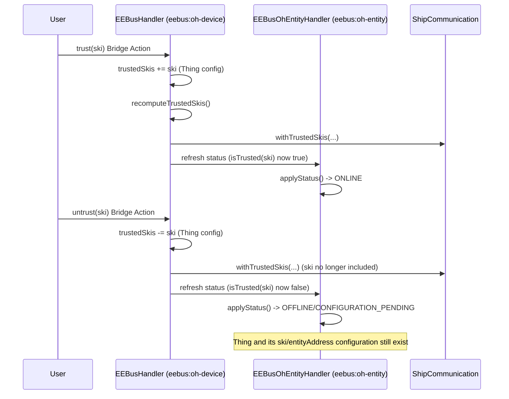

# ADR-024: EEBUS-Vocabulary Thing-Model Rename and Bridge-Level Trust

## Status

> Accepted

## Context

CONCEPT.md's Bridge/Thing type names (`eebus:service`/`eebus:cs-service`, `eebus:eebus-peer`/
`eebus:oh-peer`) predate a close reading of the actual EEBUS/SHIP/SPINE specifications and used
binding-internal vocabulary instead. A `$Concept` discussion (2026-08-23) grounded the naming
against primary sources:

- `EEBus_SHIP_TS_Specification_v1.1.0.pdf` §3 (Terms and Definitions) formally defines "SHIP
  Node" and "Trusted SHIP Node" - "peer" appears only informally, never as a defined term.
- `EEBus_SHIP_Pairing_Service_TS_Specification_V1.0.0.pdf` confirms "Pairing" names a distinct,
  unimplemented QR/PIN-code mechanism in the EEBUS ecosystem - reusing "pairing"-derived names
  (`oh-peer`, `pair()`/`unpair()`) for this binding's own SKI-trust mechanism risks confusion
  with that different, real EEBUS concept.
- `EEBus_SPINE_V1.3.0_Final_hp/Documentation/EEBus_SPINE_TR_Introduction.pdf` §2.2 formally
  defines SPINE's three-level device model: Device -> Entity -> Feature. A Device has one or
  more Entities; an Entity has one or more Features; Use Cases are realized by Features working
  together, actors (Client/Server) are Feature-scoped.

Refining iteratively, the user confirmed a naming scheme that mirrors this hierarchy and a
structural consequence of doing so precisely: SHIP's SKI-based trust is scoped to a _Device_ (one
certificate, one SHIP Node) - not to an _Entity_, which is a sub-part of an already-trusted
Device. `eebus:oh-peer` had been re-scoped (in the same discussion) from representing an entire
paired device to representing one SPINE Entity - at that point, keeping trust-granting Thing
Actions on it (as docs/ADR/012-pairing-trust-property-and-actions.md decided) would be
Entity-granular trust for a Device-granular concept, and would also mean re-granting trust
separately for every Entity Thing on the same already-trusted device.

This ADR covers the requirements in
`docs/changes/oh-device-oh-entity-rename/specs/thing-model-rename/spec.md`.

It **explicitly supersedes ADR-012** on the trust-location point: ADR-012's choice of a Thing
property + `pair()`/`unpair()` Thing Actions, scoped to the paired-device Thing, no longer holds
once that Thing represents an Entity rather than a Device. ADR-012's other reasoning (a
Thing-property is the right persistence primitive for small, restart-surviving facts, matching
`PROPERTY_LOCAL_SKI`) is not overturned - it is superseded by moving the same kind of decision to
a different, more correct scope (Bridge, not Entity Thing) and a different persistence primitive
(Bridge Thing-config, not a Thing property) to match.

## Decision

### 1. Rename every Bridge/Thing type to match SHIP/SPINE vocabulary

| Old id | New id | Type | Meaning |
|---|---|---|---|
| `service` | `oh-device` | Bridge | one local SHIP/SPINE service instance (SHIP Node) |
| `cs-service` | `oh-cs-device` | Bridge | `oh-device` convenience variant, LPC/LPP Server pre-configured |
| `eebus-peer` | `hw-device` | Thing (bridgeless) | a real EEBUS device seen on the network |
| `oh-peer` | `oh-entity` | Thing (child of a Bridge) | one SPINE Entity on an already-trusted device |

Every Java identifier that named the old concept (class/file names, method names, local
variables, constants) is renamed to match, not only the `thing-types.xml` ids - keeping the code
itself readable against the new vocabulary was the entire point of this change, not just the
Main UI labels.

### 2. Trust moves from the Entity Thing to the Bridge

`eebus:oh-device`/`eebus:oh-cs-device` gain a `trustedSkis` Thing-config parameter (a list of
SKIs) - the source of truth `EEBusHandler#recomputeTrustedSkis()` reads, replacing the previous
"every child Thing whose `paired` property is set" query. `eebus:oh-entity` no longer has a
`paired` property, or `pair()`/`unpair()` Thing Actions of its own; its status now asks the
parent Bridge whether it currently trusts the Entity Thing's configured `ski`
(`EEBusHandler#isTrusted(String)`).

### 3. trust()/untrust() Bridge Actions as convenience mutators, not a second store

Purely editing `trustedSkis` in the Bridge's own config form already works (any Thing-config edit
takes effect via the normal dispose/initialize cycle) - but that would mean every trust change
restarts the whole Bridge, including every other already-connected Entity's live session, which
ADR-012 specifically avoided for the single-Entity case via its parameterless Actions. The chosen
mechanism (Options considered below) keeps that live-update property: `EEBusDeviceActions`
exposes `trust(ski)`/`untrust(ski)` `@RuleAction`s, each with one `@ActionInput` for the SKI
(unlike ADR-012's parameterless buttons - a Bridge-level action needs to know _which_ SKI, since
more than one SKI can be trusted per Bridge). Both mutate the same `trustedSkis` config
(`editConfiguration()`/`updateConfiguration()` - the same non-reentrant pattern
`EEBusHandler#persistAutoAssignedPort` already established) and then call
`recomputeTrustedSkis()` directly, exactly as `pair()`/`unpair()` used to.

### Options considered for the trust mechanism (user-decided via explicit scoping question)

**Option A - config-list only.** Simple, purely declarative, no Action-parameter-rendering risk
at all. Rejected as the sole mechanism: loses the "click a button" convenience ADR-012 already
established and confirmed as community-verified UX, and a config-list-only edit still triggers a
full Bridge restart for every trust change.

**Option B - Bridge Actions only, state in a Bridge property (closest to ADR-012's original
shape).** Rejected: needs its own persistence and its own "list current trusted SKIs" read path,
duplicating what a Thing-config list parameter already gives for free (Main UI rendering of the
current list, editability without invoking an Action, validation).

**Option C - config-list as source of truth + Actions as convenience mutators of that same list
(chosen).** Combines both: `trustedSkis` is inspectable/directly editable like any other
Thing-config parameter (no dedicated "list trusted SKIs" read path needed), while `trust()`/
`untrust()` retain ADR-012's live-update, no-restart, single-click UX for the common case of
adding/removing one SKI at a time.

### 4. eebus:oh-entity gains an entityAddress config field

Alongside its existing `ski` (now labeled "Device SKI", reflecting that it no longer grants trust
by itself), `eebus:oh-entity` gains `entityAddress`, recording which SPINE Entity on the trusted
device this Thing represents. This is the config-level foundation for representing more than one
Entity per Device; the transport-layer resolver
(`EEBusHandler#ohEntityHandlerForSki`/`ohEntityHandlerForCommunicationAddress`, feeding every
`*UseCase` class) is **not** changed to route by `entityAddress` in this pass - it continues to
resolve the first `eebus:oh-entity` child matching a given `ski`, Device-level. Multiple Entity
Things sharing one `ski` will currently all observe the same Device-level events. Wiring true
per-Entity routing is deliberately deferred - see the proposal's "Out of scope" and the
still-unimplemented `jeebus.spine` `NodeManagement` notification handling
(github.com/openmuc/jeebus.spine#11), which live structural per-Entity updates would depend on
regardless.

## Consequences

### Positive

- Code and Main UI vocabulary now matches the actual SHIP/SPINE spec hierarchy (SHIP Node/Trusted
  SHIP Node; Device/Entity/Feature), reducing the risk of a contributor or user conflating this
  binding's own concepts with the spec's differently-scoped ones (especially "pairing", which now
  names nothing in this binding, avoiding confusion with EEBUS's own distinct Pairing Service).
- Trust is granted/revoked exactly once per Device, regardless of how many Entities are
  eventually represented under it - previously, re-scoping `oh-peer` to Entity-granularity would
  have meant pairing separately, redundantly, per Entity.
- `trustedSkis` as a Thing-config list is directly visible and editable in the Bridge's own config
  form (e.g. via REST API, `.things` file, or Main UI), not only through invoking an Action -
  useful for bulk/scripted setup, which a pure Action-only design would not offer.

### Negative

- `trust(ski)`/`untrust(ski)` need an `@ActionInput` parameter (the SKI), unlike ADR-012's
  parameterless buttons - Main UI renders this as a plain text field, not a selectable dropdown
  (openHAB Action-parameter rendering does not support a `ConfigOptionProvider`-style options
  list the way Thing-config parameters do); a user must know or copy the SKI from elsewhere (a
  `hw-device` Thing's properties, or the Bridge's own `EEBusSkiOptionProvider`-populated
  `trustedSkis` config field, which does offer a dropdown).
- No automated migration: an existing `eebus:oh-peer` Thing's `paired=true` property has no
  successor value carried forward automatically. The equivalent SKI must be manually (re-)added
  to the new parent Bridge's `trustedSkis` once, after upgrading - consistent with ADR-020's
  Thing-type merge also not being auto-migrated.
- `entityAddress` is presently write-only from the binding's perspective (recorded, not yet acted
  upon) - a config field with no behavioral effect until a follow-up change wires per-Entity
  routing. Documented explicitly rather than left as a silent gap.

## Diagram

---

_Supersedes docs/ADR/012-pairing-trust-property-and-actions.md's trust-location decision - see
CONCEPT.md's 2026-08-23 addendum and
`docs/changes/oh-device-oh-entity-rename/`. ADR-012's persistence-primitive reasoning (Thing
property over `StorageService`) is not itself overturned, only re-applied at Bridge Thing-config
scope instead of Entity Thing-property scope._

_Decision 3 (the `trust()`/`untrust()` Bridge Actions, live and restart-free) is_ _superseded by docs/ADR/027-derive-local-use-cases-from-entities.md (2026-08-24) Decision 6:_ _every configuration change, trust included, now uniformly triggers a full Bridge rebuild;_ _`trustedSkis` is edited only as ordinary Bridge Thing-config. The rest of this ADR - the_ _rename itself, Decision 2 (trust moved to the Bridge), Decision 4 (`entityAddress`) - remains_ _in force._
