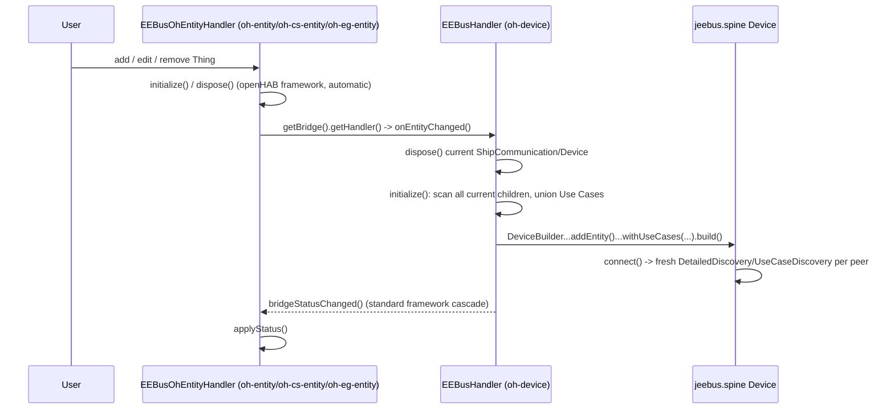

# ADR-027: Derive Local Use Cases From Entity Children; Uniform Full-Rebuild On Any Change

## Status

> Accepted

## Context

Following the `eebus:oh-device`/`eebus:oh-entity` rename (ADR-024) and the convenience Entity
types it enabled (ADR-025/026), a `$Concept` discussion (2026-08-24) challenged a leftover
inconsistency: which Use Cases the local SPINE service offers/detects
(`supportedUseCasesClient`/`supportedUseCasesServer`) was still a checkbox list on the
`eebus:oh-device` Bridge, even though `eebus:oh-cs-entity`/`eebus:oh-eg-entity` already expressed
the equivalent idea - "which Use Cases does this pairing involve" - at the Entity Thing level, via
Thing-type choice instead of a checkbox.

The discussion first explored, and then discarded, introducing a new "local Entity" Thing type to
hold this configuration, on the reasoning that SPINE's Device -> Entity -> Feature hierarchy
implies Use-Case configuration belongs on an Entity. That reasoning does not hold: a single SPINE
Entity can offer multiple Features/Use Cases simultaneously (LPC, LPP and MPC can all be Features
of the same one local Entity) - there was never a need for _multiple_ local Entities, only for the
existing checkbox list to live somewhere other than the Bridge. The actually-needed design is
simpler: derive the local Use-Case set from the **existing** `eebus:oh-entity`/`eebus:oh-cs-entity`/
`eebus:oh-eg-entity` children a Bridge already has, rather than maintaining a separate,
Bridge-level list that duplicates the same intent.

A second, related question came up in the same discussion: whether a full "destroy the local SPINE
`Device` and rebuild it from scratch" is actually safe, given `eebus:oh-device`/`eebus:oh-cs-device`
already restart on most config changes, and given the still-open
`openmuc/jeebus.spine#11` NodeManagement-notification gap (CONCEPT.md's 2026-08-24 addendum,
ADR-024 "Out of scope"). Reading the actual `jeebus.spine` source (read-only - `jeebus.spine`
remains protected, no change proposed or made here) resolved this:

- `DeviceBuilder#addEntity()` and `Device#getUseCases()` (`Map<UseCase, Entity>`) already support
  multiple local Entities with independent Use Cases at build time - this was never blocked by
  `jeebus.spine`, only unused by this binding so far.
- `DeviceImpl#addEntity(Entity)` only calls the live, currently-broken
  `NodeManagement#entityAdded(...)` notification path `if (isConnected())`. Building a complete
  `Device` (every local Use Case, from every currently configured child) **before** ever calling
  `connect()` never touches that broken path at all - the already-verified-working initial
  `DetailedDiscovery`/`UseCaseDiscovery` handshake delivers the complete, correct structure to
  every peer on (re)connect, exactly as it already does today for the single-Entity case.
- Pairing/trust (`trustedSkis`) is Bridge Thing-config, not runtime `Device` state - a full
  dispose-and-rebuild does not lose it.

This made "every configuration change causes a full, safe rebuild" viable as a single, uniform
rule, which in turn made the previous special-casing - `trust()`/`untrust()` Bridge Actions
(ADR-012, relocated by ADR-024 Decision 3) deliberately avoiding a restart - both unnecessary and
inconsistent with the new rule. The user chose to remove that special case rather than keep two
different behaviors (live trust vs. restart-requiring everything else) side by side.

Finally, once the local Use-Case set is derived from Entity children rather than a Bridge
checkbox, `eebus:oh-cs-device` (ADR-023) - a convenience Bridge that existed specifically so a
user would not have to check the LPC/LPP boxes - no longer has anything to be convenient about: a
plain `eebus:oh-device` Bridge with an `eebus:oh-cs-entity` child now gets the identical LPC/LPP
Server behavior for free, no dedicated Bridge type required.

## Decision

### 1. `eebus:oh-cs-device` is removed entirely

Supersedes ADR-023 in full. Its three failsafe seed Thing-config parameters
(`failsafeConsumptionLimitSeedWatts`, `failsafeProductionLimitSeedWatts`,
`failsafeDurationMinimumSeedSeconds`) move onto `eebus:oh-cs-entity` (the child Thing) instead -
see Decision 3.

### 2. `eebus:oh-entity` gains `supportedUseCasesClient`/`supportedUseCasesServer`

Moved from `eebus:oh-device`'s Bridge config onto the generic Entity Thing itself. Each
`eebus:oh-entity` child now declares, individually, which Use Cases its own pairing involves -
matching how `eebus:oh-cs-entity`/`eebus:oh-eg-entity` already express the same idea structurally
instead of via a checkbox. `eebus:oh-device` no longer declares either parameter.

### 3. `eebus:oh-cs-entity` becomes additive under `eebus:oh-device`, gains the failsafe seed fields

`eebus:oh-cs-entity`'s `supported-bridge-type-refs` changes from "exclusive to `eebus:oh-cs-device`"
(ADR-025 Decision 1) to "additive under `eebus:oh-device`" - structurally identical to
`eebus:oh-eg-entity` (ADR-026) now. It gains `failsafeConsumptionLimitSeedWatts`/
`failsafeProductionLimitSeedWatts`/`failsafeDurationMinimumSeedSeconds` as its own Thing-config
parameters (moved from the now-removed `eebus:oh-cs-device`), used to seed the fixed LPC/LPP
Server Use Cases it implies. `eebus:oh-cs-entity` continues to imply LPC+LPP Server unconditionally
by its Thing-type choice alone - no checkbox is added to it.

### 4. `EEBusHandler#initialize()` derives the local Use-Case set from current children

Instead of reading `cfg.supportedUseCasesClient`/`supportedUseCasesServer` from the Bridge's own
config, `initialize()` iterates `getThing().getThings()` and unions:

- each `eebus:oh-entity` child's own configured `supportedUseCasesClient`/`supportedUseCasesServer`,
- each `eebus:oh-cs-entity` child's fixed, implied LPC+LPP Server (seeded from its own failsafe
  fields),
- each `eebus:oh-eg-entity` child's fixed, implied LPC+LPP Client.

The resulting Use Case list feeds the same `DeviceBuilder...addEntity()...withUseCases(...)` call
`startShipSpine()` already makes - only where the list comes from changes, not how it is used to
build the `Device`.

### 5. `EEBusEntityChangeListener`: children trigger their Bridge's rebuild

New binding-internal interface (**not** an openHAB framework feature - the framework only
cascades Bridge status changes down to children automatically, never the reverse):

```java
public interface EEBusEntityChangeListener {
    void onEntityChanged();
}
```

`EEBusHandler implements EEBusEntityChangeListener` - `onEntityChanged()` triggers the same full
dispose-then-initialize cycle `dispose()`/`initialize()` already perform. `EEBusOhEntityHandler`
(shared by `eebus:oh-entity`/`eebus:oh-cs-entity`/`eebus:oh-eg-entity`, ADR-025/026) calls it from
its own `initialize()` and `dispose()`:

```java
Bridge bridge = getBridge();
if (bridge != null && bridge.getHandler() instanceof EEBusEntityChangeListener listener) {
    listener.onEntityChanged();
}
```

Because every child Thing's own `initialize()`/`dispose()` is already invoked automatically by
the openHAB framework whenever that child is added, removed, or has its config edited, this makes
"any child change rebuilds the Bridge" fully automatic from a user's perspective - no manual
Bridge-disable step is required, only offered as an optional way to batch several child changes
into a single rebuild (see Consequences).

### 6. `trust()`/`untrust()` Bridge Actions are removed

Supersedes ADR-024 Decision 3 (and, with it, the corresponding part of ADR-012's already-
superseded history). `EEBusDeviceActions` and `EEBusHandler#trust(String)`/`untrust(String)`/
`persistTrustedSkis(List)` are deleted. `trustedSkis` is edited only as ordinary Bridge
Thing-config (Main UI/REST), which already triggers openHAB's standard
`handleConfigurationUpdate()` -> `dispose()`+`initialize()` cycle - no binding code is needed for
this path at all. `EEBusHandler#recomputeTrustedSkis()`'s live, no-restart push to
`ShipCommunication`/child Things is also removed: with every trust change now going through a full
restart, the standard `bridgeStatusChanged()` cascade already refreshes every child
`EEBusOhEntityHandler#applyStatus()` on its own, and `startShipSpine()` already reads
`trustedSkis` fresh on every `initialize()`.

### 7. Every configuration change is now uniformly a full rebuild

No configuration change - Bridge-level (`trustedSkis`, `port`, etc.) or child-level (adding,
removing, or reconfiguring any `eebus:oh-entity`/`eebus:oh-cs-entity`/`eebus:oh-eg-entity`) - is
"live" any more. Each one disposes the current `ShipCommunication`/`Device` and rebuilds both from
scratch, briefly dropping and reconnecting every currently trusted peer. This is documented
explicitly in `README.md`, including the optional practice of disabling the Bridge before making
several changes, so they take effect together in one rebuild instead of one rebuild per change.

## Consequences

### Positive

- Closes the original vocabulary/hierarchy inconsistency without inventing a Thing type nobody
  needed: "which Use Cases are supported" now genuinely lives on the Entity Thing, matching
  SPINE's own Device -> Entity -> Feature language.
- One Bridge Thing type instead of two - resolves ADR-023's own "Negative" consequence ("a third
  Bridge Thing type to explain").
- One single behavior rule ("any change = full rebuild, automatic") replaces two previously
  different ones (live trust vs. restart-requiring everything else) - simpler to reason about,
  simpler to document.
- Confirmed safe without any `jeebus.spine` change: multi-Entity `Device` construction is already
  supported at build time, and building before `connect()` never touches the broken live-
  notification path (`openmuc/jeebus.spine#11` stays open, but is no longer a blocker for this
  binding's own local Use-Case handling).
- `EEBusEntityChangeListener`, implemented once on the shared `EEBusHandler` and called once from
  the shared `EEBusOhEntityHandler`, automatically covers all remaining Bridge/Entity
  combinations (`eebus:oh-device` with any mix of `eebus:oh-entity`/`eebus:oh-cs-entity`/
  `eebus:oh-eg-entity` children) - no per-Thing-type special-casing needed, continuing the reuse
  pattern ADR-023/025/026 already established.

### Negative

- Broader interruption blast radius than before: previously, only Bridge-level config changes
  caused a restart, and trust changes caused none at all. Now, reconfiguring any single child
  Entity Thing interrupts every other currently-connected peer too, briefly. Mitigated, not
  eliminated, by the optional disable-before-batching practice - must be communicated clearly to
  users (`README.md`).
- Migration, none automated (consistent with every prior Thing-type change in this series):
  - an existing `eebus:oh-cs-device` Bridge and its `eebus:oh-cs-entity` children must be
    manually recreated as `eebus:oh-device` + `eebus:oh-cs-entity` (now additive), including
    re-entering the three failsafe seed values on the child instead of the old Bridge;
  - an existing `eebus:oh-device` Bridge's `supportedUseCasesClient`/`supportedUseCasesServer`
    values are not carried forward automatically onto its `eebus:oh-entity` children - each
    must be manually reconfigured with the Use Cases its own pairing needs.
- `EEBusEntityChangeListener` is a binding-internal mechanism, not something openHAB's framework
  provides for free - child-to-parent lifecycle propagation must be implemented and kept correct
  by hand, unlike the framework's own (one-directional, Bridge-to-child) status cascade.
- Not yet compiled (no Maven in the editing sandbox, same limitation as every ADR in this series)
  or live-retested - reviewed manually only (brace/paren balance checked programmatically per
  touched `.java` file, `thing-types.xml` re-parsed for well-formedness, CRLF preserved
  throughout).

## Diagram



---

_Supersedes docs/ADR/023-cs-service-convenience-bridge.md in full, and
docs/ADR/024-oh-device-oh-entity-rename.md Decision 3 (the `trust()`/`untrust()` Bridge Actions).
Refines docs/ADR/025-oh-cs-entity-static-channels.md Decision 1 (exclusivity) and Decision 4
(config fields) - see that ADR's appended revision note. docs/ADR/026-oh-eg-entity-static-
channels.md's Decisions are unaffected and its additive-child pattern is the one now applied to
`eebus:oh-cs-entity` as well; that ADR's "no Bridge-level guarantee" Negative consequence is
resolved by this ADR - see docs/ADR/026's appended revision note._
