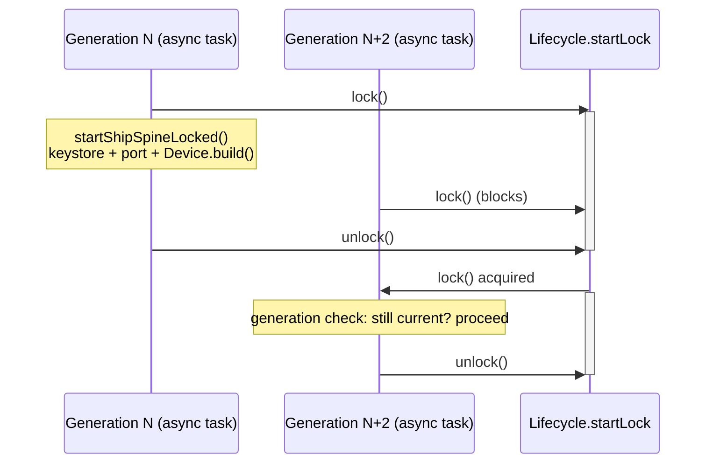

# ADR-028: Serialize startShipSpine() per Thing and debounce onEntityChanged()

## Status

Accepted

## Context

A 2026-08-26 startup trace (see project memory: `eebus-startup-trace-2026-08-26.md`) confirmed
that ADR-005's overlapping-generation scheme - `dispose()`/`initialize()` bump a generation
counter and never block on an in-flight `startShipSpine()`, which only checks after the fact
whether it has been superseded - allows two overlapping generations for the _same_ Thing to
actually execute `startShipSpine()`'s slow body concurrently. ADR-027 made this worse in
practice: every child Entity Thing change (`onEntityChanged()`) now triggers an immediate
`dispose()`/`initialize()` rebuild of the parent Bridge, so a burst of child changes at startup
(or any other rapid config-change sequence) can produce many overlapping generations in a short
window.

Two concrete bugs were confirmed live in the 2026-08-26 trace as a result:

- `org.openmuc.jeebus.ship.api.cert.KeyStoreCertificateStorage#loadKeyStore()` takes a JVM-wide
  file lock (`FileChannel#lock()`, which is scoped per JVM, not per channel) on the Thing's
  `.jks` keystore file. Two overlapping generations for the same Thing opened the same file
  concurrently and one threw `OverlappingFileLockException`. In one case, it was the _current_
  (non-stale) generation that lost this race, leaving that Thing's SHIP session unstarted until
  an unrelated later rebuild happened to occur roughly 37 seconds later - not a bounded or
  guaranteed recovery.
- `EEBusPortPool#reservePort()` logged spurious "not reserved from the pool" warnings from
  overlapping generations re-acquiring the same port, and in one case produced an actual
  `Address already in use` failure for a stale generation's own bind attempt.

A third symptom in the same trace (`IllegalArgumentException: Formats should not be empty` from
`jeebus.ship`'s SHIP client handshake, traced to `StaticConfiguration` intermittently failing to
load `config.properties` via `getResourceAsStream()`) is suspected but not confirmed to be a
further consequence of the same concurrency pressure; it is not addressed here, since its root
cause is not yet confirmed and any fix would likely require a `jeebus.ship` change (protected,
human approval required).

## Decision

We will serialize `startShipSpine()`'s actual work per Thing, and debounce `onEntityChanged()`,
rather than only one of the two:

1. **Per-Thing start lock.** `startShipSpine()`'s existing body is moved, unchanged, into a new
   private `startShipSpineLocked()` method. `startShipSpine()` becomes a thin wrapper that
   acquires a new `ReentrantLock startLock` on the Thing's shared `Lifecycle` object (the same
   static, `ThingUID`-keyed map ADR-005 already uses for the generation counter, for the same
   "more than one `EEBusHandler` object can exist for one Thing" reason) before calling
   `startShipSpineLocked()`, and releases it in a `finally` block. This guarantees that, for a
   given Thing, only one generation's keystore/port/`Device.build()` work is ever in flight at a
   time - a later generation's attempt simply waits its turn. Immediately after acquiring the
   lock, the existing generation check runs again (cheaply, under the short-lived
   `lifecycle.lock`) so a generation that was only queued behind an earlier attempt - and has
   since been superseded - exits before touching the keystore or the port pool at all, rather
   than doing the work and then discovering it should not have. `startLock` is a genuinely
   separate lock object from the existing `lifecycle.lock`: the latter continues to guard only
   brief, in-memory field reads/writes (as ADR-005 requires), while `startLock` is deliberately
   held across slow I/O for an entire start attempt - and, critically, is never acquired by
   `dispose()`, preserving ADR-005's non-blocking-dispose guarantee.
1. **Debounced entity-change rebuild.** `onEntityChanged()` no longer calls
   `dispose()`/`initialize()` synchronously. Instead it (re)schedules a rebuild
   `ENTITY_CHANGE_DEBOUNCE_MILLIS` (500 ms) in the future via the handler's existing `scheduler`,
   cancelling any not-yet-run previously scheduled rebuild first. A burst of child-Entity changes
   within that window therefore produces exactly one rebuild, reflecting the final state, instead
   of one rebuild per change. The pending `ScheduledFuture` is kept on the shared `Lifecycle`
   object (not a plain instance field) for the same multiple-handler-instances-per-Thing reason
   as the generation counter. `dispose()` cancels any still-pending debounced rebuild before
   tearing down, so a `dispose()` that happens for an unrelated reason (the Thing is disabled or
   removed) cannot have a stale timer fire afterward and call `initialize()` again.

Both changes are made together rather than either alone: the lock closes the race window
definitively for same-Thing overlaps, while the debounce reduces how often the window is even
approached, and reduces unrelated log/CPU/network churn from redundant rebuilds. Confirmed with
the user via `AskUserQuestion` before implementation (2026-08-26): the alternative narrower
options (lock only, or debounce only) were presented with their trade-offs; the combination was
chosen.

## Consequences

### Positive

- Closes the confirmed `OverlappingFileLockException` race: two generations for the same Thing
  can no longer access the keystore file concurrently.
- Substantially reduces (though does not entirely special-case away) the `EEBusPortPool` "not
  reserved"/`Address already in use` warnings, since fewer overlapping generations are created
  in the first place and the ones that remain no longer run concurrently.
- A generation that is queued behind another and later found to be stale now exits before doing
  any I/O, rather than after - strictly less wasted work than before.
- No `pom.xml`/dependency change, and no `jeebus.ship`/`jeebus.spine` code touched - entirely
  within the binding, no human-approval gate applies.

### Negative

- `onEntityChanged()` is no longer synchronous: a caller that (incorrectly) assumed the Bridge
  rebuild had already happened by the time `onEntityChanged()` returns would now be wrong.
  Confirmed by reading `EEBusOhEntityHandler#notifyBridgeOfChange()` that no such assumption
  currently exists (it is already a fire-and-forget call) - but this is now a documented
  contract (`EEBusEntityChangeListener`'s javadoc), not just an accident of the current caller.
- Introduces a fixed 500 ms delay between the last child-Entity change and the Bridge actually
  rebuilding, where none existed before. Judged acceptable: this is well below what a user would
  notice as "the Thing didn't update", and openHAB Thing status changes are not typically
  watched at sub-second granularity.
- Does not address the empty-`supportedFormats` symptom from the same trace (see Context) - that
  remains a separate, unconfirmed, and out-of-scope investigation.
- `startLock` being held across `Device.build()` means a slow/hanging build (e.g. a slow
  network) now also delays the _next_ generation's attempt for the same Thing, where previously
  it would have started immediately (and then had to shut back down once superseded). In
  practice this is judged an improvement, not a regression: the previous "immediately start,
  race, and shut back down if superseded" behavior is exactly what caused the keystore/port
  races being fixed here.

## Diagram

