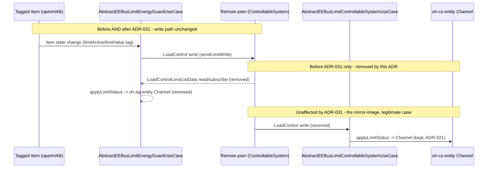

# ADR-031: Remove EnergyGuard (Client-Role) LPC/LPP Monitoring Channels

## Status

Accepted

## Context

User correction (2026-08-27, `$Concept`): "Die Channels für den Energy Guard sind unnötig. Wir
hatten vereinbart er empfängt nur Werte über tagged items. Ein Controllable System empfängt die
Werte und bildet Sie über Channels ab." (The Channels for the Energy Guard are unnecessary - we
had agreed it only receives values via tagged Items; a Controllable System receives values and
maps them onto Channels.)

Reading the actual implementation confirmed the correction is accurate and precise:
`AbstractEEBusLimitEnergyGuardUseCase` (the EnergyGuard/Client-role LPC/LPP implementation) did
two independent things per resolved peer: (1) `registerWriteListeners`/`sendLimitWrite` - the
tagged-Item-driven write path, sourced from an openHAB Item and pushed onto the peer's
`LoadControl` feature; this is the EnergyGuard's actual job and stays completely unchanged. (2)
`subscribeLimitStatus`/`applyLimitStatus(RequestResult, ...)` - a read-then-subscribe of the
same peer's `LoadControlLimitListData`, mirroring the peer's own reported status onto a Channel
via `EEBusOhEntityHandler#applyLimitStatus`. This second path is `docs/ADR/014-dynamic-client-
role-channels.md`'s general dynamic-Channel mechanism (built for MPC), applied to LPC/LPP by
`docs/ADR/015-lpc-lpp-client-role-channels.md` ("Client-Role Monitoring Channels", Scenario 1),
and later given a static `<channel-groups>` declaration on `eebus:oh-eg-entity` by
`docs/ADR/026-oh-eg-entity-static-channels.md`/`docs/ADR/027-derive-local-use-cases-from-
entities.md`.

That monitoring path is exactly what the user's correction targets: the EnergyGuard already owns
the value it writes (the tagged Item is the source of truth) - reading the peer's own echo of
that same value back into a second, read-only Channel duplicates data openHAB already has. The
Controllable-System (Server) side is the mirror image and is **not** affected by this ADR: `
AbstractEEBusLimitControllableSystemUseCase` _receives_ a write from a remote EnergyGuard it has
no local Item for, so its Channel (`docs/ADR/021-controllable-system-limit-status-channel.md`,
`docs/ADR/022-controllable-system-failsafe-status-channel-and-startup-sync.md`,
`eebus:oh-cs-entity`'s static declaration from `docs/ADR/025-oh-cs-entity-static-channels.md`)
is the only place that value is visible - exactly the "Controllable System receives the values
and maps them via Channels" half of the user's statement.

## Decision

**Remove the read/subscribe half of `AbstractEEBusLimitEnergyGuardUseCase` entirely; keep the
write path untouched.** `subscribeLimitStatus(...)` and `applyLimitStatus(RequestResult, long,
EEBusOhEntityHandler)` are deleted. `resolveLimitIdAndSubscribe(...)` - which previously wired up
both paths after resolving `limitId` - is renamed to `resolveLimitIdAndRegisterWriteListeners`
and now only calls `registerWriteListeners(...)`; `resolveLimitId` itself is unchanged (the write
path still needs it). `EEBusOhEntityHandler#applyLimitStatus(String, boolean, double)` itself is
**not** removed - it is still the correct, actively used mechanism for the Controllable-System
side (`AbstractEEBusLimitControllableSystemUseCase#onStateChanged`, ADR-021) - only the
EnergyGuard-side call site is removed.

**`eebus:oh-eg-entity` loses its static `<channel-groups>` declaration; the Thing type itself
stays.** Its "mere presence under `eebus:oh-device` unconditionally implies LPC+LPP Client"
behavior (`docs/ADR/027-derive-local-use-cases-from-entities.md`) is a property of the Thing
type existing as a distinct child, not of its Channels, so that value is retained even with no
Channels declared. A plain `eebus:oh-entity` used for the EnergyGuard role behaves identically
after this change (no Channel is created dynamically either, since the only remaining caller of
`applyLimitStatus` is the Controllable-System use case) - `oh-eg-entity` is left in place purely
for the "no checkbox to forget" guarantee, not for any Channel it once offered.

**`docs/ADR/015-lpc-lpp-client-role-channels.md` is fully superseded** - every decision point in
that ADR (the monitoring Channel mechanism itself) is undone by this one; its sibling write path
was added independently afterward (CONCEPT.md's tag-syntax design session, 2026-08-21) and is
unaffected. **`docs/ADR/026-oh-eg-entity-static-channels.md` is only partially revised** - its
Thing-type decision stands, only its Channel-declaration half is withdrawn; it keeps its
`Accepted` status with a pointer note rather than being marked superseded outright.

## Consequences

### Positive

- Removes a genuinely redundant data path: the EnergyGuard's own tagged Item was always the
  single source of truth for the value it writes; the removed Channel could only ever echo that
  same value back (when a real peer cooperated) or sit stale/`NULL` (when it did not), neither of
  which added information a user could not already see on the Item.
- Deletes real code and its upkeep burden: one SPINE subscription (`requestSubscription`), one
  extra read, and one Channel-update call per peer, for a Channel Group that had no independent
  value.
- `eebus:oh-eg-entity` and `eebus:oh-entity` (EnergyGuard role) become behaviorally identical
  except for the "guaranteed LPC/LPP Client, no checkbox" property - a strictly simpler mental
  model than before, when a subtle difference in _which_ Channels populated (both types
  nominally offered the same four, but only via two entirely different code paths depending on
  Thing type) existed without being load-bearing.
- The Controllable-System side, its Channels, and its ADRs (021/022/025) are untouched -
  verified by grep that this change's only production call-site removal
  (`ohEntityHandler.applyLimitStatus(...)` inside the deleted `applyLimitStatus(RequestResult,
  ...)`) has no effect on the Server-role method of the same name on the same handler class.

### Negative

- A user who was actually relying on `oh-eg-entity`'s Channels to see "what does the real peer
  currently report" (as opposed to "what did I last command") loses that visibility - this ADR
  treats that as out of scope per the user's explicit correction, not as an oversight, but it is
  a real capability reduction if anyone had built a sitemap/rule against those Channels.
- `eebus:oh-eg-entity` now exists purely for its "guaranteed Use Case, no checkbox" property with
  no Channels of its own to show for it in the Main UI - a new user comparing it to
  `eebus:oh-cs-entity` (which still has four visible Channels) may reasonably wonder why the
  EnergyGuard-side counterpart looks empty; mitigated only by the thing-types.xml/README
  descriptions explaining the write-only role, not by any UI affordance.
- Reverts part of prior, explicitly `Accepted` ADRs (015 fully, 026 partially) rather than
  amending a `Proposed` design - a legitimate but not free "we changed our mind after building
  and testing it" cost, not a "we caught a bug before it shipped" one.

## Diagram

---

_Supersedes `docs/ADR/015-lpc-lpp-client-role-channels.md` in full. Revises
`docs/ADR/026-oh-eg-entity-static-channels.md` (Thing type kept, Channel declaration removed) and
touches the Channels description in `docs/ADR/027-derive-local-use-cases-from-entities.md`'s
downstream docs (README.md, CONCEPT.md) without changing that ADR's own decision. Does not touch
`docs/ADR/014-dynamic-client-role-channels.md` (still valid for MPC) or the Controllable-System
side (`docs/ADR/021`/`022`/`025`, all unaffected)._
