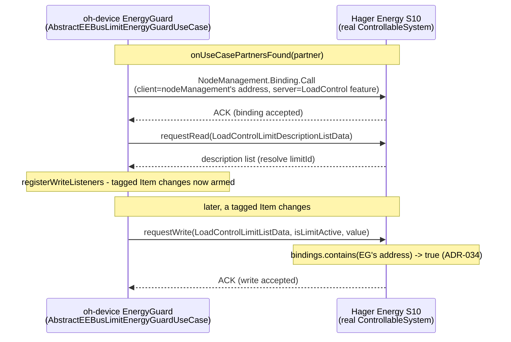

# ADR-034: Bind to the peer's `LoadControl` feature before writing LPC/LPP limits

## Status

Accepted

## Context

Real-device test (2026-09-02, chat, Hager Energy S10 as ControllableSystem + `eebus:oh-device`
EnergyGuard) writing an LPC limit produced, on every write:

```text
[WARN ] [rnal.transport.EEBusLpcClientUseCase] - lpc limit write failed (active=true, value=4200.0 W)
  for feature FeatureAddressType[device=d:_i:52158_S10-1, entity={6}, feature=10]
org.openmuc.jeebus.spine.api.SpineException: Error Number 9 (BINDING_NECESSARY): Client not bound
    at org.openmuc.jeebus.spine.impl.DeviceImpl.getSpineException(DeviceImpl.java:330)
    at org.openmuc.jeebus.spine.impl.DeviceImpl.tryRequestCompletion(DeviceImpl.java:305)
    ...
```

The stack trace is our own device parsing a `REPLY` datagram - i.e. this is the Hager device
rejecting our `LoadControlLimitListData` WRITE, not a local exception. `jeebus.spine`'s
`FeatureImpl#write` (server-side receive path, for reference - not the code that runs on our
side against a real Hager) shows exactly this gate:

```java
if (function.bindingRequired() && !bindings.contains(
        addressToString(datagram.getHeader().getAddressSource()))) {
    SpineAcknowledgment ack = new SpineAcknowledgment(Error.BINDING_NECESSARY, "");
    throw ack.getThrowable();
}
```

A SPINE server may require a client to have an active NodeManagement **binding** to a feature
before accepting writes to it (`bindingRequired()` on the relevant `FeatureFunction` - a
per-function flag, not something this project's `jeebus.spine` copy controls for a third-party
peer like the Hager device). `AbstractEEBusLimitEnergyGuardUseCase` (the Client/"EnergyGuard"-role
class shared by `EEBusLpcClientUseCase` and `EEBusLppClientUseCase`) never sent one: it went
straight from use-case-partner discovery (`onUseCasePartnersFound`) to reading the peer's
`loadControlLimitDescriptionListData` and then, once a tagged Item changed, writing
`LoadControlLimitListData` (`sendLimitWrite`) - with no `NodeManagement.Binding.Call` ever
issued in between. This binding's own Server-role code
(`AbstractEEBusLimitControllableSystemUseCase`, `EEBusLpcServerUseCase`/`EEBusLppServerUseCase`)
never needed this either, since it only _receives_ writes, never sends them.

`Feature` (`jeebus.spine`'s public client API, already used elsewhere in this class via
`NodeManagement extends Feature`) already exposes exactly the call needed:

```java
CompletableFuture<RequestResult> requestBind(FeatureAddressType address, FeatureTypeEnumType featureType);
```

confirmed (read-only) against `FeatureImpl#requestBind` (jeebus.spine): it builds a proper
`NodeManagementBindingRequestCallType.BindingRequest` from `getAddress()` (the calling `Feature`
instance's own address) to `address`, and sends it to the peer's NodeManagement. Since
`resolveLimitIdAndRegisterWriteListeners`/`sendLimitWrite` already send their `requestRead`/
`requestWrite` calls via `localDevice.getNodeManagement()` (not a dedicated local `LoadControl`
feature - see `getFeatureRequirements`'s "no local LoadControl feature is needed" comment), calling
`requestBind` on that same `nodeManagement` object produces a `BindingRequest.clientAddress`
identical to the `addressSource` of the writes it is meant to unlock - i.e. no separate local
feature or address bookkeeping is needed to fix this.

No `jeebus.ship`/`jeebus.spine` change is needed or possible here without prior human approval
(project instruction) - and none is required: the fix is entirely a missing client-side call in
`org.openhab.binding.eebus`.

## Decision

In `AbstractEEBusLimitEnergyGuardUseCase#resolveLimitIdAndRegisterWriteListeners`, send the
binding request first and only proceed to the existing description-read step (and, on success,
`registerWriteListeners`) once it completes:

```java
nodeManagement.requestBind(featureAddress, FeatureTypeEnumType.LOAD_CONTROL).thenCompose(bindResult -> {
    CmdType descriptionReadCmd = new CmdType()
            .withLoadControlLimitDescriptionListData(new LoadControlLimitDescriptionListDataType());
    return nodeManagement.requestRead(featureAddress, descriptionReadCmd);
}).thenAccept(result -> {
    // unchanged: resolveLimitId + registerWriteListeners
}).exceptionally(ex -> {
    // unchanged shape, message now covers both steps
});
```

`registerWriteListeners` (and therefore `sendLimitWrite`) is only ever reached after a
_successful_ bind, so a peer that refuses the binding (e.g. permission/trust-level denial) never
gets an unbound write attempt that would just fail the same way again - it logs once and the
write path for that peer stays disabled, matching the existing failure shape for a failed
`limitId` resolution.

This affects `EEBusLpcClientUseCase` and `EEBusLppClientUseCase` identically, since both are thin
subclasses of `AbstractEEBusLimitEnergyGuardUseCase` and share this method - one fix covers both
LPC and LPP.

### Alternative considered: bind once per write instead of once per partner

Call `requestBind` inside `sendLimitWrite` itself, immediately before `requestWrite`, every time a
tagged Item changes.

- **Pros:** self-healing if a peer ever drops its binding table (e.g. after a peer-side restart)
  without this binding noticing.
- **Cons:** doubles the round-trips on every single limit write (most of which, once bound, is
  pure overhead - Hager's own binding table is not expected to churn mid-session), and this
  binding has no equivalent "re-bind on suspected staleness" logic anywhere else to justify the
  asymmetry. If a real peer is later found to drop bindings under some condition, that is better
  handled the same way ADR-030 handled a similar one-shot-vs-retry gap (targeted retry logic),
  not by paying the cost on every write unconditionally. Rejected for now.

## Consequences

### Positive

- Closes the reported symptom: an LPC/LPP limit write against a peer that enforces
  `BINDING_NECESSARY` (confirmed live against a Hager Energy S10) now succeeds instead of failing
  on every attempt.
- One fix in the shared `AbstractEEBusLimitEnergyGuardUseCase` covers both LPC and LPP.
- Reuses the existing `nodeManagement` object and its already-correct addressing - no new local
  feature, no new address bookkeeping, no `jeebus.spine`/`jeebus.ship` change.
- Failure shape is preserved: a bind failure (like a read failure before it) leaves the write path
  disabled for that peer rather than half-registering it.

### Negative

- Adds one extra SPINE round-trip (the bind) to use-case-partner setup, once per partner, before
  the write path becomes usable - negligible, one-time cost at discovery time, not per write.
- Does not handle a peer that later revokes an already-granted binding (see "Alternative
  considered" above) - out of scope for the reported symptom.
- Source-level only, **not yet compiled or live-tested** - no local Maven/openHAB instance
  available in this environment (same limitation noted in every prior ADR in this project).
  Self-QA done: brace/paren balance (211/211, 287/287) and CRLF-only line endings (572/572, 0 bare
  LF, 0 tabs) verified on the touched file after the edit - this file already used CRLF
  throughout, unlike some other files in this codebase that use LF only, so the edit was written
  to preserve CRLF rather than convert it.

## Diagram



## Not yet done / user-owned

- `mvn clean install` + a live retest against the Hager Energy S10: confirm the `BINDING_NECESSARY`
  error is gone and the limit write is accepted end-to-end (Hager applies the limit).
