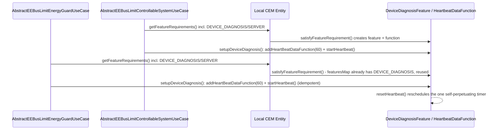

# ADR-035: EnergyGuard actor sends its own outgoing Heartbeat

## Status

Accepted

## Context

CONCEPT.md §7 item (19): `AbstractEEBusLimitEnergyGuardUseCase` (the Client-/"EnergyGuard"-role
LPC/LPP implementation, shared by `EEBusLpcClientUseCase`/`EEBusLppClientUseCase`) declared no
local `DeviceDiagnosis` Server feature and never called `startHeartbeat()` - its own class
Javadoc documented this explicitly as "Not implemented here". Scenario 3 (Heartbeat) is mutual
per the primary source (`EEBus_UC_IG_GeneralGuidelines_V1.0.0.pdf`): "in the LPC Use Case, the
'EnergyGuard' (Client Actor) hosts a Server Feature to provide its own heartbeat to the
'ControllableSystem' (Server Actor)" - a real, strict ControllableSystem peer (e.g. a Hager
Energy S10) may not consider this binding a fully spec-compliant EnergyGuard without it.

The Controllable-System (Server) role already implements exactly this on its own side
(`AbstractEEBusLimitControllableSystemUseCase#setupDeviceDiagnosis`): a two-line, self-
perpetuating pattern -

```java
DeviceDiagnosisFeature deviceDiagnosisFeature = findFeatureWrapper(localEntity,
        FeatureTypeEnumType.DEVICE_DIAGNOSIS, DeviceDiagnosisFeature.class);
deviceDiagnosisFeature.addHeartBeatDataFunction(60);
deviceDiagnosisFeature.startHeartbeat();
```

- confirmed by reading `HeartbeatDataFunction#startHeartbeat()`'s own source: it calls
`increaseCounterAndNotifySubscribers()`, which reschedules its own next firing
(`resetHeartbeat()`) before returning - fully self-perpetuating, no polling loop or scheduled
task needs to live in this binding.

User decision (2026-08-23, recorded in CONCEPT.md item 19): explicitly reject a ThingAction+Rule
design for this ("ein vergessenes/falsch konfiguriertes Rule wäre ein stiller Fehler bei einem
sicherheitsrelevanten Mechanismus") in favor of the low-risk fix: mirror the Controllable-System
side's proven two-liner into the EnergyGuard side.

**Shared-Entity risk, checked before implementing:** `oh-device`'s `deriveLocalUseCases()`
(`EEBusHandler.java`) adds Controllable-System-role and EnergyGuard-role LPC/LPP Use Cases onto
the _same_ single local CEM `Entity` (its own Javadoc: "SPINE's local CEM Entity is built with
one Use-Case implementation per abbreviation... added to the same local entity via
`withUseCases(...)`"). If both roles are active on the same Bridge, both would now declare a
`DeviceDiagnosis`/`SERVER` `FeatureRequirement`. Read (not modified) `jeebus.spine`'s
`EntityImpl#satisfyFeatureRequirement` to confirm this is safe:

- `featuresMap` is keyed by `FeatureTypeEnumType` alone (not by type+role) - a second
  `FeatureRequirement` of the same type resolves to the _same_ `Feature` instance instead of
  creating a duplicate.
- `Feature#getOrAddFunction(functionType)` (used both by `satisfyFeatureRequirement` and by
  `DeviceDiagnosisFeature#addHeartBeatDataFunction`) is a get-or-create - a second call returns
  the already-attached `HeartbeatDataFunction` instance rather than adding a second one.
- `HeartbeatDataFunction#startHeartbeat()`/`resetHeartbeat()` cancels any pending scheduled
  future before scheduling the next one - a second `startHeartbeat()` call resets the timer (and
  fires one extra immediate Heartbeat notification) but never accumulates a second parallel
  timer.

Net effect: if only the EnergyGuard role is active, this change creates the local Heartbeat
feature fresh, closing the compliance gap. If both roles are active on the same Bridge, the two
`setup()` calls harmlessly share one feature and one Heartbeat schedule - at most one extra
Heartbeat notification at startup, no duplicate feature, no duplicate periodic timer. No change
to `jeebus.ship`/`jeebus.spine` is needed or was made.

## Decision

`AbstractEEBusLimitEnergyGuardUseCase` now declares a `DeviceDiagnosis`/`SERVER`
`FeatureRequirement` (function `HeartbeatDataFunction`) in `getFeatureRequirements()`, and its
`setup()` calls a new private `setupDeviceDiagnosis(Entity)` method - an exact mirror (not
shared, per this codebase's existing "each Use Case class is self-contained" convention) of
`AbstractEEBusLimitControllableSystemUseCase`'s method of the same name, including its private
`findFeature`/`findFeatureWrapper` helpers.

The EnergyGuard side still does **not** watch/consume the ControllableSystem peer's own incoming
Heartbeat - unlike the Controllable-System side, which runs `EEBusLimitControlStateMachine` (a
failsafe state machine that must react to the Energy Guard's Heartbeat loss by falling back to
an unlimited/failsafe state), the EnergyGuard's limit-write path is not gated by the peer's
Heartbeat status and has no equivalent watchdog to feed. Only the _outgoing_ half of the mutual
Heartbeat requirement was missing, and only the outgoing half is added here.

## Consequences

### Positive

- Closes CONCEPT.md §7 item (19) - a strict real ControllableSystem peer (Hager Energy S10 or
  similar) can now see this binding's EnergyGuard side as a fully spec-compliant Scenario 3
  actor.
- Zero operational risk accepted by design: no scheduler/polling code added to this binding
  (`HeartbeatDataFunction` is self-perpetuating), and no ThingAction+Rule dependency that could
  silently fail if forgotten or misconfigured.
- No behavior change for any existing Bridge that only ever used the Controllable-System role -
  the shared-feature idempotency means nothing changes for it.

### Negative

- A Bridge running both roles on the same Entity now sends one extra immediate Heartbeat
  notification at startup (from the second `startHeartbeat()` call) - cosmetic, has no
  functional effect since a Heartbeat's only observable meaning is "counter increased,
  subscriber notified within the timeout window".
- Still no local watchdog reacting to a _received_ Heartbeat on the EnergyGuard side (out of
  scope, see docs/changes/energy-guard-outgoing-heartbeat/proposal.md "Out of scope") - if a
  future scenario needs the EnergyGuard side to react to Heartbeat loss from a
  ControllableSystem peer, that is a separate, unscoped change.

## Diagram (optional)


