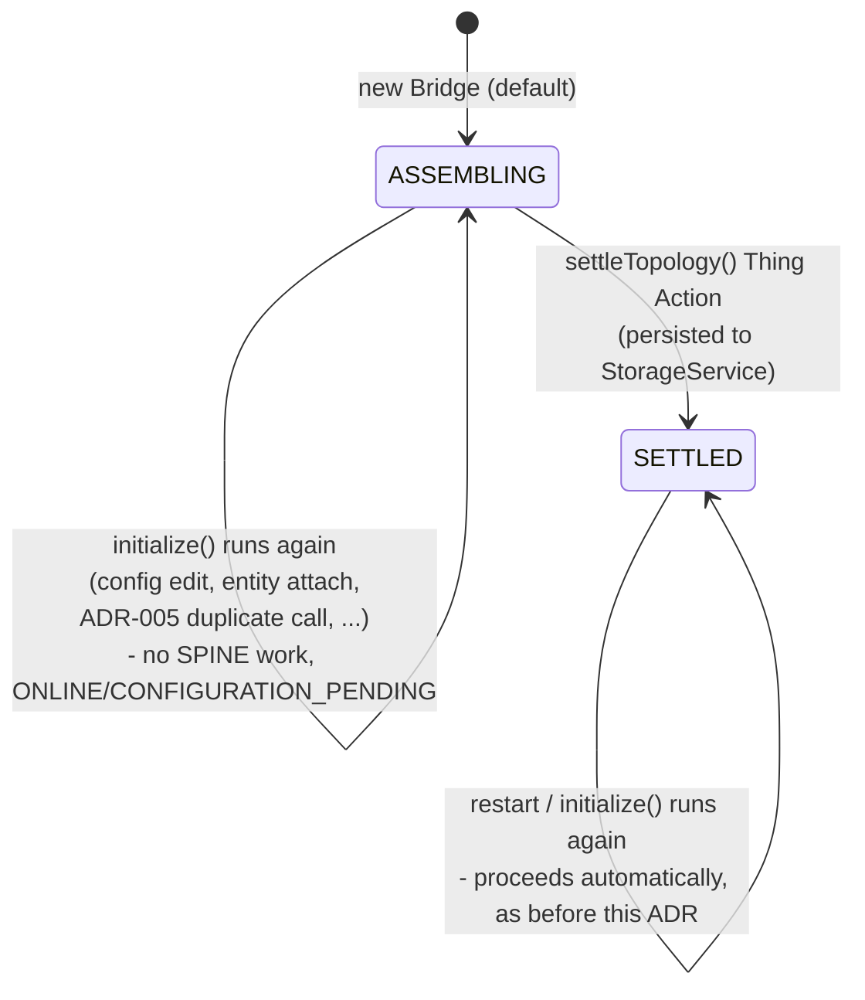

# ADR-043: Per-Bridge topology phase gate (ASSEMBLING/SETTLED)

## Status

Accepted

## Context

Investigating the 2026-09-04 local-rig finding that Heartbeat notifications silently stop being
delivered after a reconnect (see project memory: `eebus-lpc-command-rejected-2026-09-02.md`,
"CONFIRMED 2026-09-04" section) surfaced two separate, compounding problems:

1. A confirmed `jeebus.spine`-level bug: `FeatureImpl`'s client-side `subscriptions` cache
   (keyed only by remote address string) does not detect that the remote peer's underlying
   `FeatureImpl` was torn down and rebuilt by a fresh `Device` build (`UseCase#setup()` runs once
   per rebuild, per that interface's own javadoc). The client silently skips re-subscribing after
   a peer-side reconnect, leaving the new generation's server-side `subscribers` list - what
   `notifySubscribers()`/`sendHeartbeat()` actually iterates - permanently empty. This is a
   `jeebus.spine` bug; fixing it requires modifying that protected project, which needs prior
   human approval not yet sought.
1. A grep across the full log since a genuine cold restart (both `oh-eg-device` and
   `oh-cs-device` Things disabled, then re-enabled) at 14:25 showed 5 separate "starting
   heartbeat" cycles (i.e. 5 full local SPINE `Device` rebuilds) within the following 11 minutes,
   for what should have been one single startup. `EEBusHandler`'s own class javadoc already
   documents (ADR-005) a live-reproduced, still-unexplained openHAB-core-level phenomenon where
   `initialize()` runs more than once for the same Thing without an intervening `dispose()` -
   this is almost certainly the same phenomenon, now newly implicated as also breaking Heartbeat
   delivery (via problem 1 above), not just risking the port-bind race ADR-005 already mitigates.

Problem 1 is out of scope for this binding to fix directly (protected `jeebus.spine`, approval
not sought). Problem 2's root trigger is also out of scope (ADR-005's own "Negative" section
already documents this as an open openHAB-core mystery). What is in scope: reducing how much
this binding is _exposed_ to the two combined during the specific window where the exposure is
worst and least necessary - the initial setup/change phase, where a human is actively creating a
Bridge, attaching `eebus:oh-entity` Things, and adjusting configuration, and where
`onEntityChanged()`'s debounced full-rebuild-on-every-config-change design (ADR-027, ADR-028)
means bursts of rebuilds are actually expected/by-design, not anomalous - it is exactly this kind
of burst that problem 1 turns into a silently-broken Heartbeat subscription.

The previous mechanism along these lines - ADR-012's `pair()`/`unpair()` Thing Actions and
`paired` Thing property on the (since-renamed) `eebus:oh-peer` Thing - was superseded by
ADR-024, which moved trust to Bridge-level config and explicitly retired the "pairing"
terminology (the real EEBUS Pairing Service is a distinct, unimplemented QR/PIN-code mechanism;
reusing "pairing"-derived names risks confusion with it). That mechanism does not fit this
problem anyway - it gated _trust_ of a specific peer, not _whether this Bridge does any
SPINE work at all_, and no literal `ThingStatusDetail.UNPAIRED` value exists in openHAB core.

## Decision

Introduce `EEBusTopologyPhase`, a "superordinate binding status" per `eebus:oh-device`/
`eebus:oh-cs-device` Bridge, persisted in openHAB's `StorageService` (mirroring the existing
`keystoreStorage` pattern from ADR-010, in its own separate `Storage<String>` namespace keyed by
`<Thing UID>-topology`):

- **`ASSEMBLING`** (default, including for a brand-new Bridge): `initialize()` returns
  immediately after config validation - before reserving a port, touching the SHIP keystore, or
  building/connecting a SPINE `Device` - no matter how many times `initialize()` itself runs.
  `ThingStatus` is set to `ONLINE`/`CONFIGURATION_PENDING` with an explanatory message. This
  sidesteps problems 1 and 2 above entirely during setup/change: a burst of rebuilds while
  `ASSEMBLING` now does nothing at all on the network, so there is nothing for the
  `jeebus.spine` subscription-cache bug to desync in the first place.
- **`SETTLED`**: `initialize()` proceeds exactly as it did before this change (resolve port,
  `startShipSpine`, etc.).

The transition from `ASSEMBLING` to `SETTLED` is a new, explicit, parameterless Thing Action,
`settleTopology()`, on a new `EEBusTopologyActions` class (`@ThingActionsScope(name = "eebus")`,
`ThingActions`/`ThingHandlerService`, registered via a reinstated `EEBusHandler#getServices()`) -
the binding's first live Thing Action since `EEBusDeviceActions` was removed by ADR-027 Decision 6.
Calling it while already `SETTLED` is a no-op. Calling it while `ASSEMBLING` persists `SETTLED`
and calls `EEBusHandler#initialize()` directly (not `dispose()` first - while `ASSEMBLING`,
nothing was ever started, so there is nothing to tear down).

Once persisted as `SETTLED`, the phase survives restarts: a future `initialize()` - including
the very first one after a restart - sees `SETTLED` and proceeds automatically, with no manual
step required again. Only a Bridge that has never been settled (or one a human deliberately
wants to re-gate) stays in `ASSEMBLING`.

The phase is deliberately scoped **per Bridge** (`oh-device`), not global to the binding - each
`eebus:oh-device`/`eebus:oh-cs-device` Thing settles independently.

## Consequences

### Positive

- Removes this binding's exposure to the confirmed `jeebus.spine` subscription-cache desync bug
  (and to ADR-005's still-unexplained duplicate-`initialize()` phenomenon) during exactly the
  phase where both are most likely to occur and where their combination is most damaging - a
  human actively assembling/reconfiguring a Bridge and its entities.
- No `jeebus.ship`/`jeebus.spine` code touched - entirely confined to
  `org.openhab.binding.eebus`, consistent with the standing constraint on those two protected
  projects.
- Reuses the existing `StorageService` persistence pattern (ADR-010) and the existing
  generation-counter/lock machinery in `initialize()` (ADR-005/ADR-028/ADR-029) without changing
  either - the gate is a single early-return check, and `settleTopology()`'s call into
  `initialize()` goes through that same, already-hardened path.
- Explicit and inspectable: the Bridge's `ThingStatusDetail` message tells a human exactly what
  to do, and the phase is a simple two-value enum, not an inferred/derived state.

### Negative

- Does not fix either underlying cause - the `jeebus.spine` client-side subscription-cache bug
  (problem 1) and ADR-005's open "why does `initialize()` run more than once" question (problem
  2) remain fully open. A Bridge already `SETTLED` that then experiences the same duplicate-
  rebuild/reconnect churn during normal operation (not just setup) is exactly as exposed as
  before this change - this is a mitigation for the setup/change window, not a general fix.
- Requires a manual step (the `settleTopology()` Action) the first time a Bridge is set up,
  where previously it would connect automatically as soon as configuration was valid - a
  behavior change a user could initially find surprising if not aware of this mechanism.
- `EEBusTopologyActions` uses the standard `ThingActions`/`ThingActionsScope`/`RuleAction`
  openHAB core API, which is stable and used identically across many bindings, but - like every
  change in this project so far - has not been build-verified against the pinned openHAB core
  version, since no local Maven/JDK is available in the environment these changes were written
  in.
- `settleTopology()` re-running `initialize()` bumps the Thing's generation counter (ADR-005)
  exactly as any other `initialize()` call would; this is intentional and harmless (nothing was
  previously started while `ASSEMBLING` to be superseded), but is a slightly unusual use of
  `initialize()` as something other than a framework-driven lifecycle callback, worth noting for
  future readers of `EEBusHandler`.

## Diagram

## Update 2026-09-04: added unsettleTopology() (development/testing convenience)

A live retest confirmed the intended flow works: `settleTopology()` correctly no-ops on a Bridge
already `SETTLED` (`eebus:oh-device:ba56bcd5a0`, called twice, both ignored), and correctly
transitions a genuinely `ASSEMBLING` Bridge (`eebus:oh-device:energy-guard-sim`) - persisting
`SETTLED` and calling `initialize()`, which then proceeded to `startShipSpine()` for the first
time ever for that Bridge (see project memory for the unrelated `IllegalArgumentException` that
surfaced on that first real attempt - a pre-existing `entityType`/Use-Case compatibility gap from
ADR-042, not a defect in this gate).

That same retest highlighted a workflow gap during development: once a Bridge is `SETTLED`,
re-testing the `ASSEMBLING` gate itself (e.g. after fixing a config issue exposed by the first
real connection attempt) had no way back short of deleting/recreating the Thing or a full restart
after manually clearing the persisted phase. Added a symmetric `unsettleTopology()` Thing Action
(`EEBusTopologyActions`/`EEBusHandler#unsettleTopology()`): persists `ASSEMBLING` and runs a full
`dispose()` + `initialize()` rebuild (unlike `settleTopology()`, there is generally a live
connection to tear down here, so `dispose()` is needed first). No-op if already `ASSEMBLING`.

This is explicitly a development/testing convenience, not part of the original production
workflow (which only ever needs the one-way `ASSEMBLING` -> `SETTLED` transition, once, per
Bridge) - documented as such in both the Action's label and its javadoc.
