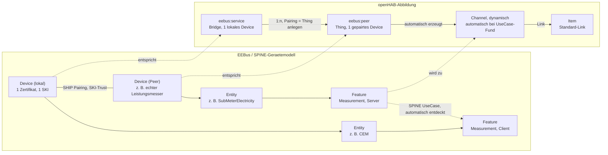

# Konzept: EEBus-Binding auf Basis von jEEBus.SHIP / jEEBus.SPINE

Status: Entwurf
Autor: Bernd Weymann
Betrifft: `org.openhab.binding.eebus`, `org.openhab.transport.eebus`, `jeebus.ship`, `jeebus.spine`

## 1. Ziel

Ein openHAB-Binding für EEBus (SHIP-Transport + SPINE-Anwendungsschicht), das vier
Kernanforderungen abdeckt:

1. Schlüsselerzeugung (Geräte-Identität, TLS-Zertifikat, SKI)
1. Pairing (Vertrauensaufbau mit Peer-Geräten)
1. Discovery mit Namen (mDNS-Sichtbarkeit mit Hersteller-/Modell-/Gerätename statt nur SKI)
1. Use-Case-Identifizierung, in **zwei Richtungen** (siehe §5.4/§5.5, nachträglich präzisiert):
   - **Konsument:** Erkennen, welche Use-Cases ein gepairtes Gerät anbietet.
   - **Anbieter:** openHAB muss selbst Use-Cases anbieten können (z. B. ein Messwert-Use-Case
     aus einem Wechselrichter-Thing), damit die Kopplung auch in die andere Richtung
     funktioniert — ohne das hat Pairing für diesen Fall keinen Nutzen.

## 2. Ist-Zustand

Im Projektumfeld existieren drei unabhängige EEBus-Stacks:

| Stack | Ort | Zustand |
|---|---|---|
| `io.eebus.*` (Port von eebus-go/ship-go) | `EEBus/eebus-java`, `EEBus/ship-java` | SHIP-Transport (`ShipAdapterImpl`) funktionsfähig; SPINE-Anbindung nicht verdrahtet (`onSpineData()` ist ein Platzhalter, `StubSpineAdapter` liefert überall `null`) |
| `org.openmuc.jeebus.*` (Fraunhofer ISE) | `jeebus.ship`, `jeebus.spine` | SHIP und SPINE beide vollständig implementiert, inkl. automatischer Use-Case-Erkennung; SHIP-Anbindung über `org.openmuc.jeebus.shipspine.ShipCommunication` bereits eingebaut |
| `org.openhab.transport.eebus` | `EEBus/org.openhab.transport.eebus` | OSGi-Wrapper-Bundle mit stabiler `EEBusService`-API, aktuell verdrahtet gegen den `io.eebus`-Stack |
| `org.openhab.binding.eebus` | dieses Bundle | reines Maven-Archetype-Gerüst, keine EEBus-Logik, keine Abhängigkeit zu `org.openhab.transport.eebus` |

**Entscheidung:** `jeebus.ship` + `jeebus.spine` ersetzen den kompletten `io.eebus`-Stack als
Backend von `org.openhab.transport.eebus`, statt nur die SPINE-Lücke zu füllen. Begründung:
`jeebus.spine` bringt die automatische Use-Case-Erkennung bereits fertig mit und integriert
`jeebus.ship` nativ — das ist genau die fehlende Funktion, während die SHIP-Seite in beiden
Stacks funktionsfähig ist.

## 3. Schichtenmodell

**Revidiert:** Kein separates Transport-Bundle. `jeebus.ship` und `jeebus.spine` sind bereits
fertige, eigenständige OSGi-Bundles (bnd-Builder-Plugin, eigenes `Bundle-SymbolicName`) und
unter `org.openmuc.jeebus` auf Maven Central veröffentlicht (`spine:4.0.1`, zieht transitiv
`ship:2.2.0`). Es gibt daher nichts zu wrappen — `org.openhab.binding.eebus` deklariert
`spine` als normale Maven-Dependency und nutzt sie intern. Ein separates
`org.openhab.transport.eebus`-Bundle (wie im alten, jetzt obsoleten `io.eebus`-Prototyp)
wäre nur gerechtfertigt, wenn mehrere unabhängige Bindings sich eine SHIP/SPINE-Instanz
teilen müssten — dafür gibt es aktuell keinen Bedarf.

```text
org.openhab.binding.eebus                     (einziges Bundle)
  internal.EEBusHandler        ── 1 lokale SHIP/SPINE-Serviceinstanz (Bridge, eebus:service)
  internal.EEBusPeerHandler    ── je ein gepairtes entferntes Gerät (SKI, eebus:peer)
        │  nutzt direkt (keine OSGi-Service-Grenze dazwischen)
        ▼
jeebus.spine (Device / Entity / NodeManagement / UseCase*)   [Maven: org.openmuc.jeebus:spine:4.0.1]
jeebus.ship  (ShipNodeConfiguration / ShipCommunication / KeyManagement)     [transitiv: ship:2.2.0]
```

Kein eigener `internal.discovery`/`internal.handler`-Unterpaket-Schnitt — beide Handler liegen
flach in `internal`, siehe Naming-Hinweis in Abschnitt 4. Ein separater Discovery-Service ist
laut Abschnitt 4.1 mit der aktuellen API nicht sinnvoll umsetzbar und daher nicht Teil des
Schichtenmodells.

Die in Abschnitt 5 beschriebenen Erweiterungen (Use-Case-Event, Pairing-Approve/Reject) sind
damit kein API-Vertrag zwischen zwei Bundles mehr, sondern normale interne Methoden/Callbacks
innerhalb von `EEBusBridgeHandler`/`EEBusPeerHandler`.

## 4. Bridge/Peer-Modell

Begriffsklärung vorab: SPINE nennt das lokale Objekt, das eine Identität (Zertifikat/SKI)
sowie eigene Entities/Use-Cases bündelt, selbst `Device`
(`org.openmuc.jeebus.spine.api.Device`). Um das nicht mit dem openHAB-Thing für ein
entferntes Gerät zu verwechseln, heißt Letzteres hier `eebus:peer` (nicht `eebus:device`).

Das SPINE-Gerätemodell selbst kennt drei Ebenen — Device, Entity, Feature (siehe
`EEBus_SPINE_TR_Introduction.pdf`, Figure 9, S. 14). Die eigentliche Geräte-zu-Geräte-Kopplung
(z. B. "Strommesser an EMS") passiert nicht auf Device-, sondern auf Feature-Ebene, vermittelt
über eine SPINE-UseCase-Client/Server-Rolle, die SPINE bereits automatisch discovered (§5.4).
openHABs Bridge/Thing-Baum bildet nur die Device-Ebene (SHIP-Pairing/Vertrauen) ab. Auf
Entity/Feature-Ebene gibt es **kein** eigenes "Thing2Thing"-Konstrukt — openHAB kennt dafür
nur zwei Mechanismen, und beide werden genutzt, je nachdem wer welche Rolle spielt
(**revidiert 2026-08-02**, siehe §4.2):

- Konsumiert openHAB von einem gepairten Peer (Client-Rolle): automatisch erzeugte **Channels**
  auf dem `eebus:peer`-Thing, sobald SPINE die UseCases dieses Peers discovered hat — Standard-
  Channel/Item-Link, keine manuelle Eingabe nötig.
- Bietet openHAB selbst etwas an (Server-Rolle): **Item-Metadata**, weil hier ein beliebiges,
  bereits existierendes Item als Datenquelle gebraucht wird — das kann Discovery nicht
  automatisch herausfinden, das muss ein Mensch festlegen.



Umgekehrter Fall (openHAB bietet an, z. B. weil "EMS" hier lokal ist und einen Wert aus einem
Modbus-Item als Server-Feature bereitstellt) ist im Diagramm nicht mitgezeichnet, um es lesbar
zu halten — dafür bleibt es bei Item-Metadata, siehe §4.2.

**Kernaussage zur Thing2Thing-Frage:** die einzige "Verknüpfung" zwischen zwei Devices, die
openHAB explizit anlegen lässt, ist Schritt 2 oben — ein `eebus:peer`- bzw. `eebus:oh-peer`-Thing
unter der passenden Bridge (SHIP-Pairing). Alles danach (Kanäle, Item-Links) entsteht automatisch
aus der SPINE-Discovery oder ist ganz normales openHAB-Alltagsgeschäft (Channel mit Item
verlinken) — es gibt keinen dritten, eebus-spezifischen Verknüpfungsschritt.

**Tabelle revidiert (2026-08-04, siehe §4.5; 2026-08-23, siehe §7(15)/ADR-020):** `eebus:peer`
war zunächst ein einziger Typ mit zwei erlaubten Eltern-Bridges, dann (§4.5) in zwei Typen
aufgeteilt, und ist seit ADR-020 als `eebus:eebus-peer` bridgelos — die dazwischenliegende
`eebus:network`-Bridge wurde ersatzlos entfernt (funktional inert, siehe §4.5/§7(15)).

| Thing | ThingTypeUID | Repräsentiert | Eltern-Bridge | Kardinalität |
|---|---|---|---|---|
| Bridge | `eebus:service` | eine lokale SHIP/SPINE-Serviceinstanz (genau ein `Device` in jeebus.spine), UI-Label "EEBus OH Service" | — (Top-Level) | 1:1, exklusiv — **entschieden, kein Teilen einer Identität über mehrere Bridges** |
| Bridge | `eebus:cs-service` ("EEBus Controllable System Service") | Convenience-Variante von `eebus:service` (ADR-023, 2026-08-23) - fest verdrahtet auf LPC/LPP-Server-Rolle, keine Checkbox, Failsafe-Werte als Thing-Config-Seed statt Item-Metadata; eigene, separate lokale SHIP/SPINE-Identität | — (Top-Level) | 1:1, exklusiv, unabhängig von jedem `eebus:service` |
| Thing | `eebus:eebus-peer` ("EEBus Peer") | ein "echtes" EEBus-Gerät, per mDNS discovered, keine Channels | — (Top-Level, bridgelos seit ADR-020) | n, unabhängig |
| Thing | `eebus:oh-peer` ("EEBus OH Peer") | manuell angelegter Pairing-Partner eines Service (Anlegen = Pairing-Vorgang, §5.2) | `eebus:service` | n pro Service |

**Bridge (`eebus:service`)** — _aktueller Stand, ersetzt die ursprüngliche Fassung dieses
Absatzes, die noch von einem separaten Transport-Bundle und einer `approvePairing`-Action
ausging (siehe §5.2, §4.1 für die Korrekturen):_

- Konfiguration: `vendorCode`, `deviceBrand`, `deviceModel`, `serialNumber`,
  `mdnsServiceInstance` (Anzeigename für Discovery), `port`, `autoAcceptEnabled`,
  `connectToPeers` (Default `true`; auf `false` nur als Diagnose-Workaround beim Pairing
  zweier selbstgebauter Instanzen gegeneinander — siehe `TEST_PAIRING.md`, Test 2,
  „Known Bug Encountered"), `supportedUseCasesClient`, `supportedUseCasesServer`
  (Checkbox-Auswahl, siehe §4.3; noch nicht in `thing-types.xml` umgesetzt — siehe §7).
- Properties (read-only, nach Start gesetzt): `localSki`.
- Aufgabe: hält `ShipCommunication` + SPINE-`Device`, legt/lädt das Zertifikat, berechnet die
  Trusted-SKI-Menge aus den konfigurierten `eebus:peer`-Kind-Things (§5.2) — **kein**
  separater Approve/Reject-Mechanismus.
- Besitzt genau ein SPINE-`Device`-Objekt exklusiv — keine zwei Bridges teilen sich je ein
  Zertifikat/SKI (bestätigte Entscheidung, siehe Abschnitt 6).

**Peer (`eebus:peer` / `eebus:oh-peer`)** — _die folgende Beschreibung galt ursprünglich für
einen einzigen Typ; **revidiert (2026-08-04, §4.5):** aufgeteilt in `eebus:peer` (Network,
"echtes" Gerät, keine Channels, SKI-Label bleibt "SKI") und `eebus:oh-peer` (Service, Channels +
Server-Metadata, SKI-Label "Trusted SKI"). Was unten als Kanal-/Metadata-Verhalten beschrieben
ist, gilt nur noch für `eebus:oh-peer` — siehe §4.5 für die vollständige, aktuelle Aufteilung._

- Konfiguration: `ski` (Pflichtfeld, aus Discovery übernommen), `shipId` (wird beim ersten
  Handshake gelernt und muss laut `EEBusEventHandler#onServiceShipIdUpdate` persistiert
  werden — landet in der Thing-Konfiguration).
- Kanäle: werden **nicht** statisch in `thing-types.xml` vordefiniert, sondern dynamisch aus
  den erkannten Use-Cases erzeugt (siehe 4.1), da ein Peer-Gerät je nach unterstütztem
  Use-Case unterschiedliche Feature-Sets hat (z. B. LPC-Leistungsgrenze vs.
  Messwert-Kanäle).

### 4.1 Discovery-Service — **Einschränkung, bei Implementierung entdeckt**

Beim Implementieren von `EEBusHandler` zeigte sich: `ShipCommunication` (jeebus.spine)
kapselt die rohe mDNS-Sicht vollständig — sie erzeugt intern ihren eigenen `ConnectionHandler`
und das zugrunde liegende `Ship`-Objekt bleibt privat (nur `getOwnSki()` ist öffentlich).
Es gibt in der gelesenen public API **keine** Methode, die "sichtbare, aber noch nicht
gepairte SKIs mit Namen" roh herausgibt, bevor eine Verbindung/SPINE-Discovery läuft.
`NodeManagement.addDeviceListener(...)` liefert Geräte erst nach erfolgreicher
SHIP-Verbindung, nicht davor.

**Update — konkreter Lösungsweg gefunden (hängt mit §5.4 TODO 2 zusammen):**
`org.openmuc.jeebus.ship.node.service` (`ServiceRegistry`, `TxtRecord`) ist laut
`ship/build.gradle` `Export-Package`-Direktive **nicht** exportiert
(`org.openmuc.jeebus.ship.api`, `.api.cert`, `.shipconnection` sind die einzigen exportierten
Pakete) — als OSGi-Dependency also nicht direkt nutzbar, wie vermutet.

Stattdessen: ein **eigener, kleiner mDNS-Browser** auf Basis der öffentlichen `JmDNS`-Bibliothek
(kein `jeebus.ship`-internes Paket, sondern deren eigene Transport-Abhängigkeit — kann parallel
selbst eingebunden werden), der `_ship._tcp.local.` durchsucht und die TXT-Records selbst
liest (Felder gemäß SHIP 7.3.2: id, ski, brand, type, model — siehe `TxtRecord`-Quelle als
Vorlage). Das liefert nicht nur Name+SKI für eine Discovery-Inbox (Anforderung 3 vollständig
erfüllt, nicht nur die eigene Sichtbarkeit), sondern **löst auch §5.4 TODO 2**: dieselbe
IP-Adresse, die unser eigener Browser auflöst, ist identisch mit dem `communicationAddress`,
das `Communication.addDevice(String communicationAddress)` intern verwendet (siehe
`Communication.java` — wird mit der IP aus `connectionDataExchangeEnabled(String ip)`
aufgerufen). Ein selbst geführtes IP↔SKI-Mapping erlaubt also, `UseCasePartner
.getCommunicationAddress()` auf die SKI eines `eebus:peer`-Things zurückzuführen.

**Umgesetzt** (§7 Punkt 9): `EEBusMdnsBrowser` (neue Klasse, `internal`-Package) implementiert
`javax.jmdns.ServiceListener`, durchsucht `_ship._tcp.local.`, liest `ski`/`brand`/`model`/`type`
aus dem TXT-Record und pflegt `communicationAddress -> DiscoveredService` sowie
`ski -> DiscoveredService`-Maps. `EEBusHandler` startet ihn in `startShipSpine()` und schließt ihn
in `dispose()`; erreichbar über den paketprivaten Accessor `EEBusHandler#getMdnsBrowser()`. Das
reine Discovery-Inbox-UI (openHAB `DiscoveryService`/Inbox) ist ein separater Folgeschritt (neuer
Punkt 10 in §7), noch nicht umgesetzt — der Browser selbst liefert aber bereits alle nötigen
Daten dafür.

**Revidiert (2026-07-30):** ursprünglich erzeugte `EEBusMdnsBrowser` per `JmDNS.create()` eine
eigene, private JmDNS-Instanz — auf Nachfrage korrigiert: openHAB Core bietet mit
`org.openhab.core.io.transport.mdns.MDNSClient` bereits einen geteilten mDNS-Service (eine pro
Netzwerkinterface verwaltete `JmDNS`-Instanz-Menge, `addServiceListener(type, listener)` und
`removeServiceListener(...)`), den alle Bindings gemeinsam nutzen sollen, statt jeweils eigene
mDNS-Responder zu starten. `EEBusMdnsBrowser` bekommt `MDNSClient` jetzt injiziert (über
`EEBusHandlerFactory` → `EEBusHandler`, OSGi `@Reference`) statt selbst eine `JmDNS`-Instanz zu
verwalten; `close()` meldet nur noch den Listener ab (`removeServiceListener`), schließt aber
nicht mehr die (geteilte, von openHAB Core lebenszyklus-verwaltete) JmDNS-Instanz selbst. Die
`org.jmdns`-Maven-Dependency bleibt nötig (für die `javax.jmdns.*`-Typen in den Methodensignaturen
von `EEBusMdnsBrowser`), ist aber auf `provided`-Scope gesetzt, damit sie nicht ein zweites Mal
ins eigene OSGi-Bundle eingebettet/exportiert wird — das noch offene, alte "Version-Konflikt"-TODO
im `pom.xml`-Kommentar ist damit hinfällig. **Noch nicht gegen eine echte Karaf-Laufzeit
verifiziert.**

**Revidiert (2026-08-01, ADR-003):** Punkt 10 (Discovery-Inbox) wurde zunächst als
`EEBusDiscoveryService extends AbstractThingHandlerDiscoveryService<EEBusHandler>` umgesetzt —
also Bridge-scoped, aktiv erst nachdem eine vollständig konfigurierte `eebus:service`-Bridge
erfolgreich `ONLINE` gegangen ist. In der Praxis bedeutete das: nach reiner Installation des
Bindings passiert sichtbar nichts, weil Discovery an eine schwergewichtige lokale Identität
(Zertifikat, Port, vendorCode/deviceModel/serialNumber) gekoppelt war, obwohl reines
mDNS-Lauschen protokollseitig gar keine lokale Identität braucht.

**Neu entschieden und umgesetzt:** `EEBusDiscoveryService` ist ersetzt durch
`EEBusMdnsDiscoveryParticipant` (`org.openhab.core.config.discovery.mdns.MDNSDiscoveryParticipant`)
— ein bindingweites, von keinem Thing-Handler abhängiges OSGi-Service, das von openHAB Cores
eigenem `MDNSDiscoveryService` automatisch aufgegriffen wird. Scan startet damit unmittelbar
nach Installation. Eine neue, schlanke Bridge `eebus:network` (keine Pflicht-Konfiguration)
dient als Elternobjekt für gefundene reale Geräte; ohne existierende `eebus:network`-Bridge
liefert der Participant bewusst keine Ergebnisse. `EEBusMdnsBrowser` bleibt bestehen, aber nur
noch für seine zweite, echte an eine aktive `eebus:service`-Session gebundene Aufgabe
(`communicationAddress -> SKI`-Auflösung, §5.4 TODO 2) — seine bisherige
Discovery-Inbox-Zuständigkeit (Punkt 1 der Klassen-Javadoc-Liste) entfällt ersatzlos zugunsten
des neuen Participants. Details, Konsequenzen und offene Punkte: siehe
`docs/ADR/003-decouple-mdns-discovery-from-bridge.md` und
`docs/changes/eebus-network-discovery/`.

> **Update (2026-08-23, ADR-020):** die `eebus:network`-Bridge in diesem Absatz ist inzwischen
> entfernt — der Participant liefert Ergebnisse jetzt unbedingt, ganz ohne Eltern-Bridge, als
> bridgeloses `eebus:eebus-peer` Thing. Siehe §7(15) und
> `docs/ADR/020-merge-network-peer-things.md`.

### 4.2 Datenanbindung: dynamische Channels für Konsum, Item-Metadaten für Angebot — **revidiert (2026-08-02)**

**Vorherige Fassung verworfen.** Die ursprüngliche v1-Entscheidung sah für **beide** Richtungen
Item-Metadata vor (analog `homekit`/`alexa`/`channel`). Das widerspricht dem Kernversprechen
von EEBus: zwei Devices pairen, machen automatisch SPINE-UseCase-Discovery (§5.4) und kennen
danach gegenseitig ihre Fähigkeiten — ohne dass ein Mensch das pro Datenpunkt und pro Peer
nochmal von Hand nachträgt. Ein Peer-Thing zwingend mit Metadata für jeden einzelnen erkannten
Datenpunkt zu versehen, reproduziert genau den manuellen Aufwand, den die Protokoll-Discovery
eigentlich erspart.

**Neu, nach Rolle getrennt** — der Grund für die frühere Metadata-Entscheidung
("Kopplung an beliebige beliebige Items aus anderen Bindings") gilt nur für **eine** der beiden
Richtungen, nicht für beide:

- **Client-Rolle (openHAB konsumiert von einem gepairten Peer):** SPINE hat die Discovery
  bereits gemacht (`NodeManagement.addUseCaseListener`/`UseCasePartner`, §5.4) — welche
  UseCases/Features ein bestimmter Peer anbietet, ist zur Laufzeit exakt bekannt, sobald das
  Pairing steht. Das gehört als **dynamisch erzeugte Channels** auf das jeweilige
  `eebus:peer`-Thing (löst die in §5.4.1 zurückgestellte Kanallosigkeit von
  `EEBusPeerHandler` ab, siehe Korrektur dort). Der Nutzer verknüpft anschließend ganz normal
  per UI einen Channel mit einem Item — Standard-openHAB-Flow, keine `eebus`-Syntax, keine
  Freitext-UIDs.
- **Server-Rolle (openHAB bietet selbst etwas an, §5.5):** hier bleibt der
  Item-Metadata-Ansatz richtig, weil openHAB einen Wert aus einem **bereits existierenden,
  beliebigen** Item braucht (z. B. dem echten Leistungswert aus einem Modbus/SunSpec-Binding).
  Das ist kein Discovery-Problem, sondern die Frage "woher kommt der reale Wert" — die kann
  nur ein Mensch beantworten, unabhängig vom Binding-Design. Namespace, Syntax und
  Datenpunkt-Vokabular unten gelten **ausschließlich noch für diesen Fall.**

#### 4.2a Server-Rolle: Item-Metadata (unverändert gegenüber v1)

Analog zu bekannten openHAB-Metadaten-Namespaces (`homekit`, `alexa`, `channel`) bekommt dieses
Binding einen eigenen Namespace `eebus`, mit dem **beliebige** existierende Items (auch aus
ganz anderen Bindings, z. B. ein Wechselrichter-Leistungs-Item aus einem Modbus/SunSpec-Binding)
an einen konkreten, von openHAB **angebotenen** Use-Case-Datenpunkt gekoppelt werden:

```java
Number:Power WR_Leistung "Wechselrichter Leistung" { eebus="MPC.power" }
```

**Wert-Syntax:** `eebus="<UseCase>.<Datenpunkt>"`, ohne weitere Konfiguration — die Kopplung
ist **immer Bridge-weit**, da nur noch die Server-Rolle Metadata nutzt (ein Server-Feature ist
netzwerkweit sichtbar, nicht pro Peer). Das frühere optionale `[peer="..."]`-Attribut für die
Client-Rolle ist mit dieser Revision entfallen — Konsum läuft jetzt ausschließlich über
Channels (siehe oben).

**Datenpunkt-Vokabular (Startmenge, aus §5.4.2 abgeleitet — wird erweitert, sobald weitere
Use-Cases/Szenarien im Detail beschafft sind):**

| Datenpunkt | Use-Case | Richtung (aus Sicht des Items) | SPINE-Quelle |
|---|---|---|---|
| `MPC.power` | MPC (Server-Rolle, "ImSys"-Anwendungsfall des Nutzers) | lesend (Item-State → SPINE-Antwort) | `Measurement`-Server, `MeasurementListDataFunction` |
| `MGCP.power` | MGCP (Server-Rolle) | lesend | `Measurement`-Server, analog MPC |
| `LPC.consumptionLimit` | LPC (Server-Rolle, CS) | schreibend (SPINE-Write vom EG-Peer → Item-Command) | `LoadControl`-Server, `LimitListDataFunction` |
| `LPC.failsafeConsumptionLimit` | LPC (Server-Rolle, CS) | schreibend (Konfiguration, jederzeit vom EG änderbar) | `DeviceConfiguration`-Server, `KeyValueListDataFunction` (`FailsafeConsumptionActivePowerLimit`) |
| `LPC.failsafeDurationMinimum` | LPC (Server-Rolle, CS) | schreibend (Konfiguration) | `DeviceConfiguration`-Server, `KeyValueListDataFunction` (`FailsafeDurationMinimum`) — **neu entdeckt beim Umsetzen**: Szenario 2 hat zwei Datenpunkte, nicht nur den Grenzwert |
| `LPC.state` | LPC (Server-Rolle, CS) | lesend (Item-State ← Zustandsautomat) | kein SPINE-Feature direkt — Ausgabe von `EEBusLimitControlStateMachine` (init/limited/unlimitedControlled/unlimitedAutonomous/failsafe), gedacht für Rules (siehe §4.2.1) |
| `LPP.productionLimit` | LPP (Server-Rolle, CS) | schreibend | analog `LPC.consumptionLimit`, Richtung Einspeisung |
| `LPP.failsafeProductionLimit` | LPP (Server-Rolle, CS) | schreibend (Konfiguration) | analog `LPC.failsafeConsumptionLimit` (`FailsafeProductionActivePowerLimit`) |
| `LPP.failsafeDurationMinimum` | LPP (Server-Rolle, CS) | schreibend (Konfiguration) | analog `LPC.failsafeDurationMinimum` |
| `LPP.state` | LPP (Server-Rolle, CS) | lesend | analog `LPC.state` |

**Ergänzung (2026-08-23, ADR-022):** Die vier Failsafe-Datenpunkte (`LPC.failsafeConsumptionLimit`/`LPC.failsafeDurationMinimum`/`LPP.failsafeProductionLimit`/
`LPP.failsafeDurationMinimum`) sind jetzt zusätzlich, rein lesend, als `failsafe-limit-value`/`failsafe-duration-minimum`-Channel auf dem gepairten oh-peer verfügbar
(analog `limit-active`/`limit-value`, ADR-021) - bewusst **ohne** Rückweg von openHAB
(Item/Metadata/Rule) zu diesen Werten, nur ein echter Energy Guard über EEBus darf sie ändern
(Nutzerentscheidung 2026-08-23).

**Java-seitige Architektur, Server-Rolle** (neue Klasse `EEBusMetadataService`, OSGi-Component
in `internal`, `@Reference`s auf `MetadataRegistry`, `ItemRegistry`, `EventPublisher` — alle
drei sind Standard-`org.openhab.core`-APIs, keine neue `pom.xml`-Dependency nötig, verifiziert
anhand der openHAB-Core-Javadocs, siehe Quellen):

- `Optional<Metadata> find(String useCase, String dataPoint)`: iteriert
  `metadataRegistry.getAll()`, filtert auf `key.getNamespace().equals("eebus")` und
  `metadata.getValue().equals(useCase + "." + dataPoint)`. Das frühere `peerThingUid`-Argument
  ist entfallen, da nur noch die Bridge-weite Server-Rolle Metadata nutzt.
  **Offener Punkt — gelöst (2026-08-04, §4.5):** bei **mehreren** lokalen `eebus:service`-
  Bridges, die denselben UseCase+Datenpunkt als Server anbieten, war `find(...)` bisher
  mehrdeutig. Gelöst durch einen `oh-service-id`-Präfix im Metadata-Wert (`eebus="<oh-service-
  id>:<UseCase>.<Datenpunkt>"`, z. B. `eebus="ems1:MPC.power"`) statt des hier ursprünglich
  vorgeschlagenen `[service="..."]`-Attributs — Details in §4.5.
- Lese-Pfad (**korrigiert nach Implementierung** — kein Abfrage-Callback, siehe §7 Punkt 6):
  SPINE hält Server-Feature-Daten in einem lokalen Cache (`ReadListFeatureFunction`/
  `DataListHolder`) und beantwortet Leseanfragen sowie Subscriptions automatisch daraus. Das
  Binding registriert sich stattdessen per `EEBusMetadataService
  .registerItemStateListener(itemName, ...)` für Item-Änderungen und schreibt bei jeder
  Änderung proaktiv per `updateData(idx, ...)` in diesen Cache.
- Schreib-Pfad (SPINE-Write kommt vom Peer an, siehe `ReadAndWriteListFeatureFunction
  .addUseCaseWriteDataListener(...)`, verifiziert anhand jeebus.spine-Quellcode):
  `eventPublisher.post(ItemEventFactory.createCommandEvent(itemName, command))` — für v1 nur
  als Architektur festgelegt, noch nicht an einem konkreten Server-Use-Case (z. B. LPC)
  implementiert (siehe §7 Punkt 8).
- Caching/Aktualisierung bei Metadaten-Änderungen (`RegistryChangeListener<Metadata>`) ist für
  v1 **nicht** vorgesehen — Zuordnung wird beim Bridge-/Peer-Start einmalig aufgelöst,
  Änderungen erfordern einen Thing-Neustart (gleiche Einschränkung wie bei der
  Trusted-SKI-Neuberechnung in §5.2, akzeptabel für v1).

### 4.2.1 Rule-Tag-Mechanismus — **entschieden: kein eigener Mechanismus nötig (§7 Punkt 7)**

Beim Entwerfen zeigte sich: ein separater "Rule-Tag"-Mechanismus wäre **redundant** zum
Item-Metadaten-Ansatz der Server-Rolle. Ein Datenpunkt, der nicht 1:1 auf ein reales Item abbildbar ist (z. B.
ein berechneter/abgeleiteter Wert), lässt sich genauso gut über ein gewöhnliches **Proxy-Item**
lösen, dessen Zustand eine normale openHAB-Rule pflegt (`postUpdate` bei Bedarf) bzw. das eine
Rule per "Item empfing Befehl"-Trigger auswertet:

```java
Number:Power WR_Leistung_Berechnet "Wechselrichter Leistung (berechnet)" { eebus="MPC.power" }
```

- eine ganz normale Rule (Tag `eebus` nur zur Auffindbarkeit/Dokumentation empfohlen, aber
**funktional nicht erforderlich**), die `WR_Leistung_Berechnet` aktuell hält.

Das erspart: einen neuen openHAB-`ModuleType`/`TriggerHandlerFactory` (nötig, um SPINE-Requests
als Rule-Trigger verfügbar zu machen), eine bespoke "synchron Rule ausführen und Ergebnis
zurückholen"-API (openHAB-Rules sind grundsätzlich asynchron/fire-and-forget,
`RuleManager.runNow(...)` liefert keinen Rückgabewert), und eine zweite Parser-Implementierung
für dieselbe Wert-Syntax. **Konsequenz:** §7 Punkt 7 ist damit durch Vereinfachung gelöst,
nicht durch Implementierung — analog zur Pairing-Entscheidung in §5.2 (kein separates
Approve/Reject-API nötig).

**Korrigiert (2026-08-02):** die vorherige Fassung dieses Absatzes pries den
Item-Metadaten-Ansatz als generell überlegen gegenüber dynamischen Channels — das galt nur für
die Server-Rolle, siehe die neue Rollenaufteilung am Anfang von §4.2. Für die Client-Rolle gilt
das Gegenteil: dort erzeugt der `ChannelTypeProvider`-Mehraufwand genau den Automatismus, den
EEBus verspricht (Discovery statt manueller Konfiguration), während reine Metadata dort den
Nutzer zwingen würde, jeden erkannten Datenpunkt jedes Peers von Hand einzutragen. Für die
Server-Rolle bleibt der ursprüngliche Vorteil bestehen: funktioniert sofort mit Items aus
beliebigen anderen Bindings, kein `ChannelTypeProvider` nötig, und die Bridge-Config (§4,
Checkboxen in §4.3) legt bereits fest, welche Use-Cases überhaupt angeboten werden — die
Metadaten binden dann nur noch die konkreten Datenpunkte an Items.

### 4.2.2 Dynamische Channels — Gating, Sichtbarkeit und Struktur (Client-Rolle) — **entschieden (2026-08-06)**

**Auslöser:** §4.2 legt fest, dass die Client-Rolle über dynamisch erzeugte Channels läuft, aber
weder wie diese Channels technisch entstehen, noch wie mehrere Datenpunkte pro Use-Case
strukturiert werden, war bisher festgelegt. Konkret sichtbar an
`EEBusMpcClientUseCase#applyMeasurement()`: der MPC-Leistungswert eines gepairten Peers wird
bereits zuverlässig gelesen, aber nur geloggt statt auf einen Channel geschrieben — mangels
Channel.

**Vier Entscheidungen:**

1. **Channel-Erzeugung: statischer Channel-Type + Laufzeit-`editThing()`, kein
   `ChannelTypeProvider`.** Widerspricht der Andeutung in §4.2.1 ("dort erzeugt der
   ChannelTypeProvider-Mehraufwand genau den Automatismus..."), die vom tatsächlichen
   Umsetzungsstand überholt ist: aktuell existiert nur eine einzige Client-Rolle-UseCase-Klasse
   (`EEBusMpcClientUseCase`), das Datenpunkt-Vokabular ist also klein und vorab bekannt genug,
   um als normale `channel-type`-Deklarationen in `thing-types.xml` gepflegt zu werden. Ein
   `ChannelTypeProvider` (voll dynamisch generierte Channel-Types für beliebige, erst zur
   Laufzeit bekannte Use-Cases) bleibt die Lösung, sobald die Zahl der Use-Cases das nicht mehr
   rechtfertigt — für v1 wäre das verfrühter Aufwand. Zugriff auf `EEBusOhPeerHandler` (nicht nur
   dessen Thing-UID als String, wie bisher beim `ohPeerThingUidResolver`) ist dafür notwendig,
   da nur der Handler `editThing()`/`updateState()` aufrufen kann.
1. **Gating: nur konfigurierte Use-Cases erzeugen Channels, unabhängig davon, was Discovery
   tatsächlich liefert.** `supportedUseCasesClient`/`supportedUseCasesServer` auf der
   `eebus:service`-Bridge legen abschließend fest, welche Use-Case-Klassen überhaupt bei SPINE
   registriert werden (`Device.getBuilder()...withUseCases(...)`) — ein Peer, der zusätzliche,
   nicht konfigurierte Use-Cases anbietet, wird dafür gar nicht erst erkannt, weil keine
   passende `addUseCaseListener`-Registrierung existiert. Das ist keine neue Einschränkung,
   sondern macht nur explizit, was der bestehende Code (`cfg.supportedUseCasesClient.contains
   ("MPC")`) ohnehin schon erzwingt.
1. **Sichtbarkeit erkannter Use-Cases: Thing-Property auf dem `eebus:oh-peer`.** Sobald ein
   Use-Case bei einem gepairten Peer erkannt wird, wird das als Thing-Property auf dem
   jeweiligen `eebus:oh-peer` festgehalten — Key = Use-Case-Name in Kleinschreibung (z. B.
   `lpc`), Value = `server`/`client`. **Offener Punkt (Rückfrage im Chat gestellt):** die genaue
   Bedeutung von Value ist noch zu klären — beschreibt es die Rolle, die der **Peer** für diesen
   Use-Case spielt (aus SPINE-Actor-Sicht), oder die Rolle, die **wir selbst** gegenüber diesem
   Peer einnehmen? Bei nur einer bisher implementierten Client-Rolle-Klasse (MPC) lässt sich das
   noch nicht anhand von Code-Präzedenz entscheiden.
1. **Struktur: eine Channel Group pro Use-Case, ein Channel pro Datenpunkt darin.** Statt eines
   flachen Channel-Namensraums pro Thing bekommt jeder erkannte Use-Case eine eigene Channel
   Group (Group-ID = Use-Case-Name, z. B. `lpc`), darunter je ein Channel pro SPINE-Datenpunkt
   (z. B. `lpc#limit-active`, `lpc#limit-value`, `lpc#limit-duration`). Vermeidet
   Namenskollisionen zwischen Use-Cases mit ähnlichen Datenpunktnamen und spiegelt die
   SPINE-Struktur (ein Feature/eine Funktion pro Use-Case-Szenario) direkter als ein einzelner
   flacher Channel pro Use-Case.

**Channels bleiben nach Depairing/Verbindungsabbruch bestehen** (letzter bekannter Wert, Item
bleibt verlinkt) — kein automatisches Entfernen beim `unpair()` (§4.6) oder Verbindungsverlust.

**Nächster Schritt:** `$Spec` erstellt eine Datenpunkt-/Channel-Tabelle je Use-Case,
primärquellenbasiert (LPC/LPP: `C:\Projects\eebus\EEBus_UC_TS_LimitationOfPowerConsumption_
V1.0.0_public.pdf`; MPC seit 2026-08-06 ebenfalls primärquellenbasiert:
`C:\Projects\eebus\EEBus_UC_TS_MonitoringOfPowerConsumption_V1.0.0_public.pdf`, siehe §5.4.2/
§5.4.3) — als Vorlage für `channel-type`-Deklarationen in `thing-types.xml`. Scope für die erste
Umsetzung: MPC (einziger bisher implementierter Client-Rolle-Use-Case).

### 4.3 Bridge-Konfiguration: Use-Case-Auswahl per Checkbox

Die Bridge (`eebus:service`) bekommt zwei Multi-Select-Konfigurationsparameter (in
`thing-types.xml` als `type="text" multiple="true"` mit `<options>` aus dem Katalog in
§5.4.1 — openHAB rendert das als Checkbox-Liste):

- `supportedUseCasesClient` — welche Use-Cases openHAB bei Peers **erkennen/konsumieren**
  soll (Konsumenten-Rolle, §5.4).
- `supportedUseCasesServer` — welche Use-Cases openHAB selbst **anbieten** soll
  (Anbieter-Rolle, §5.5).

Beide Listen steuern, welche `UseCase`-Implementierungen beim Bauen der lokalen Entity in
`EEBusHandler` registriert bzw. welche `addUseCaseListener(...)`-Aufrufe abgesetzt werden.

### 4.4 Thing2Thing-Pairing: Thing Action statt manuellem SKI-Copy-Paste — **vorläufig entschieden (2026-08-02), Testvorbehalt**

**Auslöser:** §4.1/§5.2 verlangten bisher, dass ein Nutzer die `localSki`-Property einer
Bridge manuell abliest und in die `ski`-Konfiguration eines neuen `eebus:peer`-Things unter
der jeweils anderen Bridge einträgt — insbesondere relevant, wenn zwei lokale
`eebus:service`-Bridges miteinander gekoppelt werden sollen (Beispiel-Szenario: ein "unechtes"
`eebus:service` "EMS" soll mit einem "echten" `eebus:service`/`eebus:peer` "Leistungsmesser"
verbunden werden). Das ist kein first-class, sichtbarer Verknüpfungsschritt, sondern
Zweckentfremdung generischer Mechanismen.

**Entscheidung:** eine Thing Action auf `eebus:service` (Arbeitstitel `pairWith`), die die
`eebus:peer`-Things auf beiden Seiten automatisch mit korrekter SKI anlegt, statt manuellem
Copy-Paste. Der Zielparameter wird als `@ActionInput`/`ConfigDescriptionParameter` mit
Options-Liste (befüllt aus `ThingRegistry`, gefiltert auf `eebus:service`/`eebus:peer`)
deklariert.

**Warum keine Rule nötig ist** (verifiziert anhand Community-Diskussion, openHAB 5.1.4,
Juni 2026 — siehe Quellen): eine mit `@RuleAction`/`@ActionInput` annotierte Thing Action
erscheint automatisch auf der Properties-Seite des Things in Main UI, als generiertes
Eingabeformular, direkt aufrufbar **ohne** Rule-Umweg. Das gilt nur für die Thing-eigene Seite
— ein Aufruf aus einem beliebigen Custom-Widget/Dashboard heraus bräuchte weiterhin einen
Rule-Umweg (`action: rule` im Widget → `actions.thingActions(binding, thingId)`), das ist für
unseren Fall aber nicht nötig, da die Aktion auf der Bridge-eigenen Seite ausgelöst wird.

**Testvorbehalt (Nutzer-Vorgabe):** diese Entscheidung ist **vorläufig** — sie beruht auf einer
Community-Verifikation eines fremden, einfachen Beispiels (`reboot()`/`permitJoin()`-artige
Aktionen), nicht auf einem Test im eigenen Setup. Vor endgültiger Umsetzung muss der Nutzer
selbst verifizieren, dass:

- eine Thing Action mit Options-Liste-Parameter (nicht nur Freitext) tatsächlich als Dropdown
  in Main UI gerendert wird, befüllt aus `ThingRegistry`-Inhalten zur Laufzeit,
- das auf der openHAB-Version des Zielsystems genauso funktioniert wie im verlinkten
  Community-Beitrag (dort: 5.1.4),
- eine Thing Action, die auf **zwei** Bridge-Handlern gleichzeitig schreibend eingreift (Peer
  auf Seite A **und** Seite B anlegen), technisch unproblematisch ist (kein Deadlock/Race
  zwischen zwei `EEBusHandler`-Instanzen).

Bis zur Verifikation bleibt der bisherige manuelle SKI-Copy-Paste-Weg (§4, §5.2) die einzige
verifizierte Vorgehensweise. Diese Sektion ersetzt **keine** der Vorschläge B–D aus der
Diskussion (eigenes `eebus:link`-Thing, Discovery-Erkennung von Geschwister-Bridges,
Status-Channel pro Peer) — die bleiben zurückgestellt, nicht verworfen.

### 4.5 "Echte" vs. "openHAB"-Geräte — Aufteilung von `eebus:peer` — **entschieden (2026-08-04)**

> **Update (2026-08-23, siehe §7(15)/ADR-020):** `eebus:network` wurde inzwischen ersatzlos
> entfernt und `eebus:peer` zu einem bridgelosen `eebus:eebus-peer` verschmolzen — die
> "funktional inert"-Beobachtung unten war der Auslöser dafür. Die Aufteilung von `eebus:peer`
> vs. `eebus:oh-peer` (Punkt 2 unten) bleibt bestehen; nur die `eebus:network`-Bridge selbst
> entfällt.
>
> **Update (2026-08-23, siehe §4.7/ADR-024):** die Thing-Namen selbst wurden noch am selben Tag
> ein zweites Mal revidiert — `eebus:service`/`eebus:cs-service` → `eebus:oh-device`/
> `eebus:oh-cs-device`, `eebus:eebus-peer` → `eebus:hw-device`, `eebus:oh-peer` → `eebus:oh-entity`
> (jetzt eine einzelne SPINE Entity statt eines ganzen gepairten Geräts) — und Trust von
> `eebus:oh-peer` auf die Bridge verschoben. Die strukturelle Aufteilung "echtes Gerät ohne
> Vertrauen" vs. "openHAB-verwaltetes, vertrauenswürdiges Gegenstück" bleibt unverändert; siehe
> §4.7 für Details.

**Auslöser:** `eebus:peer` erlaubte laut `thing-types.xml` bisher zwei Eltern-Bridges
(`eebus:service` **und** `eebus:network`) mit identischer Konfiguration, aber unterschiedlichem
Laufzeitverhalten. Bei der Umsetzung zeigte sich: das passt nicht zusammen.
`EEBusPeerHandler`s Javadoc hält fest, dass Pairing (Trusted-SKI-Berechnung) ausschließlich vom
Eltern-`EEBusHandler` (`eebus:service`) übernommen wird; `EEBusNetworkHandler` dagegen hält laut
eigenem Javadoc bewusst keine SHIP/SPINE-Identität und geht bedingungslos auf ONLINE. Ein
`eebus:peer`-Thing unter `eebus:network` war damit funktional inert — es pairt nichts, verbindet
nichts, spiegelt nur den (immer-ONLINE) Bridge-Status. Historischer Grund: `eebus:network` kam
erst mit ADR-003 dazu, `eebus:peer` wurde nie vollständig darauf umgestellt.

**Vier Entscheidungen im Zuge dieser Revision:**

1. **`eebus:service` bleibt Top-Level-Bridge.** Ein zwischenzeitlicher Vorschlag, `eebus:service`
   als Kind-Bridge unter `eebus:network` zu hängen (damit Disable von Network automatisch alle
   Services stoppt — openHABs Framework propagiert `BRIDGE_OFFLINE` an Kind-Things ohnehin
   automatisch), wurde **verworfen**. Der Status bleibt wie in §3/§4 beschrieben: zwei
   unabhängige Top-Level-Bridges. UI-Label von `eebus:service` wird zu "EEBus OH Service"
   präzisiert (rein kosmetisch, keine strukturelle Änderung), um im Zusammenspiel mit "EEBus
   Network"/"EEBus Peer" (siehe unten) die "echt" vs. "openHAB"-Unterscheidung auch im Namen
   sichtbar zu machen.
1. **`eebus:peer` wird aufgeteilt in zwei Thing-Types:**
   - `eebus:peer` ("EEBus Peer"), Kind ausschließlich von `eebus:network`: ein "echtes" EEBus-
     Gerät, idealerweise per mDNS-Discovery gefunden. **Keine Channels.** SKI-Konfiguration
     bleibt frei editierbar mit Label "SKI" (kein Vertrauens-Statement, da `eebus:network` keine
     Identität besitzt, gegenüber der man Vertrauen herstellen könnte).
   - `eebus:oh-peer` ("EEBus OH Peer"), Kind ausschließlich von `eebus:service`: manuell
     angelegt und vollständig konfiguriert. Anlegen dieses Things **ist** der Pairing-Vorgang
     (§5.2, unverändert) — die SKI wird Teil der Trusted-SKI-Menge der Service-Bridge. SKI-Label
     wird zu "Trusted SKI", da der Eintrag hier tatsächlich Vertrauen herstellt. Client-Rolle-
     UseCases werden wie bisher in §4.2 beschrieben als dynamisch erzeugte Channels
     bereitgestellt; Server-Rolle-UseCases weiterhin über Item-Metadata (siehe Punkt 3 unten).
1. **Kein automatischer Link zwischen `eebus:peer` und `eebus:oh-peer`.** Beide werden
   unabhängig konfiguriert — die SKI eines `eebus:oh-peer` wird manuell eingetragen (typischerweise
   abgeschrieben von einem zuvor gesehenen `eebus:peer`), es gibt keine Thing-Referenz oder
   sonstige technische Kopplung zwischen den beiden Things. Das entspricht dem bereits in §4.4/
   §5.2 verifizierten manuellen SKI-Copy-Paste-Weg; die dort beschriebene, noch unter
   Testvorbehalt stehende `pairWith`-Action bliebe der einzige Weg, diesen Schritt später zu
   automatisieren — keine neue Entscheidung an dieser Stelle nötig.
1. **Server-Rolle-Metadata wird auf `oh-service-id` statt bridge-weit skaliert.** Löst den in
   §4.2a offen gelassenen Punkt (Mehrdeutigkeit bei mehreren `eebus:service`-Bridges mit
   identischem angebotenem UseCase+Datenpunkt). Mechanismus bleibt Item-**Metadata** im
   bestehenden `eebus`-Namespace (keine Abkehr zu Item-**Tags** — Tags wurden diskutiert und
   verworfen, da sie sich den Namensraum mit openHABs Semantic-Model-Tags teilen und keinen
   eingebauten Namespace-Schutz bieten). Wert-Syntax:

   ```text
   eebus="<oh-service-id>:<UseCase>.<Datenpunkt>"
   ```

   Beispiel:

   ```java
   Number:Power WR_Leistung "Wechselrichter Leistung" { eebus="ems1:MPC.power" }
   ```

   `EEBusMetadataService#find(...)` (§4.2a) filtert damit zusätzlich auf den `oh-service-id`-
   Präfix vor dem ersten Doppelpunkt, statt wie bisher nur auf `useCase + "." + dataPoint`.

**Auswirkung auf `thing-types.xml`:** neuer Bridge-/Thing-Type-Zuschnitt (Punkt 2) ist hier nur
konzeptionell entschieden, noch nicht umgesetzt — Umsetzung (neues `eebus:oh-peer`, Anpassung von
`eebus:peer`s `supported-bridge-type-refs`, Label-/Description-Änderungen) ist ein
`$Spec`/`$Architect`-Folgeschritt.

### 4.6 Pairing-Bestätigung: Config-Schritt und Trust-Schritt getrennt — **entschieden (2026-08-05)**

> **Update (2026-08-23, siehe §4.7/ADR-024 — supersedes diesen Abschnitt teilweise):** die
> `pair()`/`unpair()`-Actions und die `paired`-Property, hier auf `eebus:oh-peer` eingeführt,
> existieren nicht mehr. Trust wurde von der (jetzt Entity-skalierten) `eebus:oh-entity` auf die
> Parent-Bridge verschoben — SKI-basiertes Vertrauen ist SHIP-seitig Device-granular, nicht
> Entity-granular. Die Grundidee "Config-Schritt und Trust-Schritt getrennt" bleibt richtig und
> gilt unverändert weiter, nur auf einer anderen Ebene (Bridge statt Thing) und mit einem
> anderen Persistenz-Mechanismus (Bridge-Config-Liste statt Thing-Property). Siehe §4.7.

**Auslöser:** Ein SKI-Dropdown für den `ski`-Parameter von `eebus:oh-peer` (Punkt 2 aus §4.5,
über einen `ConfigOptionProvider` gespeist aus bekannten `eebus:peer`-Things und den `localSki`-
Properties anderer `eebus:service`-Bridges) löst nur das Tippfehler-Problem beim Anlegen. Am
Verhalten aus §5.2 ändert er nichts: **Anlegen des Things ist weiterhin sofort der Pairing-
Vorgang** (`EEBusHandler.recomputeTrustedSkis()` läuft bei jedem `childHandlerInitialized`). Das
bleibt überraschend — eine Config speichern löst unsichtbar eine Vertrauensentscheidung aus. Für
den Zwei-Services-Fall (§4.4) kommt hinzu, dass beide Seiten ihr jeweiliges `oh-peer`-Thing
anlegen müssten, ohne die Möglichkeit, erst beide SKIs zu prüfen und dann bewusst zu bestätigen.

**Entscheidung:** Konfiguration und Vertrauen werden getrennt:

1. Ein neues `eebus:oh-peer`-Thing wird über den SKI-Dropdown (§4.5) angelegt, ist danach aber
   **nicht** automatisch Teil der Trusted-SKI-Menge der Parent-Bridge — reine Konfiguration, kein
   Vertrauen.
1. Eine parameterlose Thing Action (Arbeitstitel `pair()`) auf dem `oh-peer`-Thing selbst löst
   den eigentlichen Pairing-Schritt aus: sie markiert dieses Thing als aktiv gepairt und stößt
   `recomputeTrustedSkis()` auf der Parent-Bridge an.
1. Für den Zwei-Services-Fall (§4.4) bleibt es bei zwei Klicks — einmal `pair()` pro Seite. Das
   ist gewollt: echtes gegenseitiges Vertrauen soll von beiden Seiten einzeln bestätigt werden,
   nicht atomar über beide Bridges hinweg ausgelöst werden.
1. Symmetrisch dazu eine zweite parameterlose Thing Action `unpair()` auf demselben Thing: leert
   die Pairing-Property wieder und stößt ebenfalls `recomputeTrustedSkis()` an. Das Thing (und
   damit die SKI-Konfiguration) bleibt erhalten — nur das Vertrauen wird entzogen. Das ist die
   weiche Variante gegenüber dem bisherigen Weg "Thing löschen entzieht Vertrauen" (§5.2,
   weiterhin gültig und unverändert): `unpair()` für "temporär sperren, SKI-Konfiguration
   behalten", Thing löschen weiterhin für "ganz vergessen". Beide Actions sind idempotent —
   `pair()` auf einem bereits gepairten bzw. `unpair()` auf einem bereits ungepairten Thing ist
   ein harmloser No-Op, da openHAB Thing Actions nicht laufzeitabhängig ein-/ausblenden kann und
   deshalb ohnehin immer beide gleichzeitig sichtbar sind.

**Warum das die beiden Risiken vermeidet, die in §4.4 noch unter Testvorbehalt standen:**

- Keine Options-Liste als Action-Parameter mehr nötig (die Ziel-SKI steht schon in der Config)
  — die Action ist parameterlos, exakt das bereits community-verifizierte
  `reboot()`/`permitJoin()`-Muster.
- Die Action schreibt nur in die eine Parent-Bridge des Things, auf dem sie aufgerufen wird —
  kein gleichzeitiger Schreibzugriff auf zwei `EEBusHandler`-Instanzen wie bei der ursprünglichen
  `pairWith`-Idee.

**Konsequenz für §5.2:** die dortige Aussage "kein separates Approve/Reject-API nötig ... ein
Thing anzulegen ist der Pairing-Vorgang" wird revidiert — es gibt jetzt zwei Schritte, aber
weiterhin ohne ein bespoke Approve/Reject-API im SHIP-Sinn: der zweite Schritt ist nur ein
erneuter `withTrustedSkis()`-Aufruf, ausgelöst durch die Action statt allein durch den
Thing-Lifecycle.

**Offener Punkt — gelöst (2026-08-05):** der Zustand "konfiguriert, aber noch nicht gepairt"
wird als Thing-**Property** auf `eebus:oh-peer` persistiert, analog zu `PROPERTY_LOCAL_SKI` auf
`eebus:service`. Überlebt damit einen openHAB-Neustart, ohne dass die `pair()`-Action erneut
ausgelöst werden müsste. `EEBusHandler.recomputeTrustedSkis()` (§5.2) liest bei jedem
Kind-Thing-Lifecycle-Event nur die `oh-peer`-Things ein, deren Property gesetzt ist; `pair()`
setzt die Property und stößt anschließend den Recompute an.

### 4.7 EEBUS-Spec-Vokabular: Rename und Trust-Verschiebung auf Bridge-Ebene — **entschieden (2026-08-23)**

> **Update (2026-08-24, siehe §4.8/ADR-025):** `eebus:oh-cs-device` bekam einen eigenen,
> exklusiven Entity-Thing-Typ `eebus:oh-cs-entity` mit statisch deklarierten LPC/LPP-Channels —
> `eebus:oh-entity` ist unter `eebus:oh-cs-device` nicht mehr nutzbar (die Erweiterung von
> `eebus:oh-entity`s `supported-bridge-type-refs` weiter unten war ein Interims-Bugfix aus
> ADR-024, keine bewusste Design-Entscheidung). Siehe §4.8 für Details.

**Auslöser:** `$Concept`-Diskussion, ob die Bridge-/Thing-Namen (`eebus:service`/
`eebus:oh-service`, `eebus:peer`/`eebus:oh-peer`) näher an tatsächlicher EEBUS-Spec-Vokabular
liegen könnten, statt binding-interner Begriffe. Primärquellen-Recherche zur Grundierung:

- `EEBus_SHIP_TS_Specification_v1.1.0.pdf` §3 (Terms and Definitions) definiert formal "SHIP
  Node" und "Trusted SHIP Node" — "peer" taucht nur informell auf, nie als definierter Begriff.
- `EEBus_SHIP_Pairing_Service_TS_Specification_V1.0.0.pdf` bestätigt: "Pairing" bezeichnet einen
  eigenständigen, in diesem Binding nicht implementierten QR-/PIN-Mechanismus — Wiederverwendung
  von "Pairing"-abgeleiteten Namen (`oh-peer`, `pair()`/`unpair()`) für den eigenen
  SKI-Vertrauensmechanismus riskiert Verwechslung mit diesem anderen, echten EEBUS-Konzept.
- `EEBus_SPINE_V1.3.0_Final_hp/Documentation/EEBus_SPINE_TR_Introduction.pdf` §2.2 definiert
  formal SPINEs dreistufiges Gerätemodell: Device → Entity → Feature.

**Finale Namenstabelle:**

| Alt | Neu | Typ | Bedeutung |
|---|---|---|---|
| `service` | `oh-device` | Bridge | eine lokale SHIP/SPINE-Service-Instanz (SHIP Node) |
| `cs-service` | `oh-cs-device` | Bridge | `oh-device`-Convenience-Variante, LPC/LPP Server vorkonfiguriert |
| `eebus-peer` | `hw-device` | Thing (bridgelos) | ein echtes, im Netz gesehenes EEBUS-Gerät |
| `oh-peer` | `oh-entity` | Thing (Kind einer Bridge) | eine SPINE Entity auf einem bereits vertrauten Gerät |

**Strukturelle Konsequenz (Kernentscheidung):** `eebus:oh-peer` wurde im selben Zug von "ein
ganzes gepairtes Gerät" zu "eine einzelne SPINE Entity auf einem Gerät" umskaliert (SPINE:
Device → Entity → Feature, Channels = Features gruppiert nach Use Case, strukturell unverändert
gegenüber dem bisherigen `mpc`/`lpc`/`lpp`-Channel-Group-Muster, nur jetzt Entity- statt
geräteweit-skaliert). SKI-basiertes Vertrauen ist in SHIP jedoch Device-granular (ein
Zertifikat, ein SHIP Node) — nicht Entity-granular. Trust auf der (jetzt Entity-skalierten)
`eebus:oh-entity` zu belassen wäre daher die falsche Ebene gewesen. Konsequenz: die
`pair()`/`unpair()`-Thing-Actions und die `paired`-Property aus §4.6/ADR-012 wandern auf die
Parent-Bridge (`eebus:oh-device`/`eebus:oh-cs-device`):

- Neuer Bridge-Config-Parameter `trustedSkis` (Liste) ist die Quelle der Wahrheit.
- Neue Bridge Actions `trust(ski)`/`untrust(ski)` sind Komfort-Mutatoren derselben Liste — kein
  zweiter, konkurrierender Persistenz-Mechanismus (Nutzer-Entscheidung über eine
  `AskUserQuestion`-Rückfrage: Config-Liste **und** Actions, nicht nur eines von beiden).
- `eebus:oh-entity` bekommt zusätzlich zu `ski` ein neues Konfigurationsfeld `entityAddress`
  (welche SPINE Entity auf dem Gerät). Bewusst **noch nicht** in die Transport-Schicht verdrahtet
  (`EEBusHandler#ohEntityHandlerForSki` löst weiterhin nur nach `ski` auf, Device-granular) —
  bei mehreren `eebus:oh-entity`-Things mit derselben SKI beobachten aktuell alle dieselben
  Device-Level-Events. Dokumentiert als bewusste Scope-Grenze, kein stiller Kompromiss — siehe
  ADR-024 "Out of scope".

Formal umgesetzt in ADR-024 (`docs/ADR/024-oh-device-oh-entity-rename.md`), welches ADR-012
explizit auf der Trust-Ebene supersedet (ADR-012 selbst bleibt als historisches Dokument
erhalten, Status auf "Superseded" gesetzt).

**Nebenbefund beim Rename (`EEBusMdnsDiscoveryParticipant`):** `isOwnService()` prüfte bisher
nur `eebus:service`-Bridges auf eigene SKI, nie `eebus:cs-service` — ein von diesem Rename
unabhängiger, vorbestehender Lücke (eine `cs-service`-Bridges eigene mDNS-Selbstankündigung
konnte fälschlich als Inbox-Vorschlag zurückkommen). Beim Berühren dieses Codes mitgefixt, siehe
ADR-024/tasks.md.

**Zwei offene Punkte aus der ursprünglichen `$Concept`-Diskussion — beide gelöst:**

1. Exakter Trust-Mechanismus auf der Bridge: gelöst per Rückfrage, Ergebnis siehe oben
   (Config-Liste + Actions).
1. Risiko für `eebus:oh-entity`-Auto-Discovery durch den jeebus.spine-`NodeManagement`-
   Notification-Stub (`Discovery#handleNodeManagementNotification`, leer/TODO): nach Lesen des
   tatsächlichen Quellcodes als geringes Risiko eingestuft — die initiale, verbindungsweise
   Discovery (`DetailedDiscovery`/`UseCaseDiscovery`, Request/Response) funktioniert unverändert
   korrekt; nur _spätere_, laufzeitseitige Strukturänderungen auf einer bereits verbundenen
   Gegenstelle werden vom Stub verschluckt. Als GitHub-Issue gemeldet:
   `openmuc/jeebus.spine#11`. jeebus.spine bleibt geschützt (keine Änderung ohne vorherige
   menschliche Freigabe).

---

### 4.8 `eebus:oh-cs-entity`: eigener Thing-Typ mit statisch deklarierten Channels — **entschieden (2026-08-24)**

**Auslöser:** direkter Folge-Wunsch nach ADR-024: `eebus:oh-cs-device` (die LPC/LPP-"Controllable
System"-Convenience-Bridge, ADR-023) teilte sich bisher denselben generischen
`eebus:oh-entity`-Thing-Typ mit dem vollständig generischen `eebus:oh-device`. Das war kein
bewusster Entwurf, sondern ein Nebeneffekt des ADR-024-"Post-acceptance"-Bugfixes (`oh-entity`s
`supported-bridge-type-refs` wurde damals nur erweitert, damit überhaupt ein Kind-Thing unter
`eebus:oh-cs-device` anlegbar war).

Der Nutzer wünschte stattdessen einen eigenen `oh-cs-entity`-Thing-Typ mit vordefinierten
Channels für die LPC/LPP-CS-Use-Cases — da `eebus:oh-cs-device` konstruktionsbedingt immer genau
LPC+LPP anbietet (keine Checkboxen), gibt es keinen Grund, die Channels des Kind-Things auf das
erste EEBus-Ereignis warten zu lassen, wie es das generische, Use-Case-agnostische
`eebus:oh-entity` tut (§4.2.2/ADR-014/ADR-015).

Drei Rückfragen per `AskUserQuestion` geklärt:

1. **Exklusivität:** `eebus:oh-cs-entity` wird der einzige unter `eebus:oh-cs-device` akzeptierte
   Entity-Thing-Typ — `eebus:oh-entity` wird wieder auf `eebus:oh-device` beschränkt. Spiegelt
   die bestehende `oh-device`/`oh-cs-device`-Aufteilung auf Bridge-Ebene.
1. **Channel-Mechanik:** statisch in `thing-types.xml` deklariert (`<channel-groups>`), nicht
   dynamisch beim ersten EEBus-Ereignis erzeugt.
1. **entityAddress:** bleibt erhalten, aus denselben Gründen und mit demselben
   Noch-nicht-in-die-Transport-Schicht-verdrahtet-Status wie bei `eebus:oh-entity`.

**Umsetzung:**

- Neuer `<thing-type id="oh-cs-entity">` in `thing-types.xml`, exklusiv unter `oh-cs-device`.
- `<channel-groups>` referenziert die bestehenden `lpc`/`lpp`-`channel-group-type`s direkt — alle
  vier Channels (`limit-active`, `limit-value`, `failsafe-limit-value`,
  `failsafe-duration-minimum`) je Gruppe existieren ab Thing-Erstellung, nicht erst nach dem
  ersten `applyLimitStatus`/`applyFailsafeStatus`-Aufruf.
- Keine neuen Java-Klassen: `oh-cs-entity` nutzt `EEBusOhEntityConfiguration` und
  `EEBusOhEntityHandler` unverändert weiter — dasselbe Muster, das `EEBusConfiguration`/
  `EEBusHandler` bereits zwischen `oh-device`/`oh-cs-device` teilen (ADR-023). Der Trick:
  `ensureChannel` prüft ohnehin zuerst, ob der Channel schon existiert (`thing.getChannel(...)
  != null`) — bei statisch deklarierten Channels ist das schon beim ersten Aufruf der Fall, also
  ist die Erzeugungs-Pfad-Seite einfach ein No-op, ohne dass der Handler wissen muss, unter
  welchem Thing-Typ er läuft.
- `EEBusSkiOptionProvider` um `oh-cs-entity`s `ski`-Parameter erweitert (identisches Verhalten zu
  `oh-entity`s eigenem).

Formal umgesetzt in ADR-025 (`docs/ADR/025-oh-cs-entity-static-channels.md`), welches ADR-023 und
ADR-024 **präzisiert**, keines von beiden supersedet.

**Migration:** kein automatisierter Übergang — ein vor diesem Zeitpunkt unter `eebus:oh-cs-device`
angelegtes `eebus:oh-entity`-Thing (nur im kurzen Fenster zwischen dem ADR-024-Bugfix und diesem
Zeitpunkt überhaupt möglich) muss manuell gelöscht und als `eebus:oh-cs-entity` mit denselben
`ski`/`entityAddress`-Werten neu angelegt werden; der Trust-Zustand der Parent-Bridge
(`trustedSkis`) ist davon nicht betroffen und muss nicht erneut vergeben werden.

---

### 4.9 `eebus:oh-eg-entity`: EnergyGuard-Pendant zu `oh-cs-entity`, ohne eigene Convenience-Bridge — **entschieden (2026-08-24)**

**Auslöser:** direkter Folge-Wunsch nach ADR-025 (§4.8): "Das oh-cs-device müsste jetzt eine
oh-cs-entity werden, mit config daten und vordefinierten channels für die LPC/LPP CS use cases"
war die ursprüngliche CS-seitige Anfrage; nun "analog zu LPC/LPP CS den EnergyGuard LPC/LPP EG
als oh-eg-entity" — das EnergyGuard-seitige (Client-Rolle) Pendant zu `oh-cs-entity`.

Anders als bei CS gibt es EnergyGuard-seitig bisher **keine** eigene Convenience-Bridge analog zu
`eebus:oh-cs-device` (ADR-023) — die EnergyGuard-/Client-Rolle ist bislang nur über das
vollständig generische `eebus:oh-device` erreichbar, mit LPC/LPP als zwei von vielen Optionen in
der `supportedUseCasesClient`-Checkbox-Liste (`EEBusHandler`s
`cfg.supportedUseCasesClient.contains("LPC"/"LPP")`-Konstruktion — anders als die Server-Rolle,
die bei `eebus:oh-cs-device` fest verdrahtet ist, ohne Checkbox). Das ist relevant, weil
`oh-cs-entity`s statisches-Channel-Design darauf aufbaut, dass `oh-cs-device` LPC+LPP
_garantiert_ aktiviert — eine gleichwertige Garantie gibt es auf dem generischen `oh-device`
nicht.

Deshalb wurde vor der Umsetzung per `AskUserQuestion` geklärt: soll zusätzlich eine neue
Convenience-Bridge `eebus:oh-eg-device` gebaut werden (vollständiges Spiegelbild von
ADR-023+ADR-025, `oh-eg-entity` exklusiv darunter) — oder soll `oh-eg-entity` stattdessen als
zusätzlicher Entity-Thing-Typ unter dem bestehenden generischen `oh-device` angeboten werden,
ohne neue Bridge? **Der Nutzer hat sich explizit gegen die empfohlene Option entschieden** und
"Nein, nur oh-eg-entity unter bestehendem oh-device" gewählt.

**Umsetzung:**

- Neuer `<thing-type id="oh-eg-entity">` in `thing-types.xml`, **zusätzliches** (nicht
  exklusives) Kind von `oh-device` — `oh-entity` bleibt unverändert gleichberechtigt darunter
  verfügbar, für jeden anderen/gemischten Use-Case.
- `<channel-groups>` referenziert dieselben `lpc`/`lpp`-`channel-group-type`s wie `oh-cs-entity`
  — identischer Mechanismus, identische vier Channels je Gruppe, unverändert wiederverwendet.
- Keine neuen Java-Klassen: `oh-eg-entity` nutzt `EEBusOhEntityConfiguration`/
  `EEBusOhEntityHandler` unverändert weiter, genau wie `oh-cs-entity`. `EEBusHandlerFactory`
  bekommt einen weiteren Zweig für die neue Thing-Type-UID. `EEBusSkiOptionProvider` um
  `oh-eg-entity`s `ski`-Parameter erweitert (Bridge-Auflösung über `oh-device` funktionierte
  bereits, nur die Entity-Typ-Erkennung musste ergänzt werden).
- `entityAddress` bleibt erhalten, aus denselben Gründen wie bei `oh-entity`/`oh-cs-entity`.

**Wichtiger Unterschied zu `oh-cs-entity` (bewusste, dokumentierte Konsequenz der Nutzer-Wahl):**
da `oh-device` generisch/checkbox-gesteuert bleibt, garantiert nichts, dass ein
`oh-eg-entity`-Thing tatsächlich unter einer Bridge mit aktiviertem LPC/LPP-Client-Use-Case
hängt — wird die Checkbox nicht gesetzt, bleiben die statisch deklarierten Channels dauerhaft
`NULL`. Nichts im Thing-Type-Modell kann das erzwingen oder anzeigen; anders als bei
`oh-cs-device`, dessen feste Konfiguration die Leere-vor-erstem-Ereignis zum einzig möglichen
Zwischenzustand macht.

Formal umgesetzt in ADR-026 (`docs/ADR/026-oh-eg-entity-static-channels.md`), welches ADR-025s
Muster auf die Client-Rolle überträgt — keine der vorherigen ADRs (023/024/025) wird supersedet.

**Migration:** keine nötig — rein additiv, keine bestehenden `supported-bridge-type-refs` oder
Laufzeit-Verhalten ändern sich.

**UPDATE 2026-08-27 (ADR-031, `$Concept`-Korrektur des Nutzers):** die oben beschriebenen
statisch deklarierten Channels wurden wieder entfernt - der EnergyGuard (Client-Rolle) empfängt
seine Werte ausschließlich über ein getaggtes Item (Schreibpfad, unverändert); ein Controllable
System empfängt Werte und bildet sie über Channels ab (unverändert, ADR-021/022/025) - das war
die vom Nutzer korrigierte Rollenaufteilung: "Wir hatten vereinbart er empfängt nur Werte über
tagged items. Ein Controllable System empfängt die Werte und bildet Sie über Channels ab."
Damit ist auch das oben beschriebene NULL-Risiko gegenstandslos - es gibt schlicht keine
Channels mehr, die NULL bleiben könnten. `oh-eg-entity` bleibt als eigener Thing-Typ bestehen,
ausschließlich wegen seiner "erzwingt LPC+LPP Client ohne Checkbox"-Eigenschaft (ADR-027), jetzt
aber ohne jegliche Channels. Siehe `docs/ADR/031-remove-energyguard-monitoring-channels.md`.

**UPDATE 2026-09-17 (ADR-047, `$Concept`-Korrektur des Nutzers):** das bisherige Modell "ein
`oh-eg-entity`-Thing pro getrusteter SKI" wurde aufgegeben. Auslöser war ein realer Aufbau, bei
dem ein einzelnes GridGuard-Gerät gleichzeitig einen Wechselrichter (LPP-Partner), evcc
(LPC-Partner) und die eigene `oh-cs-entity` (beide Richtungen) mit Werten versorgen muss - nach
dem alten Modell drei unabhängige Things mit drei unabhängigen Item-Sätzen, ohne dass irgendetwas
verhinderte, dass z.B. der LPC-Wert für evcc und der LPC-Wert für die eigene CS auseinanderlaufen,
obwohl beide physikalisch dieselbe Bezugsgrenze abbilden müssen. Der Vergleich mit einer echten
Hager-Controllable-System-Entity (die von mehreren GridGuards gleichzeitig gebunden werden kann)
zeigte, dass SPINE selbst dieses 1-lokale-Feature-zu-N-Partnern-Modell bereits nativ kennt
(`onUseCasePartnersFound` liefert immer die volle, sich ändernde Partnerliste) - die
Beschränkung lag ausschließlich im Binding, nicht in `jeebus.spine`/`jeebus.ship`.

Jetzt genügt ein `oh-eg-entity`-Thing pro Bridge, unabhängig davon, wie viele Partner die Bridge
trusted: seine getaggten LPC-/LPP-Items werden bei jeder Änderung an **alle** aktuell gefundenen
Partner der jeweiligen Richtung geschickt, jeweils mit dem korrekt für diesen Partner aufgelösten
`limitId`. Der `ski`-Parameter beschränkt, sofern gesetzt, weiterhin auf genau einen Partner - für
den selteneren Fall, dass einer bewusst ausgeschlossen werden soll; leer (empfohlen) bedeutet "an
alle". Bestehende Mehr-Things-Installationen funktionieren unverändert weiter, sind aber keine
unterstützte Konfiguration mehr - nur das erste gefundene `oh-eg-entity`-Thing treibt den
Schreibpfad. Siehe `docs/ADR/047-fanout-energyguard-writes-to-all-partners.md`.

### 4.10 `eebus:oh-mpc-entity`: MPC-Pendant zu `oh-cs-entity`, additiv unter `oh-device` — **entschieden (2026-09-03)**

**Auslöser:** direkter Folge-Wunsch nach §4.8/§4.9 (`oh-cs-entity`/`oh-eg-entity`): "dann brauchen
wir noch zusätzlich die convenience Entity mit thing.xml welche die Channels enthält" für MPC —
die Empfänger-Seite (Client-Rolle, "Monitoring Appliance"), die den `mpc#power`-Wert eines
gepairten Peers liest. Bislang war MPC-Client-Empfang nur über das generische `eebus:oh-entity`
erreichbar (Checkbox `MPC` in `supportedUseCasesClient`, Channel erst dynamisch nach der ersten
erfolgreich aufgelösten Messung — dieselbe Ausgangslage, die ADR-025 für die CS-Seite bereits
gelöst hatte).

Anders als beim EnergyGuard-Fall (§4.9/ADR-026, revidiert durch ADR-031) gibt es hier keine
Lese/Schreib-Asymmetrie aufzulösen: MPC-Client besteht ausschließlich aus Lesen (Channel), es
gibt keinen Schreibpfad. Das ADR-025-Muster (statisch deklarierte Channels) greift daher direkt,
ohne den Write-only-Sonderfall, den ADR-031 später für `oh-eg-entity` brauchte.

Eine eigene Convenience-Bridge (`oh-mpc-device`, Analogie zum inzwischen entfernten
`oh-cs-device`) wurde nicht in Betracht gezogen — ADR-027 hat bereits etabliert, dass die bloße
Anwesenheit eines Entity-Things genügt, um dessen Use Case zu garantieren; eine dedizierte Bridge
ist dafür nicht mehr nötig.

**Namensfrage per `AskUserQuestion` geklärt:** `oh-mpc-entity` — nutzt die Use-Case-Abkürzung
`mpc` direkt als Rollen-Kürzel, da MPC (anders als LPC/LPP mit `cs`/`eg`) keinen eigenen
Rollen-Kurznamen im Katalog hat.

**Umsetzung:**

- Neuer `<thing-type id="oh-mpc-entity">` in `thing-types.xml`, **additiv** (nicht exklusiv)
  unter `oh-device` — `oh-entity`/`oh-cs-entity`/`oh-eg-entity` bleiben unverändert
  gleichberechtigt verfügbar.
- `<channel-groups>` referenziert den bestehenden `mpc`-`channel-group-type` (ADR-014)
  unverändert — der `mpc#power`-Channel existiert ab Thing-Erstellung, nicht erst nach der
  ersten aufgelösten Messung.
- Keine neuen Java-Klassen: `oh-mpc-entity` nutzt `EEBusOhEntityConfiguration`/
  `EEBusOhEntityHandler` unverändert weiter, exakt wie `oh-cs-entity`/`oh-eg-entity`.
  `EEBusHandlerFactory` bekommt einen weiteren Zweig für die neue Thing-Type-UID.
  `EEBusSkiOptionProvider` um `oh-mpc-entity`s `ski`-Parameter erweitert.
- `EEBusHandler#deriveLocalUseCases` bekommt einen weiteren Zweig: ein `oh-mpc-entity`-Kind
  trägt bedingungslos `MPC` zur Client-Use-Case-Menge der Bridge bei — dieselbe Mechanik, die
  `oh-cs-entity`/`oh-eg-entity` bereits nutzen, keine Checkbox nötig.
- `entityAddress` bleibt erhalten, aus denselben Gründen wie bei den anderen drei
  Entity-Thing-Typen.

Formal umgesetzt in ADR-036 (`docs/ADR/036-oh-mpc-entity-static-channels.md`), welches ADR-014,
ADR-025, ADR-026 und ADR-027 **präzisiert**, keines von ihnen supersedet.

**Migration:** keine nötig — rein additiv, keine bestehenden `supported-bridge-type-refs` oder
Laufzeit-Verhalten ändern sich.

**Noch offen:** `mvn clean install` und Live-Retest (kein Maven im Sandbox, wie bei jedem
vorherigen ADR) — siehe §7 Punkt 27.

---

### 4.11 MPC: zwölf weitere Datenpunkte + drei permanente Stub-Channels — **entschieden (2026-09-03)**

**Auslöser:** direkter Folge-Wunsch nach §4.10 (`oh-mpc-entity`): "sind alle channels drin? also
5 glaube ich" deckte auf, dass von den in §5.4.3 dokumentierten 16 MPC-Datenpunkten bislang nur
einer (`power`, Szenario 1 Total Active Power) implementiert war. Auf "mach gleich alle, ist doch
kein Aufwand, oder?" folgte die Prüfung gegen `jeebus.spine`s `ScopeTypeEnumType` (nur lesend,
`jeebus.spine` bleibt geschützt): zwölf der fünfzehn verbleibenden Datenpunkte lassen sich exakt
so auflösen wie `power`s eigener `ACPowerTotal`-Scope; für die drei Außenleiter-Spannungen
(Phase-zu-Phase, A-B/B-C/C-A) existiert in dieser `jeebus.spine`-Version kein unterscheidbarer
`ScopeType`.

**Per `AskUserQuestion` geklärt:** die zwölf auflösbaren Datenpunkte werden implementiert; für die
drei nicht auflösbaren werden trotzdem Channels angelegt — als permanente, funktionslose Stubs,
statt sie stillschweigend wegzulassen oder einen ungetesteten Auflösungsmechanismus zu raten.

**Umsetzung:**

- `EEBusMpcClientUseCase`: neue Datenstruktur (`MpcDataPoint`-Record) bildet jeden der zwölf
  zusätzlichen Datenpunkte auf seinen `ScopeType`, Channel-ID, `ChannelTypeUID`, Item-Type, Label
  und Unit ab; Auflösung ausschließlich per exaktem `ScopeType`-Match, bewusst **ohne** den
  Measurement-Type-/Sole-Entry-Fallback, den `power`s `resolvePowerMeasurementId` nutzt (mehrdeutig
  bei mehreren Einträgen desselben generischen `MeasurementTypeEnumType`). Ein Description-Read,
  ein initialer Value-Read und eine Subscription pro Peer decken jetzt `power` **und** alle
  gefundenen zusätzlichen IDs gemeinsam ab — keine zusätzlichen SPINE-Roundtrips.
- `EEBusOhEntityHandler`: neue generische `applyMpcMeasurement(...)`-Methode verallgemeinert das
  bestehende `ensureChannel`/`updateCachedState`-Muster; `applyMpcPower(double)` bleibt mit exakt
  gleicher Signatur erhalten und delegiert intern dorthin.
- `thing-types.xml`: fünfzehn neue `channel-type`-Deklarationen (`power-phase-a`/`-b`/`-c`,
  `energy-consumed`/`-produced`, `current-phase-a`/`-b`/`-c`, `voltage-phase-a`/`-b`/`-c`,
  `voltage-a-b`/`-b-c`/`-c-a`, `frequency`); die drei Stub-`channel-type`s tragen zusätzlich eine
  `description`, die erklärt, warum sie nie befüllt werden (Main-UI-Transparenz).
- Stub-Channels sind rein statisch (nur auf `oh-mpc-entity`, ADR-036) — auf einem generischen
  `oh-entity` erscheinen sie gar nicht, da nie ein Auflösungsversuch für sie unternommen wird.

Formal umgesetzt in ADR-037 (`docs/ADR/037-mpc-additional-datapoints.md`), welches ADR-014 und
ADR-036 **präzisiert**, keines von ihnen supersedet.

**Migration:** keine nötig — rein additiv; `power`s bestehendes Verhalten, Channel und
Methodensignatur bleiben unverändert.

**Noch offen:** `mvn clean install`, Live-Retest gegen einen echten/Test-MPC-Server-Peer
(bestätigt Auflösung/Channels/Stub-Verhalten) und Verifikation der gewählten `Unit`s
(`WATT_HOUR`/`AMPERE`/`VOLT`/`HERTZ`, unverifiziert gegen ein reales Gerät) — kein Maven im
Sandbox, wie bei jedem vorherigen ADR — siehe §7 Punkt 28.

### 4.12 MGCP Client-Rolle, Szenario 2 (Total Active Power) — **entschieden (2026-09-03)**

**Auslöser:** direkte Nutzerfrage nach der hagers10.json-Prüfung für §4.11 (der reale Hager
Energy S10 belegt keine MPC-Server-Rolle für irgendeine Entity), gefolgt von "was könnte ich
denn mit dem hager konkret testen? lpc Kommandos funktionieren nicht" — der reale S10 belegt
laut `hagers10.json` Entity `[6]` aber sehr wohl `monitoringOfGridConnectionPoint`
(`scenarioSupport: [1,2,3,4,5,6,7]`), gestützt auf echte `Measurement`/`ElectricalConnection`-
Server-Features. MGCP wurde damit als unabhängiger, bislang unimplementierter Lesepfad
identifiziert, um allgemeine SHIP/SPINE-Kommunikation gegen dieses konkrete Gerät zu verifizieren
— unabhängig vom weiterhin offenen LPC-`COMMAND_REJECTED`-Problem (siehe Projekt-Notizen zur
LPC-Fehlersuche). Nutzerentscheidung: "3 anfangen" (dritte von mehreren vorgeschlagenen
Optionen).

**Bewusst eng gehaltener MVP-Scope:** von MGCPs sieben Szenarien wird nur Szenario 2 (Total
Active Power, `[MGCP-021]`) implementiert — strukturell identisch zu MPCs eigenem Szenario 1
(`ACPowerTotal`-Scope, dieselbe Load-Convention-Vorzeichenregel [MGCP-001]/[MPC-001]). Explizit
zurückgestellt: Szenario 1 (`DeviceConfiguration`-basiert statt `Measurement`-basiert, andere
Auflösungsmechanik als jede bisherige Klasse in diesem Binding), Szenarien 3/4 (Energiezähler,
strukturell näher an MPCs Szenario 2, aber nicht für diesen MVP gebraucht), Szenarien 5/6
(phasenspezifischer Strom/Spannung — benötigen einen `ElectricalConnection`-zu-`Measurement`-
Join über `acMeasuredPhases`, den keine bisherige Klasse in diesem Binding implementiert; deutlich
höherer Aufwand als MPCs einfacherer Pro-Phase-`ScopeType`-Mechanismus), Szenario 7 (AC-Frequenz
— bereits über MPCs eigenen `frequency`-Channel abgedeckt, falls der Peer auch MPC anbietet).
Siehe `docs/changes/mgcp-client-usecase/proposal.md` "Scope" für die vollständige Begründung
je Szenario.

**Umsetzung:**

- `EEBusMgcpClientUseCase` (neue Datei, strukturell an `EEBusMpcClientUseCase` angelehnt):
  `getActor()` liefert `"MonitoringAppliance"` (identisch zu MPCs Client Actor), `getName()`
  liefert `"monitoringOfGridConnectionPoint"` (beide direkt gegen `hagers10.json` bestätigt,
  keine weitere Verifikation nötig), `getScenarioSupport()` liefert `List.of(2L)`. Anders als
  `EEBusMpcClientUseCase`/`EEBusMpcServerUseCase` (deren `"CEM"`-Actor-String dem
  §5.4.1-Katalog widerspricht — noch offene, separat geflaggte Diskrepanz, hier nicht
  behoben) verwendet `setup()` von Anfang an den katalogkonformen Peer-Actor-Wert
  `"GridConnectionPoint"`, ebenfalls gegen `hagers10.json` (Entity `[6]`, `"actor":
  "GridConnectionPoint"`) verifiziert.
- Peer-Feature-Anforderungen (Table 22 der MGCP-TS): sowohl `Measurement`
  (`measurementListData`/`measurementDescriptionListData`, Mandatory für Szenario 2) als auch
  `ElectricalConnection` (`electricalConnectionDescriptionListData`/
  `electricalConnectionParameterDescriptionListData`, ebenfalls Mandatory) — auch wenn dieser
  MVP selbst noch keine `ElectricalConnection`-Daten ausliest, verlangt die Spezifikation beide
  Features vom Peer.
- Auflösung der Total-Active-Power-Measurement-ID: identische dreistufige Fallback-Kette wie
  `EEBusMpcClientUseCase#resolvePowerMeasurementId` (`ScopeType == AC_POWER_TOTAL` →
  `MeasurementType == Power` → einziger Eintrag) — derselbe `ScopeTypeEnumType`-Wert, den MPCs
  eigener `power`-Channel bereits nutzt.
- `EEBusOhEntityHandler#applyMgcpMeasurement(double)`: bewusst eine feste Sibling-Methode zu
  `applyMpcPower`, keine Wiederverwendung der generischen `applyMpcMeasurement(...)`-Signatur
  (ADR-037) — dieser MVP hat genau einen Datenpunkt, eine generische Mehrparameter-Methode hätte
  ohne zweiten Aufrufer keinen Mehrwert (siehe proposal.md "Open Questions").
- `thing-types.xml`: neue `channel-group-type id="mgcp"` (ein `channel id="total-active-power"`)
  nach demselben "dynamisch auf `oh-entity`, nicht in dessen `<channel-groups>` referenziert"-
  Muster wie `mpc` — kein eigener `oh-mgcp-entity`-Thing-Typ für diesen MVP.
- `EEBusHandler#deriveLocalUseCases`: neuer `clientUseCaseKeys.contains("MGCP")`-Zweig,
  `"MGCP"` zur Menge der implementierten Client-Use-Cases ergänzt.

Formal umgesetzt in ADR-040 (`docs/ADR/040-mgcp-client-usecase.md`), welches ADR-014 und
ADR-037 **präzisiert**, keines von ihnen supersedet.

**Migration:** keine nötig — rein additiv, kein bestehendes Verhalten geändert.

**Noch offen:** `mvn clean install`, Live-Retest gegen den echten Hager Energy S10 (bestätigt
MGCP-Erkennung für Entity `[6]`, `mgcp#total-active-power` erscheint und aktualisiert sich mit
plausiblem Vorzeichen) und die Bestätigung, dass dieser Erfolg unabhängig vom weiterhin offenen
LPC-`COMMAND_REJECTED`-Problem ist — kein Maven im Sandbox, wie bei jedem vorherigen ADR — siehe
§7 Punkt 29.

---

## 5. Die vier Anforderungen im Detail

### 5.1 Schlüsselerzeugung

_Hinweis: `CertificateStorage`/`ConfigBuilder` (unten referenziert) gehören zu jeebus.ship
3.0.0. Per Entscheidung (§6.1) bleiben wir bei 2.2.0 (`ShipNodeConfiguration`) — die
`CertificateStorage`-Abstraktion selbst existiert dort nicht. Das ursprünglich hier
vorgeschlagene "Neu zu implementieren: eigene CertificateStorage" ist damit obsolet; siehe
stattdessen §6.1 und §7 Punkt 1 für den aktuellen, noch zu verifizierenden Stand._

- `jeebus.ship` 3.0.0 (nicht verwendet): `KeyManagement` lädt bestehendes Zertifikat via
  `CertificateStorage#readCertificate()`; fehlt es, wird ein neues ECDSA-P256-Zertifikat
  erzeugt und über `saveCertificate()` persistiert. Diente als Referenz für das erwartete
  Verhalten von 2.2.0.
- `EEBusHandler` übergibt `ShipNodeConfiguration` einen Keystore-Pfad unter
  `<userdata>/eebus/<bridgeUID>.jks` sowie ein X.500-DN (`CN=<deviceModel>-<serialNumber>`).
  Ob 2.2.0 bei fehlender Datei automatisch ein Zertifikat anlegt (wie 3.0.0 es tut), ist
  **offen** — siehe §7 Punkt 1.

### 5.2 Pairing — **Modell bei Implementierung präzisiert**

_Revidiert (2026-08-05, siehe §4.6): "Ein Thing anzulegen ist der Pairing-Vorgang" und "kein
separates Approve/Reject-API nötig" gelten nicht mehr unverändert — Config-Schritt (Thing
anlegen) und Trust-Schritt (`pair()`-Action) sind jetzt getrennt. Details und offener Punkt zur
Persistenz in §4.6._

- `ConfigBuilder.withAutoAcceptEnabled(...)`/`ShipNodeConfiguration`s Auto-Accept-Flag und
  `ShipCommunication.withConnectClientsTo(ALL|TRUSTED|NONE)` decken automatisches und
  vorvertrautes Pairing ab.
- **Kein separates Approve/Reject-API nötig** (Revision gegenüber der ersten Fassung dieses
  Abschnitts): `ShipCommunication.withTrustedSkis(...)` **ersetzt** die komplette Trust-Menge
  bei jedem Aufruf (kein inkrementelles Hinzufügen einer einzelnen SKI über die öffentliche
  API). Das passt exakt zum openHAB-Bridge/Thing-Modell: `EEBusHandler.recomputeTrustedSkis()`
  liest bei jedem Kind-Thing-Lifecycle-Event (`childHandlerInitialized`/`childHandlerDisposed`)
  die SKIs aller konfigurierten `eebus:peer`-Things neu ein und ruft `withTrustedSkis(...)`
  erneut auf. **Ein `eebus:peer`-Thing anzulegen ist der Pairing-Vorgang**, es entfernen
  entzieht das Vertrauen. Keine bespoke Action-Methode, kein Channel dafür nötig.
- Die SHIP-Spezifikation kennt zusätzlich PIN-basiertes Pairing (`smepin`-Zustandsmaschine in
  `jeebus.ship`). **Entschieden: nicht in v1** — v1 deckt nur Accept/Reject/Pre-Trusted-SKIs
  ab (siehe Abschnitt 6).

### 5.3 Discovery mit Namen

- `ConfigBuilder.withMDnsServiceInstance(...)`, `withBrand/withType/withModel(...)` werden per
  mDNS-TXT-Record verteilt (`ServiceRegistry`, SHIP-Spec §7.3.2, max. 400 Byte TXT-Record).
- Bestehendes `EEBusRemoteService`-Record (`name`, `brand`, `model`, `deviceType`,
  `deviceCategories`) passt strukturell bereits zu dem, was `ShipService`/`MdnsEntry`
  liefern — hier ist nur die Anbindung an den neuen Adapter nötig, keine API-Änderung.

### 5.4 Use-Case-Identifizierung

- `Device.getBuilder().withDiscoverDevices(true)` aktiviert automatische
  DetailedDiscovery + UseCaseDiscovery gegenüber jedem verbundenen Peer.
- `NodeManagement.addUseCaseListener(listener, useCase, actor, scenarioRequirements,
  featureRequirements)` liefert erkannte Partner als `List<UseCasePartner>`
  (Geräte-/Entity-/Feature-Infos inkl. `getCompleteFeatureAddress(...)`).
- Alternativ: `Device.getUseCases(): Map<UseCase, Entity>` für eine Gesamtübersicht aktiver
  Use-Cases.

#### 5.4.1 Use-Case-Katalog — **ersetzt durch Primärquelle**

**Quelle geändert:** der Katalog unten stammt jetzt direkt aus Annex A ("Classification of Use
Case Actors as Client or Server Roles", Table 1) von `EEBus_UC_IG_GeneralGuidelines_V1.0.0.pdf`
— einer offiziellen EEBUS-Primärspezifikation, bereitgestellt vom Nutzer unter
`C:\Projects\eebus` (Ordner mit direkt von eebus.org heruntergeladenen Dokumenten, siehe
Quellenangaben am Ende dieses Dokuments). Er **ersetzt vollständig** die vorherige Fassung
dieses Abschnitts, die auf Web-Recherche und einer nicht abschließend verifizierten
"erweiterte/neuere Use-Cases"-Liste beruhte — diese Unsicherheit ist damit aufgelöst: die
folgende Tabelle ist die vollständige, offizielle Liste aller EEBUS-Use-Cases (Stand des
Dokuments), nicht nur ein Kern-Subset.

| Kürzel | Name | Client Actor(s) | Server Actor(s) |
|---|---|---|---|
| CDSF | Configuration of DHW System Function | Configuration Appliance | DHW Circuit |
| CDT | Configuration of DHW Temperature | Configuration Appliance | DHW Circuit |
| CRCSF | Configuration of Room Cooling System Function | Configuration Appliance | HVAC Room |
| CRCT | Configuration of Room Cooling Temperature | Configuration Appliance | HVAC Room |
| CRHSF | Configuration of Room Heating System Function | Configuration Appliance | HVAC Room |
| CRHT | Configuration of Room Heating Temperature | Configuration Appliance | HVAC Room |
| COB | Control of Battery | CEM | Inverter |
| CEVC | Coordinated EV Charging | Energy Guard, Energy Broker | EV |
| DBEVC | Dynamic Bidirectional EV Charging | CEM | EV |
| EVCEM | EV Charging Electricity Measurement | CEM | EV |
| EVCS | EV Charging Summary | Energy Broker | EVSE |
| EVCC | EV Commissioning and Configuration | CEM | EV |
| EVPS | EV Peak Shaving | Energy Manager | Charging Station Manager |
| EVSoC | EV State of Charge | Monitoring Appliance | EV |
| EVSECC | EVSE Commissioning and Configuration | CEM | EVSE |
| EPRQ | Extra Power Request | Transmission Broker | CEM |
| FLOA | Flexible Load | CEM | Energy Consumer |
| FSWG | Flexible Start for White Goods | CEM | Smart Appliance |
| ITPCM | Incentive-Table based power consumption management | CEM | Energy Consumer |
| LPC | Limitation of Power Consumption | Energy Guard | Controllable System |
| LPP | Limitation of Power Production | Energy Guard | Controllable System |
| MCSGRC | Monitoring and Control of Smart Grid Ready Conditions | CEM | Heat Pump |
| MOB | Monitoring of Battery | Monitoring Appliance | Battery |
| MDSF | Monitoring of DHW System Function | Monitoring Appliance | DHW Circuit |
| MDT | Monitoring of DHW Temperature | Monitoring Appliance | DHW Circuit |
| MGCP | Monitoring of Grid Connection Point | Monitoring Appliance | Grid Connection Point |
| MOI | Monitoring of Inverter | Monitoring Appliance | Inverter |
| MOT | Monitoring of Outdoor Temperature | Monitoring Appliance | Outdoor Temperature Sensor |
| MPC | Monitoring of Power Consumption | Monitoring Appliance | Monitored Unit |
| MPS | Monitoring of PV String | Monitoring Appliance | PV String |
| MRCSF | Monitoring of Room Cooling System Function | Monitoring Appliance | HVAC Room |
| MRHSF | Monitoring of Room Heating System Function | Monitoring Appliance | HVAC Room |
| MRT | Monitoring of Room Temperature | Monitoring Appliance | HVAC Room |
| NID | Node Identification | Visualization Appliance | Identifiable Node |
| OHPCF | Optimization of Self Consumption by Heat Pump Compressor Flexibility | CEM | Compressor |
| OSCEV | Optimization of Self-Consumption During EV Charging | CEM | EV |
| OPEV | Overload Protection by EV Charging Current Curtailment | Energy Guard | EV |
| PODF | Power Demand Forecast | Energy Broker, Transmission Broker | CEM |
| POEN | Power Envelope | Transmission Broker | CEM |
| TOUT | Time of Use Tariff | Energy Broker, Transmission Broker | CEM |
| VABD | Visualization of Aggregated Battery Data | Visualization Appliance | Battery System |
| VAPD | Visualization of Aggregated Photovoltaic Data | Visualization Appliance | PV System |
| VHAN | Visualization of Heating Area Name | Visualization Appliance | Heating Circuit, Heating Zone, HVAC Room |
| VPCHPC | Visualization of Electrical Power Consumption of the Heat Pump Compressor | CEM | Heat Pump Compressor |

**Korrekturen gegenüber der alten, unverifizierten Liste:** "OPEV"/"OSCEV" waren vertauscht
benannt (OSCEV ist tatsächlich "Optimization of Self-Consumption During EV Charging", nicht
"Overload Protection by Setpoint Curtailment" — dieses Use Case existiert laut Primärquelle so
nicht); "FSWG_IOT" heißt korrekt "FSWG"; "FLOA" ist tatsächlich "Flexible Load" (nicht wie
vermutet "Flexible Load/Heating Rod"); "SBEVC" (Scheduled/Smart Battery EV Charging) taucht in
der offiziellen Liste **nicht** auf und wird gestrichen.

**Entschieden (2026-07-30):** `thing-types.xml`s `supportedUseCasesClient`/
`supportedUseCasesServer`-Checkboxen (§4.3) listeten bislang nur die alten 13
"Kern-Use-Cases" als Optionen. Auf Anweisung ("Alles rein") wurde die Options-Liste auf den
vollen, oben verifizierten Katalog (43 Einträge) erweitert — inklusive Korrektur der zuvor
falschen OSCEV-Beschreibung. Umgesetzt, siehe §7 Punkt 11.

- **Bei Implementierung zurückgestellt, zwei offene Voraussetzungen:**
  1. `NodeManagement.addUseCaseListener(...)` braucht die exakten `scenarioRequirements`
     ("Scenario implementation requirements for Actors") und
     `communicationPartnerFeatureRequirements` ("Feature Types and Functions used within
     this Use Case") aus den jeweiligen EEBUS-Use-Case-Spezifikationen (LPC, LPP,
     Measurement) — **teilweise beschafft, siehe §5.4.2 und §7 Punkt 3.**
  1. `UseCasePartner.getCommunicationAddress()` muss auf die SKI eines `eebus:peer`-Things
     zurückgeführt werden können. **Bestätigt und gelöst:** `communicationAddress` ist ein
     `"ip:port"`- bzw. `"[ipv6]:port"`-String (verifiziert anhand
     `ServiceRegistry#getIpAndPort(ServiceInfo)`, `ship:2.2.0`-Quellcode), nicht die SKI.
     `EEBusMdnsBrowser` (§4.1, §7 Punkt 9, **umgesetzt**) baut denselben String selbst aus den
     mDNS-`ServiceInfo`-Daten auf und liefert damit
     `skiForCommunicationAddress(String): Optional<String>` — reicht aus, um einen
     `UseCasePartner` auf ein `eebus:peer`-Thing zurückzuführen, sobald Punkt (3) die
     Listener-Registrierung selbst ermöglicht.
  Bis beide Punkte geklärt sind, bleibt `EEBusPeerHandler` ohne Kanäle (Platzhalter mit
  Bridge-Status-Weiterleitung), siehe Code-Kommentar in `EEBusPeerHandler`.
  **Revidiert (2026-08-02):** die Kanallosigkeit ist keine Zielarchitektur mehr, sondern nur
  der aktuelle Umsetzungsstand — sobald Punkt (2)/(3) gelöst sind, bekommt `EEBusPeerHandler`
  dynamisch erzeugte Channels pro erkanntem UseCase-Datenpunkt, siehe §4.2 (neue
  Rollenaufteilung Client-Channels/Server-Metadata).

#### 5.4.2 Scenario-/Feature-Tabellen — LPC/LPP jetzt primärquellen-verifiziert (§7 Punkt 3)

**Quellenlage aktualisiert:** der Nutzer hat unter `C:\Projects\eebus` echte, direkt von
eebus.org heruntergeladene Primärspezifikationen bereitgestellt (`pdftotext -layout` erfolgreich
extrahiert, anders als frühere PDF-Abrufversuche in dieser Session). Für **LPC und LPP** liegen
damit `EEBus_UC_TS_LimitationOfPowerConsumption_V1.0.0_public.pdf` und
`EEBus_UC_TS_LimitationOfPowerProduction_V1.0.0_public.pdf` als Primärquelle vor — die Tabellen
unten sind direkt daraus übernommen (Table 2, Table 21 des jeweiligen Dokuments), nicht mehr
aus der `eebus-go`-Sekundärquelle abgeleitet. Für MPC liegt seit 2026-08-06
`EEBus_UC_TS_MonitoringOfPowerConsumption_V1.0.0_public.pdf` als Primärquelle vor (siehe unten);
für MGCP liegt seit 2026-09-03
`EEBus_UC_TS_MonitoringOfGridConnectionPoint_V1.0.0_public.pdf` als Primärquelle vor
(§4.12/docs/ADR/040-mgcp-client-usecase.md) — die Scenario-/Feature-Tabelle unten bleibt
dennoch auf dem `eebus-go`-Sekundärquellen-Stand, da nur Szenario 2 (MVP-Scope) tatsächlich
gegen die neue Primärquelle abgeglichen wurde; siehe die MGCP-Datenpunkttabelle in §5.4.3 für
den primärquellenverifizierten Teil.

**LPC** (`EEBus_UC_TS_LimitationOfPowerConsumption_V1.0.0_public.pdf`, Actors: Energy Guard =
Client, Controllable System = Server):

Table 2 (Scenario implementation requirements for Actors):

| Szenario | Name | Energy Guard | Controllable System |
|---|---|---|---|
| 1 | Control active power consumption limit | M | M |
| 2 | Failsafe values | M | M |
| 3 | Heartbeat | M | M |
| 4 | Constraints | M | R |

Table 21 (Feature Types and Functions used within this Use Case by the Actor Controllable
System — das ist die für `EEBusMpcServerUseCase`-artige Server-Implementierungen relevante
Richtung, siehe §5.5):

| Feature Type | Szenario:Function | Possible operations |
|---|---|---|
| LoadControl | 1:M `loadControlLimitDescriptionListData` | read (M), partial (R) |
| LoadControl | 1:M `loadControlLimitListData` | read (M), partial (R), write (M), partial (M) |
| DeviceConfiguration | 2:M `deviceConfigurationKeyValueDescriptionListData` | read (M), partial (R) |
| DeviceConfiguration | 2:M `deviceConfigurationKeyValueListData` | read (M), partial (R), write (M), partial (M) |
| DeviceDiagnosis | 3:M `deviceDiagnosisHeartbeatData` | read (M) |
| ElectricalConnection | 4:M `electricalConnectionCharacteristicListData` | read (M), partial (R) |

Permitted `entityType`s for Actor Controllable System: CEM, Compressor, EVSE,
HeatPumpAppliance, Inverter, SmartEnergyAppliance, SubMeterElectricity (deckt sich mit dem
"Wechselrichter"-Anwendungsfall — Inverter ist explizit erlaubt).

Auf der Energy-Guard-Seite (Table 12, falls openHAB die EG/Client-Rolle spielt) ist nur
`DeviceDiagnosis` (Szenario 3, `deviceDiagnosisHeartbeatData`, read) als Server-Feature nötig —
der eigentliche Datenfluss (Limit schreiben) läuft dort als Client gegen die CS-Seite.

**LPP** (`EEBus_UC_TS_LimitationOfPowerProduction_V1.0.0_public.pdf`) ist strukturell
**identisch** zu LPC (gleiche Szenario-Tabelle, gleiche Feature-/Funktionstabelle, nur
Vorzeichen/Naming gespiegelt: `FailsafeProductionActivePowerLimit` statt
`FailsafeConsumptionActivePowerLimit`, `ActivePowerProductionLimit` statt
`ActivePowerConsumptionLimit`). Einzige inhaltliche Abweichung: die Liste der erlaubten
`entityType`s für den Controllable System ist enger — CEM, EVSE, Inverter,
SmartEnergyAppliance, SubMeterElectricity (kein Compressor, kein HeatPumpAppliance).

**Konsequenz:** die zuvor bestehende Unsicherheit auf Funktions-Ebene ("nicht anhand von
Primärtext verifiziert") ist für LPC/LPP jetzt vollständig aufgelöst — die Tabellen oben wurden
1:1 in `FeatureRequirement`s der `AbstractEEBusLimitControllableSystemUseCase`-Implementierung
(Server-Rolle) übersetzt, siehe §7 Punkt 13. Die Client-Rolle (openHAB als Energy Guard, die
einen fremden Controllable System-Peer steuert) bleibt weiterhin offen.

**MPC ist seit 2026-08-06 primärquellenbasiert verifiziert**
(`EEBus_UC_TS_MonitoringOfPowerConsumption_V1.0.0_public.pdf`, jetzt in `C:\Projects\eebus`
vorhanden) — Details in §5.4.3. **MGCP ist seit 2026-09-03 für Szenario 2 (Total Active Power)
primärquellenbasiert verifiziert** (`EEBus_UC_TS_MonitoringOfGridConnectionPoint_V1.0.0_public.pdf`,
jetzt ebenfalls in `C:\Projects\eebus` vorhanden) — Details in §5.4.3 und §4.12. Die
Scenario-Tabelle direkt unten (alle sieben Szenarien) bleibt weiterhin auf dem `eebus-go`-
Sekundärquellen-Stand, da die übrigen sechs Szenarien nicht Teil des MVP-Scopes waren.

**MPC** (`usecases/ma/mpc`) — im Referenzcode die **Client-/Konsumentenseite** (trotz Package-
Name "ma" registriert `AddFeatures()` nur Client-Features — wir lesen also von einem Peer, der
selbst als "MonitoredUnit" auftritt). Gültige Partner-Entity-Typen (bestätigt u. a.
`EntityTypeTypeInverter`, `EntityTypeTypeEVSE`, `EntityTypeTypeSubMeterElectricity`,
`EntityTypeTypeHeatPumpAppliance` — deckt den ursprünglichen "Wechselrichter"-Anwendungsfall
des Nutzers ab):

| Szenario | Mandatory | Server-Features (Typ, beim Peer) |
|---|---|---|
| 1 | ja | ElectricalConnection, Measurement |
| 2 | nein | ElectricalConnection, Measurement |
| 3 | nein | ElectricalConnection, Measurement |
| 4 | nein | ElectricalConnection, Measurement |
| 5 | nein | ElectricalConnection, Measurement |

Client-Features (unsere Bridge, Konsumentenrolle): `ElectricalConnection`, `Measurement`
(jeweils Client). Primärquelle bestätigt (Table 20, S. 45): `Measurement` liefert
`measurementDescriptionListData` (M), `measurementConstraintsListData` (R/R/R/R/M je Szenario
1–5) und `measurementListData` (M) — Szenario 1 nutzt also `measurementListData` für den
Gesamtwert; die Feld-/Funktionszuordnung der übrigen Szenarien ist jetzt textlich verifiziert
(Tables 1–6, siehe §5.4.3), nicht mehr nur anhand von jeebus.spine-Klassennamen vermutet.

**MGCP** (`usecases/ma/mgcp`) — ebenfalls Client-/Konsumentenseite im Referenzcode, Partner-
Entity-Typen `CEM`/`GridConnectionPointOfPremises`:

| Szenario | Mandatory | Server-Features (Typ, beim Peer) |
|---|---|---|
| 1 | nein | DeviceConfiguration |
| 2 | ja | Measurement, ElectricalConnection |
| 3 | ja | Measurement, ElectricalConnection |
| 4 | ja | Measurement, ElectricalConnection |
| 5 | nein | Measurement, ElectricalConnection |
| 6 | nein | Measurement, ElectricalConnection |
| 7 | nein | Measurement, ElectricalConnection |

Client-Features (unsere Bridge): `DeviceConfiguration`, `ElectricalConnection`, `Measurement`
(jeweils Client).

**Für alle übrigen Use-Cases des vollständigen Katalogs (§5.4.1, ~36 insgesamt) weiterhin
offen** — für einige davon (EVSECC, EVCC, EVCEM, EVSoC, OPEV, OSCEV, CEVC, VABD, VAPD) existiert
vermutlich ebenfalls Quellcode unter `eebus-go` (`usecases/cem/*`/`usecases/ev/*`), aber noch
nicht recherchiert; für die übrigen, neu bekannt gewordenen Use-Cases (CDSF, CDT, CRCSF, CRCT,
CRHSF, CRHT, EVCS, EVPS, ITPCM, MCSGRC, MOB, MDSF, MDT, MOI, MOT, MPS, MRCSF, MRHSF, MRT, NID,
TOUT, VHAN, VPCHPC) wurde noch gar nicht recherchiert, ob und wo TS-PDFs oder Referenzcode
vorliegen.

**Konsequenz für die Umsetzung:** Die Feature-**Typ**-Ebene (was jeebus.spine als
`FeatureRequirement`/`CommunicationPartnerFeatureRequirement` mindestens braucht) ist für
LPC/LPP/MPC/MGCP jetzt verifiziert belegt. Die Funktions-Ebene (`FunctionEnumType` je
Szenario) wird beim eigentlichen Implementieren (§7 Punkt 8) pragmatisch anhand der
jeebus.spine-`FeatureFunction`-Klassen (`utils.features.*`, die bereits genau diese
Funktionsbausteine kapseln) abgeleitet und mit einem echten Peer getestet, statt weiter auf
den PDF-Text zu warten — Risiko: falsch abgeleitete `PresenceIndication`-Werte führen bestenfalls
zu einer zu strengen/zu laxen Validierung, nicht zu Datenkorruption (siehe
`MeasurementFeature#setStrictMode`, das genau für diesen Fall existiert).

#### 5.4.3 Vollständige Use-Case-Datenpunkttabelle (LPC + MPC + MGCP Szenario 2) — primärquellenverifiziert (2026-08-06/2026-09-03)

**Zweck:** Vorlage für `channel-type`-Kandidaten für beide bisher primärquellenverifizierten
Client-Rolle-Use-Cases — siehe §4.2.2 Punkt 4 ("Channel Group pro Use-Case, ein Channel pro
Datenpunkt"). **Nicht Teil der aktuellen Umsetzung** (Scope für die erste Umsetzung bleibt MPC,
§4.2.2; die LPC-Zeilen sind Referenz für eine spätere Erweiterung). Primärquellen:

- LPC: `EEBus_UC_TS_LimitationOfPowerConsumption_V1.0.0_public.pdf`, Tables 3–6
  (Szenario-Datenpunkte, S. 20–24), Tables 22–23 (Funktion `loadControlLimitListData`, S. 53–54)
  und Table 27 (Funktion `electricalConnectionCharacteristicListData`, S. 57–58).
- MPC: `EEBus_UC_TS_MonitoringOfPowerConsumption_V1.0.0_public.pdf`, Tables 1–6
  (Szenario-Datenpunkte, S. 10–14) und Tables 19–20 (Feature-/Funktionsebene Actor
  "Monitored Unit", S. 44–46).

##### LPC — Energy Guard (Client) ↔ Controllable System (Server)

**Szenario 1 — Control active power consumption limit** (Table 3 verdichtet einen einzigen
konzeptionellen Datenpunkt "Active Power Consumption Limit"; Tables 22/23 zeigen, dass dieser
auf SPINE-Ebene aus mehreren einzeln lesbaren/schreibbaren Feldern der Funktion
`loadControlLimitListData` besteht — genau die Granularität, die §4.2.2 Punkt 4 als
"ein Channel pro Datenpunkt" verlangt):

| Kandidat-Channel-ID | SPINE-Feld (Table 23) | Typ | Item-Type | Bemerkung |
|---|---|---|---|---|
| `limit-active` | `isLimitActive` | `"true"`/`"false"` | `Switch` | [LPC-007]/[LPC-008]/[LPC-009]; wenn `false`, werden `value`/`timePeriod` ignoriert |
| `limit-value` | `value.number` + `value.scale` | Scaled Number, Einheit `"W"` | `Number:Power` | [LPC-001]/[LPC-011]; laut Table 3 ≥0, Vorzeichenkonvention siehe Doc §2.8.1 |
| `limit-duration` | `timePeriod.endTime` | relative Dauer (`xs:duration`, z. B. `PT30M`) | `Number:Time` _(verifiziert: LimitationOfPowerConsumption TS V1.0.0 §3.1.8.2 legt `endTime` für dieses Feld explizit auf relative Zeit fest, keine `now`-Subtraktion nötig — Wert wird 1:1 übernommen; ADR-033, 2026-08-27)_ | [LPC-004]; fehlt/leer = unbefristet, jetzt umgesetzt CS-seitig als Channel und EG-seitig als drittes getaggtes Schreib-Item `limitDuration` (ADR-033) |
| _(optional)_ `limit-changeable` | `isLimitChangeable` | `"true"`/`"false"` | `Switch` (read-only) | Fähigkeits-Flag, kein eigentlicher Nutzdatenpunkt — vermutlich kein eigener Channel nötig |

**Szenario 2 — Failsafe values** (Table 24, SPINE-Feldebene noch nicht im Detail gegen Table 3
abgeglichen wie Szenario 1, aber Datenpunkte selbst primärquellenverifiziert):

| Kandidat-Channel-ID | Datenpunkt (Table 3) | Item-Type | Bemerkung |
|---|---|---|---|
| `failsafe-limit-value` | Failsafe Consumption Active Power Limit [LPC-021] | `Number:Power` | Grenzwert, der bei Kommunikationsausfall gilt |
| `failsafe-duration-minimum` | Failsafe Duration Minimum [LPC-022] | `Number:Time` | Mindestdauer, die der Failsafe-Wert nach Ausfall gehalten wird |

**Szenario 3 — Heartbeat**: Heartbeat of Energy Guard / Controllable System [LPC-031/032] —
vermutlich kein Nutzer-Channel (Protokoll-intern, reine Liveness-Prüfung, kein für den Nutzer
relevanter Datenpunkt).

**Szenario 4 — Constraints** (Table 27, Funktion `electricalConnectionCharacteristicListData`,
jetzt vollständig extrahiert): zwei `ElectricalConnectionCharacteristic`-Einträge unter
derselben `electricalConnectionId`/`parameterId` — bei koexistierendem MPC auf demselben Peer
identisch mit dessen `ElectricalConnection`-IDs:

| Kandidat-Channel-ID | SPINE-Feld (Table 27) | Typ | Item-Type | Bemerkung |
|---|---|---|---|---|
| `nominal-max` | `characteristicType: "powerConsumptionNominalMax"`, `value.number`+`value.scale`, `unit: "W"` | Scaled Number | `Number:Power` (read-only) | [LPC-041]; `characteristicContext: "entity"` |
| `contractual-nominal-max` | `characteristicType: "contractualConsumptionNominalMax"`, `value.number`+`value.scale`, `unit: "W"` | Scaled Number | `Number:Power` (read-only) | [LPC-042]; gleiche Struktur, vertraglich statt technisch begrenzter Wert |

LPP ist strukturell identisch (§5.4.2) — dieselbe Tabelle gilt mit gespiegeltem Naming
(`ActivePowerProductionLimit`, `powerProductionNominalMax`, `contractualProductionNominalMax`
etc.).

##### MPC — Monitoring Appliance (Client) ↔ Monitored Unit (Server)

Alle fünf Szenarien nutzen `Measurement`/`ElectricalConnection` (Table 20); Szenario 1 ist als
einziges mandatory (Table 1). Seit docs/ADR/037-mpc-additional-datapoints.md (2026-09-03) sind
13 der 16 Datenpunkte implementiert (`EEBusMpcClientUseCase`, `mpc#power` + zwölf weitere via
exaktem `ScopeType`-Match) — nur die drei Außenleiter-Spannungen (Phase-zu-Phase, [MPC-041/4,5,6])
bleiben als permanente, nie befüllte Stub-Channels ohne Auflösungsmechanismus, da die aktuelle
`jeebus.spine`-Version keinen dafür unterscheidbaren `ScopeType` kennt (Nutzerentscheidung, siehe
ADR-037 Kontext). Phasenbezogene Datenpunkte (Szenarien 1 Phase-Specific, 3, 4) sind laut Table 1
nur `R*1`/`O*1` — nur relevant, wenn der Peer seine angeschlossenen Phasen kennt/meldet.

| Szenario | Mandatory | Datenpunkt (Table-Name, [ID]) | Kandidat-Channel-ID | Item-Type |
|---|---|---|---|---|
| 1 – Monitor power | M | Total Active Power [MPC-011] | `power` _(implementiert)_ | `Number:Power` |
| 1 – Monitor power | O*1 | Phase-Specific Active Power A/B/C [MPC-012/1,2,3] | `power-phase-a`/`-b`/`-c` _(implementiert)_ | `Number:Power` |
| 2 – Monitor energy | O (M*1) | Total Consumed Energy [MPC-021] | `energy-consumed` _(implementiert)_ | `Number:Energy` |
| 2 – Monitor energy | O (M*2) | Total Produced Energy [MPC-022] | `energy-produced` _(implementiert)_ | `Number:Energy` |
| 3 – Monitor current | R (R*1) | Phase-Specific AC Current A/B/C [MPC-031/1,2,3] | `current-phase-a`/`-b`/`-c` _(implementiert)_ | `Number:ElectricCurrent` |
| 4 – Monitor voltage | O (M*1) | AC Voltage A-neutral/B-neutral/C-neutral [MPC-041/1,2,3] | `voltage-phase-a`/`-b`/`-c` _(implementiert)_ | `Number:ElectricPotential` |
| 4 – Monitor voltage | O (O*1) | AC Voltage A-B/B-C/C-A [MPC-041/4,5,6] | `voltage-a-b`/`-b-c`/`-c-a` _(Stub, nicht auflösbar - kein `ScopeType` in dieser `jeebus.spine`-Version, ADR-037)_ | `Number:ElectricPotential` |
| 5 – Monitor frequency | O | AC Frequency [MPC-051] | `frequency` _(implementiert)_ | `Number:Frequency` |

Feature-/Funktionsebene (Table 20, Actor "Monitored Unit"): `ElectricalConnection`
(`electricalConnectionDescriptionListData` M, `electricalConnectionParameterDescriptionListData`
M — für alle Szenarien) liefert die Struktur (welche `electricalConnectionId`/`parameterId` zu
welcher Phase gehört); `Measurement` (`measurementDescriptionListData` M,
`measurementConstraintsListData` R/R/R/R/M je Szenario 1–5, `measurementListData` M) liefert die
eigentlichen Werte. Szenario 1 ("Total Active Power") entspricht damit
`measurementListData` für den ohne Phasenbezug beschriebenen `measurementId` — konsistent mit
der bereits implementierten `EEBusMpcClientUseCase#applyMeasurement()`.

##### MGCP — Monitoring Appliance (Client) ↔ Grid Connection Point (Server)

Primärquelle: `EEBus_UC_TS_MonitoringOfGridConnectionPoint_V1.0.0_public.pdf` (87 Seiten,
`pdftotext -layout` extrahiert, 2026-09-03). Sieben Szenarien insgesamt; nur Szenario 2 ist
MVP-Scope (§4.12) und damit unten primärquellenverifiziert tabelliert — die übrigen sechs sind
zur Vollständigkeit benannt, aber **nicht implementiert**:

| Szenario | Mandatory | Datenpunkt (Table-Name, [ID]) | Kandidat-Channel-ID | Item-Type |
|---|---|---|---|---|
| 1 – PV Feed-In Power Limitation Factor | O | PV Curtailment Limit Factor [MGCP-011], `DeviceConfiguration`-basiert (`keyName: "pvCurtailmentLimitFactor"`, `unit: "pct"`) | — _(nicht implementiert, MVP-Scope)_ | `Number:Dimensionless` |
| 2 – Total Active Power | M | Total Active Power [MGCP-021] | `total-active-power` _(implementiert)_ | `Number:Power` |
| 3 – Total Grid Feed-In Energy | M | Total Grid Feed-In Energy [MGCP-031], `ScopeType: gridFeedIn` | — _(nicht implementiert, MVP-Scope)_ | `Number:Energy` |
| 4 – Total Grid Consumed Energy | M | Total Grid Consumed Energy [MGCP-041], `ScopeType: gridConsumption` | — _(nicht implementiert, MVP-Scope)_ | `Number:Energy` |
| 5 – Phase-Specific AC Current | O | Phase-Specific AC Current [MGCP-051], `ScopeType: acCurrent` (generisch — braucht `ElectricalConnection`-Join über `acMeasuredPhases` zur Phasen-Disambiguierung) | — _(nicht implementiert, MVP-Scope, härterer Auflösungsmechanismus)_ | `Number:ElectricCurrent` |
| 6 – Phase-Specific AC Voltage | O | Phase-Specific AC Voltage [MGCP-061], `ScopeType: acVoltage` (generisch — braucht zusätzlich `acMeasuredInReferenceTo` zur Disambiguierung) | — _(nicht implementiert, MVP-Scope, härterer Auflösungsmechanismus)_ | `Number:ElectricPotential` |
| 7 – AC Frequency | O | AC Frequency [MGCP-071], `ScopeType: acFrequency` | — _(nicht implementiert, MVP-Scope — bereits über MPCs `frequency`-Channel abgedeckt, falls Peer auch MPC anbietet)_ | `Number:Frequency` |

Feature-/Funktionsebene für Szenario 2 (Table 22, Actor "Grid Connection Point"): sowohl
`Measurement` (`measurementListData` M, `measurementDescriptionListData` M) als auch
`ElectricalConnection` (`electricalConnectionDescriptionListData` M,
`electricalConnectionParameterDescriptionListData` M) sind für den Peer Mandatory — anders als
bei MPC verlangt schon dieses eine Szenario beide Feature-Typen gleichzeitig. Vorzeichenkonvention
("Load Convention", positiv = Bezug, negativ = Einspeisung) laut [MGCP-001]/§2.5.1 identisch zu
MPCs eigener [MPC-001]/§2.5.1 — keine neue Interpretationsregel für Konsumenten, die beide
Channels nutzen.

### 5.5 Use-Case-Bereitstellung (Server-Rolle) — **neu, durch Rückfrage aufgedeckt**

Bisher baut `EEBusHandler` die lokale SPINE-`Entity` ohne `.withUseCases(...)` — openHAB tritt
also aktuell nur als Konsument auf (erkennt fremde Use-Cases), bietet aber selbst keinen an.
Für Szenarien wie "openHAB bietet einen Messwert-Use-Case aus einem Wechselrichter-Thing für
andere EEBUS-Teilnehmer an" reicht das nicht — das Pairing wäre für diese Richtung wirkungslos.

Mechanismus (verifiziert anhand `org.openmuc.jeebus.spine.spi.UseCase` und
`spine-demo/ExampleUseCase.java`):

- Eine Java-Klasse implementiert `UseCase` (`getActor()`, `getName()`, `getVersion()`,
  `getScenarioSupport()`, `getAddress()`, `setup()`, `close()`).
- `getFeatureRequirements(EntityTypeEnumType)` gibt ein Set von `FeatureRequirement`
  zurück, jeweils mit `FeatureTypeEnumType` + `RoleType` (`CLIENT` oder **`SERVER`**) +
  den zu implementierenden `FeatureFunction`-Klassen (`utils.features.*`-Pakete, z. B.
  `measurement`, `loadcontrol`, `devicediagnosis`). **`RoleType.SERVER`** ist die Rolle, die
  wir für "openHAB bietet etwas an" brauchen — SPINE hängt dann automatisch ein
  Server-Feature mit diesen Functions an die Entity.
- Die Instanz wird beim Bauen der Entity registriert:
  `.addEntity().setType(...).withUseCases(new MeinUseCase()).applyToDevice()`.
- **Geklärt (Grundmechanismus):** echte Werte fließen über `eebus`-Item-/Rule-Metadaten
  (§4.2) in das Server-Feature — der Nutzer koppelt ein beliebiges Item (z. B. aus dem
  Wechselrichter-Binding) an den Datenpunkt, den die `UseCase`-Implementierung erwartet.
  ("imSys" war kein spezifischer Use-Case, sondern der Sammelbegriff des Nutzers für
  "intelligentes Messsystem"/Monitoring-Datenquelle — betrifft am ehesten MPC/MGCP, siehe
  Katalog in §5.4.1.)
- **Entschieden:** Server- und Client-Rolle werden beide für den aktuellen Umsetzungsschritt
  eingeplant (nicht zurückgestellt) — siehe §4.3 (Checkbox-Konfiguration) und §7.
- **Weiterhin offen:** die konkrete `UseCase`-Implementierung pro Server-Use-Case (welche
  `FeatureFunction`-Klassen aus `utils.features.*` zu verwenden sind) hängt an §7 Punkt 3
  (Scenario-/Feature-Tabellen aus der Spezifikation) — ändert sich durch die Metadaten-Klärung
  nicht.

## 6. Entscheidungen

Alle sechs Punkte wurden durchgesprochen und sind getroffen bzw. geklärt:

1. **Versions-Strategie — bestätigt (2026-07-30, nach Fehldiagnose korrigiert):**
   `spine:4.0.1` (zieht `ship:2.2.0` transitiv) **ist** die offizielle, auf Maven Central
   veröffentlichte Kombination — direkt gegen `repo1.maven.org` verifiziert (beide POMs
   abgerufen: `spine:4.0.1` deklariert `ship:2.2.0` als Dependency, beide unter EPL-2.0). Eine
   frühere Zwischen-Diagnose ("`4.0.1`/`2.2.0` seien nicht offiziell veröffentlicht, nur
   `3.0.0`/`3.1.0` mit `ship:2.1.1` unter AGPL") beruhte auf einer unvollständigen
   `search.maven.org`-Abfrage und war falsch — inzwischen per direktem POM-Abruf richtiggestellt
   und die versehentliche Herabstufung auf `spine:3.1.0` in `pom.xml` zurückgenommen.
   **Tatsächliche Ursache des `ShipNodeConfiguration cannot be resolved`-Fehlers:** eine lokal
   verunreinigte Maven-Repository-Cache-Eintragung — vermutlich ein lokal per
   `mvn install`/Gradle-Publish erzeugter `ship`-Build unter der Versionsbezeichnung `2.2.0`,
   der aber tatsächlich aus einem neueren Checkout-Stand stammt (`jeebus.ship` lokal bei
   `v2.3.0` + 7 Commits, `ShipNodeConfiguration` dort bereits durch `ConfigBuilder`/`ShipConfig`
   ersetzt) und damit den echten, von Maven Central herunterladbaren `ship:2.2.0`-Jar unter
   derselben Koordinate verdeckt. Lokales Cache-Löschen
   (`~/.m2/repository/org/openmuc/jeebus/`) und `mvn -U` behoben den Fehler jedoch **nicht** —
   derselbe Fehler blieb bestehen, was die reine Cache-Theorie widerlegt. **Wahrscheinlichere
   Ursache:** ein `<dependencyManagement>` irgendwo in der Eltern-POM-Kette des
   `openhab-addons`-Reactors (oder ein anderes Bundle im Reactor) pinnt `org.openmuc.jeebus:ship`
   auf eine andere Version, die die transitive `2.2.0` von `spine:4.0.1` überschreibt. **Fix:**
   `ship:2.2.0` zusätzlich als explizite direkte Dependency in `pom.xml` ergänzt — eine direkte
   Dependency mit fester Versionsnummer gewinnt in Maven immer gegen eine geerbte
   `dependencyManagement`-Version, unabhängig davon, was von `spine` transitiv kommt. Noch nicht
   durch einen erneuten Build bestätigt.
1. **Lizenz — bestätigt: EPL-2.0.** Sowohl `spine:4.0.1` als auch `ship:2.2.0` sind laut ihren
   auf Maven Central veröffentlichten POMs unter EPL-2.0 lizenziert (direkt verifiziert, siehe
   oben) — kein Blocker für die Einbindung in ein openHAB-Add-on. Die zwischenzeitliche
   AGPL-Einschätzung (s. o.) war eine Fehldiagnose und ist damit hinfällig.
1. **Bridge-Modell — entschieden: 1 Bridge = 1 SPINE-`Device`, exklusiv.** Keine Bridge teilt
   sich ein Zertifikat/eine SKI mit einer anderen. Braucht ein Anwendungsfall zwei Rollen
   (z. B. CEM + Monitoring), führt das zu zwei unabhängigen Bridges mit je eigenem
   `Device`-Objekt, nicht zu geteilter Identität.
1. **PIN-Pairing — entschieden: nicht in v1.** v1 deckt Accept/Reject/Pre-Trusted-SKIs ab.
   Die SHIP-PIN-Zustandsmaschine (`smepin`) bleibt vorerst ungenutzt; kann als Erweiterung
   nachgezogen werden, falls ein Gerät PIN-Pairing erzwingt.
1. **Channel-Mapping-Tiefe — entschieden: feste Tabelle zuerst.** Nur LPC/LPP/Measurement
   bekommen vordefinierte Channel-Sets für v1. Generisches Feature→Channel-Mapping für
   beliebige Use-Cases ist ein späterer Ausbauschritt.
1. **Persistenz der SKI-Zuordnung — technische Festlegung, keine offene Diskussion:**
   `shipId` wird beim Handshake gelernt (`EEBusEventHandler#onServiceShipIdUpdate`) und über
   `updateConfiguration()` in der Peer-Thing-Konfiguration gespeichert, nicht über einen
   Channel.

## 7. Umsetzungsstatus / Nächste Schritte

Erledigt:

- `org.openmuc.jeebus:spine:4.0.1` als Dependency in `pom.xml` ergänzt.
- `EEBusHandler` (Bridge, `eebus:service`): Zertifikatsablage unter
  `<userdata>/eebus/<bridgeUID>.jks`, `ShipCommunication`/`Device`-Aufbau,
  Trusted-SKI-Berechnung aus Kind-Things (siehe §5.2).
- `EEBusPeerHandler` (`eebus:peer`): Konfiguration, Bridge-Status-Weiterleitung.
- `thing-types.xml` und `EEBusHandlerFactory` auf Bridge/Peer umgestellt.
- `supportedUseCasesClient`/`supportedUseCasesServer` Checkbox-Parameter in `thing-types.xml`
  (voller Use-Case-Katalog aus §5.4.1, siehe §7 Punkt 11) und `EEBusConfiguration` ergänzt;
  `EEBusHandler` verdrahtet MPC in beiden Rollen (§7 Punkte 8, 12), alle anderen Einträge
  werden weiterhin nur geloggt (siehe §7 Punkt 3 für den jeweils nötigen Tabellen-Nachschub).
- `EEBusMdnsBrowser` (eigener JmDNS-Browser für `_ship._tcp.local.`, `org.jmdns:jmdns:3.6.3`
  als neue Dependency) implementiert und in `EEBusHandler` verdrahtet (§7 Punkt 9) — löst
  Discovery-Namen und `communicationAddress`↔SKI-Korrelation.
- `EEBusMetadataService` (`eebus`-Item-Metadaten, einziger OSGi-`EventSubscriber` des Bundles),
  `EEBusMpcServerUseCase` (Server-Rolle) und `EEBusMpcClientUseCase` (Client-Rolle, Gegenstück)
  für MPC umgesetzt und in `EEBusHandlerFactory`/`EEBusHandler` verdrahtet (§7 Punkte 6, 8, 12).
- `EEBusDiscoveryService` (Bridge-scoped Discovery-Inbox auf Basis von `EEBusMdnsBrowser`)
  umgesetzt und über `EEBusHandler#getServices()` registriert (§7 Punkt 10).

Offen, mit klar benannter Blockade — auch als `// TODO(CONCEPT §7.N)` im Code markiert, siehe
Dateiverweise:

- [x] **(1) Verifiziert:** `ShipNodeConfiguration` (ship 2.2.0) legt den Keystore automatisch
      an, wenn die Datei unter dem konfigurierten Pfad fehlt (§6 Entscheidung 1, Quelle unten).
      Dabei nebenbei einen Bug in `EEBusHandler#startShipSpine` gefunden und behoben: 4.
      Konstruktor-Parameter ist `keepAlive`, nicht `autoAccept` — jetzt korrekt über
      `ShipCommunication#withAutoAcceptMode(...)` verdrahtet.
- [x] **(2) Verifiziert:** `UseCasePartner#getCommunicationAddress()` ist die IP, nicht die
      SKI — Mapping-Schritt nötig, Lösungsweg gefunden (§4.1), Umsetzung siehe Punkt (9).
      → `EEBusPeerHandler.java`, Klassenkommentar + `initialize()`.
- [x] **(3) LPC/LPP primärquellen-verifiziert, MPC/MGCP weiterhin sekundär, Katalog
      vollständig:** Nutzer hat echte EEBUS-Primärspezifikationen unter `C:\Projects\eebus`
      bereitgestellt (`pdftotext -layout` erfolgreich, anders als frühere Abrufversuche). Für
      LPC/LPP damit Szenario- UND Funktions-Ebene vollständig aus der TS-PDF verifiziert (siehe
      §5.4.2, Table 2 + Table 21 je Dokument) — die zuvor offene Funktions-Granularität ist für
      diese beiden gelöst. MPC/MGCP bleiben auf `eebus-go`-Sekundärquellen-Stand (keine TS-PDF
      dafür vorhanden). **Zusätzlich:** der komplette Use-Case-Katalog (§5.4.1) wurde durch
      Annex A der `EEBus_UC_IG_GeneralGuidelines_V1.0.0.pdf` ersetzt — ~36 Use-Cases statt der
      alten, teils unverifizierten 13+9-Liste, inkl. Korrektur mehrerer falscher/unsicherer
      Namen (OSCEV, FSWG, FLOA; SBEVC existiert laut Primärquelle nicht).
      → `EEBusPeerHandler.java`, Klassenkommentar + `initialize()`.
- [x] **(4) Entschieden:** kein Erweiterungswunsch an jeebus.ship/jeebus.spine nötig —
      eigener JmDNS-Browser (§4.1) ist machbar und löst Discovery-Inbox + Punkt (2)
      gemeinsam. Umsetzung selbst ist Punkt (9), weiterhin offen.
      → `EEBusPeerConfiguration.java`, Feld `ski`.

Diese Liste ist die Referenz — Häkchen hier setzen, wenn ein Punkt geklärt ist, und den
zugehörigen `// TODO(CONCEPT §7.N)`-Kommentar im Code dann entfernen oder auflösen.

Neu hinzugekommen durch die Anbieter-Rolle-Rückfrage (§5.5, §4.2, §4.3):

- [x] **(5) Umgesetzt:** `supportedUseCasesClient`/`supportedUseCasesServer`
      Checkbox-Konfigurationsparameter in `thing-types.xml` (Optionsliste aus §5.4.1) — seit
      Punkt (11) der volle, primärquellen-verifizierte Katalog von 43 Use-Cases als Optionen.
- [x] **(6) Umgesetzt:** `EEBusMetadataService` implementiert — `find(useCase, dataPoint,
      peer)`, `readState(itemName)`, `sendCommand(itemName, command)`, sowie
      `register/unregisterItemStateListener(...)`. Läuft als einziger OSGi-`EventSubscriber`
      dieses Bundles (`AbstractItemEventSubscriber`, verifiziert anhand openHAB-Core-Javadoc);
      einzelne `UseCase`-Implementierungen abonnieren Item-Änderungen darüber statt sich selbst
      am Event-Bus zu registrieren. **Wichtiger Korrektur gegenüber der ursprünglichen
      Entwurfsbeschreibung:** kein "Server-Feature fragt Item-State ab"-Callback — verifiziert
      anhand `ReadListFeatureFunction`/`DataListHolder` (jeebus.spine) ist das Modell
      pull-aus-Cache: `addData(...)`/`updateData(...)` schreiben in einen lokalen Cache, aus dem
      SPINE Lese-Anfragen und Subscription-Benachrichtigungen automatisch bedient — das Binding
      muss also bei Item-Änderungen proaktiv in diesen Cache schreiben, nicht auf eine
      Leseanfrage warten.
      → `EEBusMetadataService.java` (neu).
- [x] **(7) Entschieden — kein eigener Mechanismus nötig:** ein separater Rule-Tag-Mechanismus
      wäre redundant zum Item-Metadaten-Ansatz; Proxy-Items + normale Rules decken denselben
      Bedarf ab, siehe §4.2.1 (Begründung: kein synchroner Rückgabewert aus
      `RuleManager.runNow(...)` verfügbar, kein neuer `ModuleType` nötig).
- [x] **(8) Erster Use-Case umgesetzt:** `EEBusMpcServerUseCase` — MPC in Server-Rolle,
      genau der vom Nutzer ursprünglich genannte "Wechselrichter/ImSys"-Anwendungsfall.
      Bewusst eng begrenzter Umfang: nur Szenario 1 (Gesamt-Wirkleistung,
      `ScopeTypeEnumType.AC_POWER_TOTAL`), nur `Measurement`-Server-Feature (kein
      `ElectricalConnection` — dafür fehlt eine Server-seitige Referenz in `eebus-go`, siehe
      Klassenkommentar). In `EEBusHandler` verdrahtet: wird nur registriert, wenn `"MPC"` in
      `supportedUseCasesServer` enthalten ist. Bedient sich bei `EEBusMetadataService` für die
      `eebus="MPC.power"`-Zuordnung. **Für die übrigen 12 Kern-Use-Cases (inkl. LPC/LPP, deren
      Server-Rolle den Schreib-Pfad testen würde) weiterhin offen** — abhängig von Punkt (3)
      für die jeweils anderen Use-Cases.
      → `EEBusMpcServerUseCase.java` (neu), `EEBusHandler.java` (`startShipSpine()`).
- [x] **(9) Umgesetzt:** eigener JmDNS-Browser für `_ship._tcp.local.` (TXT-Record-Parsing
      gemäß SHIP 7.3.2), der eine `communicationAddress`↔SKI-Zuordnung pflegt — löst gemeinsam
      Discovery-Namen (Anforderung 3) und Use-Case-Partner-Korrelation (2). Neue Dependency
      `org.jmdns:jmdns:3.6.3` in `pom.xml` ergänzt (nicht auf `jeebus.ship`-interne Pakete, die
      sind laut Export-Package nicht nutzbar). Format `"ip:port"`/`"[ipv6]:port"` verifiziert
      anhand `ServiceRegistry.java` (Quelle unten).
      → `EEBusMdnsBrowser.java` (neu); `EEBusHandler.java` (Start/Close-Lifecycle,
      `getMdnsBrowser()`); `EEBusPeerHandler.java` (Klassenkommentar aktualisiert).
- [x] **(10) Umgesetzt, dann durch ADR-003 ersetzt (2026-08-01):** ursprünglich
      `EEBusDiscoveryService extends AbstractThingHandlerDiscoveryService<EEBusHandler>`
      (`PROTOTYPE`-Scope, Bridge-scoped über `EEBusHandler#getServices()`). Problem in der
      Praxis: Discovery lief erst nach vollständig konfigurierter, `ONLINE`-gegangener
      `eebus:service`-Bridge — nach reiner Binding-Installation passierte sichtbar nichts. Durch
      `EEBusMdnsDiscoveryParticipant` ersetzt (`org.openhab.core.config.discovery.mdns
      .MDNSDiscoveryParticipant`, bindingweit statt Bridge-scoped, kein `eebus:service` nötig)
      plus neuer, konfigurationsloser Bridge `eebus:network` als Elternobjekt für Funde. Siehe
      §4.1 Revision und `docs/ADR/003-decouple-mdns-discovery-from-bridge.md`.
      → `EEBusMdnsDiscoveryParticipant.java` (neu, ersetzt `EEBusDiscoveryService.java`),
      `EEBusNetworkHandler.java` (neu), `EEBusShipTxtRecord.java` (neu, geteilte
      TXT-Record-Parsing zwischen `EEBusMdnsBrowser` und dem neuen Participant),
      `EEBusHandler.java` (`getServices()`-Override und `pairedSkis()` entfernt — beide waren
      ausschließlich für die alte, jetzt ersetzte Discovery-Variante da).
- [x] **(11) Entschieden ("Alles rein") und umgesetzt:** Checkbox-Optionsliste in
      `thing-types.xml` (`supportedUseCasesClient`/`supportedUseCasesServer`, §4.3) auf den
      vollen, primärquellen-verifizierten Katalog von 43 Use-Cases (§5.4.1) erweitert —
      identische Optionsliste für beide Parameter. Dabei die zuvor falsche OSCEV-Beschreibung
      ("Overload Protection by Setpoint Curtailment of EV Charging") auf die verifizierte
      "Optimization of Self-Consumption During EV Charging" korrigiert.
      → `thing-types.xml` (`supportedUseCasesClient`, `supportedUseCasesServer`).
- [x] **(12) Erste Client-Rolle-UseCase umgesetzt:** `EEBusMpcClientUseCase` — Gegenstück zu
      `EEBusMpcServerUseCase` (Punkt 8): erkennt Peers, die MPC als `"CEM"`-Server-Actor
      anbieten (`NodeManagement#addUseCaseListener`, verifiziert anhand jeebus.spine's Demo
      `ExampleUseCase`), löst die `measurementId` über `MeasurementDescriptionListData`
      auf (Fallback-Kette: `scopeType==ACPowerTotal` → `measurementType==Power` → einziger
      Eintrag) und schreibt den Wert per `eebus="MPC.power" [peer="..."]`-Metadaten-Item via
      neuer `EEBusMetadataService#updateState(...)` (Gegenstück zu `sendCommand`, postet ein
      `ItemStateEvent` statt eines Commands — verifiziert anhand
      `ItemEventFactory#createStateEvent` Javadoc). Architektur-Klarstellung dabei gefunden:
      `addUseCaseListener` ist am lokalen `CEM`-Entity registriert (ein Aufruf für alle Peers),
      nicht pro-Peer — Routing zum passenden `eebus:peer`-Thing läuft daher zentral in
      `EEBusHandler#startShipSpine` über einen neuen `peerThingUidForCommunicationAddress`-
      Resolver (kombiniert `EEBusMdnsBrowser#skiForCommunicationAddress` +
      `EEBusHandler#peerThingUidForSki`). `EEBusPeerHandler`s Klassenkommentar, der noch von
      Pro-Peer-Wiring ausging, wurde entsprechend korrigiert.
      **Nebenbei-Bugfix:** `EEBusMpcServerUseCase#getActor()` gab fälschlich den Client-Actor
      `"MonitoringAppliance"` zurück statt des Server-Actors `"CEM"` (jetzt eindeutig dank
      Punkt 11's primärverifiziertem Katalog).
      **Bewusst eng begrenzt** (wie Punkt 8): nur Szenario 1, nur `Measurement`-Feature, nur
      MPC von den ~43 Use-Cases — die übrigen bleiben in `supportedUseCasesClient` weiterhin
      nur geloggt, siehe Punkt (3)/§5.4.2 für den jeweils nötigen Scenario/Feature-Tabellen-
      Nachschub (nur LPC/LPP sind bislang primärquellen-verifiziert).
      → `EEBusMpcClientUseCase.java` (neu), `EEBusMetadataService.java` (`updateState`),
      `EEBusHandler.java` (`startShipSpine()`, `peerThingUidForSki`,
      `peerThingUidForCommunicationAddress`), `EEBusMpcServerUseCase.java` (`getActor()`-Fix),
      `EEBusPeerHandler.java` (Klassenkommentar).
- [x] **(13) LPC/LPP Server-Rolle ("Controllable System") umgesetzt, alle 3 Pflicht-Szenarien**
      (Nutzerentscheidung: volle Zustandsmaschine statt Minimal-Scope). Beim genaueren
      Quellenstudium zwei wichtige, zuvor nicht bekannte Details gefunden:
      1. Szenario 2 ("Failsafe values") hat **zwei** Datenpunkte, nicht einen —
         `FailsafeConsumptionActivePowerLimit`/`FailsafeProductionActivePowerLimit` UND
         `FailsafeDurationMinimum` (§4.2 Datenpunkt-Tabelle korrigiert, siehe Punkt oben).
      2. Die drei Pflicht-Szenarien bilden zusammen eine gekoppelte 5-Zustands-Automat
         (init/limited/unlimited-controlled/unlimited-autonomous/failsafe, 12 Übergänge,
         Heartbeat-Timeout 120s), keine drei unabhängigen Features — implementiert in
         `EEBusLimitControlStateMachine` (siehe deren Klassenkommentar für eine bewusste,
         offengelegte Vereinfachung: ein einzelner Heartbeat-Watchdog statt zweier separater
         120s-Fenster, da die sicherheitsrelevante Eigenschaft — "einem stillen Energy Guard
         nicht mehr vertrauen" — davon unberührt bleibt).
      **Primärquellen-verifiziert:** Wire-Format-Actor-Strings `"EnergyGuard"`/
      `"ControllableSystem"` (nicht die Katalog-Klarnamen mit Leerzeichen) direkt aus
      `EEBus_UC_IG_GeneralGuidelines_V1.0.0.pdf` zitiert; dieselbe Stelle bestätigt auch das
      **mutuelle** Heartbeat-Design (beide Actors bieten ihren eigenen
      `DeviceDiagnosis`-Heartbeat an — CS über `HeartbeatDataFunction#startHeartbeat()`
      (selbst-perpetuierend, kein eigener Polling-Code nötig), EG-Heartbeat wird über
      `NodeManagement#addUseCaseListener` + Subscription auf die gefundene Partner-Adresse
      beobachtet, exakt das Muster aus jeebus.spine's Demo `ExampleUseCase`).
      **Architektur-Fund:** `DeviceConfiguration`-Key/Values dürfen nicht direkt über
      `addData`/`updateData` verwaltet werden — die vorgesehene API ist
      `KeyValueInitialData`/`RunningKeyValue` (verifiziert im jeebus.spine-Quellcode), die
      Key-IDs und Schreibrechte selbst verwaltet.
      **Bewusst offen gelassen** (nicht Teil dieses Schritts): Szenario 4 ("Constraints", nur
      "Recommended" für CS); Persistenz der Failsafe-Werte über Neustarts hinweg (Spec: SHOULD,
      nicht SHALL); mehr als ein gleichzeitiger Energy-Guard-Peer.
      → `EEBusLimitControlState.java` (neu), `EEBusLimitControlStateMachine.java` (neu),
      `AbstractEEBusLimitControllableSystemUseCase.java` (neu), `EEBusLpcServerUseCase.java`
      (neu), `EEBusLppServerUseCase.java` (neu), `EEBusHandler.java` (`startShipSpine()`).

Neu hinzugekommen durch reale Pairing-Tests gegen zwei self-built `eebus:service`-Bridges
(2026-08-21):

- [ ] **(14) TOP PRIORITÄT — als Nächstes anzugehen:** `oh-service` (`EEBusHandler`) soll auf
      Pairing-Änderungen seiner `oh-peer`-Kinder nicht nur mit dem bestehenden
      `recomputeTrustedSkis()` reagieren (aktualisiert nur `ShipCommunication`s Trust-Set live),
      sondern zusätzlich einen echten Bridge-`dispose()`/`initialize()`-Zyklus auslösen.
      **Befund aus dem Test:** `ShipCommunication` (jeebus.spine) prüft Trust ausschließlich
      innerhalb ihres eigenen mDNS-`serviceAdded`-Callbacks, zum Zeitpunkt der Entdeckung. Eine
      spätere Trust-Änderung (Pair-Action) wirkt nur auf **künftige** `serviceAdded`-Events -
      nicht rückwirkend auf einen Peer, den mDNS schon vor dem Pairing entdeckt hat (siehe
      TEST_PAIRING.md, "Known Limitation: Trust Must Already Be Set When the Peer Is
      (Re-)Discovered"). Aktuell bleibt als einziger Workaround ein manueller Bridge-Neustart.
      **Ziel:** `EEBusOhPeerHandler#pair()`/`#unpair()` sollen über den Eltern-`EEBusHandler`
      zusätzlich zu `requestTrustedSkiRecompute()` einen Restart anstoßen (z.B. bestehendes
      `dispose()` gefolgt von `initialize()`, oder ein neuer, gezielterer
      `restartShipSpine()`-Helper statt des vollen Bridge-Lifecycles), damit `ShipCommunication`
      mit frischem Trust-Set neu aufgebaut wird und der nächste mDNS-Browse den bereits
      bekannten Peer sofort anwählt - ohne manuellen Eingriff.
      → `EEBusHandler.java` (`recomputeTrustedSkis()`, `childHandlerInitialized()`/
      `childHandlerDisposed()`, `dispose()`/`initialize()`/`startShipSpine()`),
      `EEBusOhPeerHandler.java` (`pair()`, `unpair()`, `requestTrustedSkiRecompute()`).

- [x] **(15) UMGESETZT (2026-08-23, ADR-020) — vorgezogen, nicht wie ursprünglich geplant erst
      nach vollständigem Funktionstest:**
      Thing-Modell vereinfachen: `eebus:network` + `eebus:peer` zu einem einzigen, bridgelosen
      "eebus-peer"-Thing verschmelzen (reine mDNS-Sichtung, kein Vertrauen, keine Channels).
      **Auslöser:** Nutzer-Vorschlag (2026-08-21) für einen radikalen Umbau auf nur noch 2
      Thing-Typen (`eebus-peer`, `eebus-oh-pair`), im Rahmen der Diskussion um die drei an
      diesem Tag gefundenen "was ist wann verfügbar"-Bugs (§7.14 oben; NULL-Channel-Wert, siehe
      `EEBusOhPeerHandler#lastKnownState`; Resolver matcht auf Adresse statt SKI, siehe unten).
      **Teilweise bestätigt:** §4.5 hält bereits selbst fest, dass ein `eebus:peer` unter
      `eebus:network` "funktional inert" ist - `eebus:network` besitzt laut eigenem Javadoc
      bewusst keine SHIP/SPINE-Identität und geht bedingungslos auf ONLINE; es existiert nur,
      damit gefundene Peers überhaupt im Inbox erscheinen (historisch bedingt, ADR-003). Die
      Verschmelzung zu einem einzigen bridgelosen "eebus-peer"-Thing ist unproblematisch.
      **Explizit _nicht_ übernommen:** die Abschaffung von `eebus:service`. Es hält die einzige
      lokale SHIP/SPINE-Identität (ein `Device`, ein Zertifikat, ein lauschender Socket) - das
      ist strukturell ein Singleton pro "wie sich OH nach außen zeigt", keine Eigenschaft, die
      pro Peer-Beziehung dupliziert werden sollte (sonst: unterschiedliche SKIs je Peer,
      Port-Konflikte, konkurrierende mDNS-Announces). Außerdem ist `eebus:service` bewusst
      mehrfach instanziierbar - genau das ermöglichte den heutigen Zwei-Bridges-Testaufbau ("OH
      LPC Server", "OH ENergy Manager" als zwei unabhängige lokale Identitäten in einer
      openHAB-Instanz). Ziel bleibt daher **3** statt aktuell 4 Thing-Typen
      (`eebus:service`, `eebus-peer`, `eebus:oh-peer`), nicht 2.
      **Wichtig, nicht vergessen:** dieser Umbau löst keinen der drei "was ist wann
      verfügbar"-Bugs von selbst - die liegen in der SHIP/SPINE-Interaktionslogik
      (Trust-Check-Zeitpunkt, Channel-Push-Timing, Adress- statt SKI-basierter Resolver), nicht
      in der Anzahl der Thing-Typen, und brauchen eigene, gezielte Fixes unabhängig davon.
      → `thing-types.xml` (neuer `eebus-peer`-Thing-Type, Entfernen von `eebus:network` und dem
      bisherigen `eebus:peer`), `EEBusNetworkHandler.java` (entfällt), `EEBusPeerHandler.java`
      (umbenennen/anpassen), `EEBusMdnsDiscoveryParticipant.java` (neues Eltern-Thing für
      Discovery-Ergebnisse), `EEBusOhPeerSkiOptionProvider.java` (prüfen, ob SKI-Optionsliste
      noch auf `eebus:peer`-Kinder von `eebus:network` verweist).
      **Ergebnis:** wie geplant umgesetzt — `thing-types.xml`, `EEBusBindingConstants`,
      `EEBusHandlerFactory`, `EEBusPeerHandler`, `EEBusPeerConfiguration`,
      `EEBusMdnsDiscoveryParticipant`(-Test) angepasst; `EEBusNetworkHandler.java` und das
      bereits seit ADR-003 zur Löschung anstehende `EEBusDiscoveryService.java` nach
      `_to_delete/` verschoben (Sandbox kann weiterhin nicht löschen). `EEBusOhPeerSkiOptionProvider`
      brauchte keine Änderung. Details: `docs/ADR/020-merge-network-peer-things.md`,
      `docs/changes/merge-network-peer-things/`. **Noch offen:** `mvn clean install` (Sandbox hat
      kein Maven) und ein Live-Retest durch den Nutzer — siehe Risiko-Hinweis in
      `docs/changes/merge-network-peer-things/tasks.md` §5 zur Überschneidung mit dem noch
      unbestätigten ADR-019.
- [x] **(16) Resolver-Bug behoben:** `EEBusMdnsBrowser#skiForCommunicationAddress` matchte
      bisher nur exakt gegen den mDNS-_beworbenen_ `"host:port"`-String. Ein reales
      Trace-Log (2026-08-21, echtes Zwei-Bridge-Testsetup) zeigte, dass eine live laufende
      SPINE-Verbindung (`UseCasePartner#getCommunicationAddress()`) einen strukturell anderen
      String liefert — verifiziert anhand jeebus.ship-Quellcode
      (`WebSocketHandler#getRemoteAddress()`: `String.format("%s:%d", ...)`, nie geklammert,
      auch nicht bei IPv6): auf der SHIP-_Server_-Seite ist der gemeldete "remote"-Port immer
      der ephemere Quellport des einwählenden Peers, nie der feste beworbene SHIP-Port — ein
      exakter Treffer ist damit strukturell ausgeschlossen. Beobachtet wurde zusätzlich ein
      Scope-Unterschied (Link-Local-IPv6 mit Zone-ID wie `%2` vs. beworbene Routable/ULA-
      Adresse). Betraf gleichermaßen den bereits bestehenden Read-Pfad
      (`subscribeLimitStatus`) und den neuen Write-Pfad (Punkt oben, "los") — beide wurden für
      die reale Testverbindung komplett übersprungen (`onUseCasePartnersFound` erreichte den
      "skipping"-Zweig für sowohl LPC als auch LPP).
      **Geprüft, aber verworfen:** ein SKI-basierter Resolver (SKI = stabile Identität aus dem
      SHIP-Handshake, `ShipConnectionInterface#getRemoteSki()` existiert) wäre robuster
      gewesen — aber weder jeebus.ship noch jeebus.spine reichen einer SPINE-`Device`-Instanz
      (bzw. dieser Binding) irgendeine `ShipConnectionInterface`, einen Connection-Opened-
      Callback oder sonst einen Weg von `communicationAddress` zu SKI durch; das bleibt
      intern in `ShipCommunication`. Ein SKI-basierter Fix hätte also eine Erweiterung von
      jeebus.ship/jeebus.spine erfordert — laut Vorgabe nicht ohne vorherige menschliche
      Zustimmung zulässig, daher nicht umgesetzt.
      **Umgesetzter Fix (rein binding-seitig):** neuer Host-only-Fallback in
      `skiForCommunicationAddress` — Port und IPv6-Zone-ID werden abgeschnitten (`hostOf`),
      und es wird gegen **alle** von mDNS für einen Service aufgelösten Adressen (nicht nur
      die eine bevorzugte) verglichen (`allHosts`, neue `byHost`-Map). Nebenbei behoben: die
      exakte Treffer-Map hatte für IPv6 zusätzlich einen Klammer-Formatfehler
      (`"[ipv6]:port"` vs. das tatsächlich unbeklammerte Live-Format) — `ipAndPort` erzeugt
      jetzt konsistent unbeklammerte Strings.
      **Noch zu verifizieren (User):** ob dieser Fix tatsächlich kompiliert (`mvn compile`)
      und ob im echten Testsetup jetzt sowohl Read- als auch Write-Pfad-Logzeilen erscheinen.
      → `EEBusMdnsBrowser.java` (`skiForCommunicationAddress`, `ipAndPort`, neu: `allHosts`,
      `hostOf`, `stripZone`, `byHost`).
- [x] **(17) UMGESETZT (2026-08-23, ADR-021):** §4.2s Rollenaufteilung ("Client-Rolle =
      Channels, Server-Rolle = Metadata") war an der falschen Achse festgemacht. Beim realen
      Pairing eines physischen Energy Guards (SMGW, fest in dieser Rolle) gegen einen openHAB
      Controllable System zeigte sich: der Empfangspfad (Server-Rolle, aber **empfangend**, nicht
      **anbietend**) hatte kein Channel-Äquivalent zum bereits bestehenden Client-Rolle-Lesepfad -
      nur bridge-weite, nicht peer-scoped Item-Metadata (`LPC.state`/`LPC.consumptionLimit`).
      **Korrigierte Regel:** nicht Client- vs. Server-Rolle entscheidet, sondern ob der Wert
      bereits an ein existierendes Item gebunden ist (Metadata, unverändert - betrifft MPC-Server
      und den LPC/LPP-Client-Schreibpfad des Energy Guard) oder von einem Peer **empfangen** wird
      (jetzt: dynamischer Channel, wie Client-Rolle-Konsum). `AbstractEEBusLimitControllableSystem
      UseCase#onStateChanged` ruft jetzt zusätzlich `EEBusOhPeerHandler#applyLimitStatus(...)` auf
      dem via neuem `ohPeerHandlerResolver`-Konstruktorparameter aufgelösten Energy-Guard-Peer auf
      - dieselbe Methode, die der Client-Rolle-Lesepfad schon nutzt. Kein Eingriff in den
      Item-Tag-Mechanismus (bewusst außer Scope, mit Nutzer abgestimmt).
      **Noch offen:** `mvn clean install` und ein Live-Retest gegen ein reales Energy-Guard-Gerät
      (kein Maven im Sandbox, wie bei ADR-016 bis ADR-020).
      → `AbstractEEBusLimitControllableSystemUseCase.java`, `EEBusLpcServerUseCase.java`,
      `EEBusLppServerUseCase.java`, `EEBusHandler.java`. Details:
      `docs/ADR/021-controllable-system-limit-status-channel.md`.
- [x] **(18) UMGESETZT (2026-08-23, ADR-022):** Zwei separate, aber verwandte Lücken beim
      `$Concept`-Gespräch über eine mögliche künftige "Convenience-Thing" für die
      Controllable-System-Rolle gefunden und geschlossen. **Erstens:** die vom Energy Guard über
      Scenario 2 geschriebenen Failsafe-Werte hatten keine lesbare Channel-Repräsentation - nur
      Item-Metadata. Nutzerentscheidung: strikt nur über EEBus änderbar (kein Item/Metadata/Rule),
      aber ein rein lesbarer Channel ist wichtig. Umgesetzt als `failsafe-limit-value`/
      `failsafe-duration-minimum` auf dem oh-peer, analog ADR-021s `limit-active`/`limit-value`.
      **Zweitens:** `onStateChanged` (aktualisiert `LPC.state`/`LPP.state`-Metadata und den
      oh-peer-Channel) feuert erst beim ersten echten Übergang (120s-Heartbeat-Timeout oder
      frischer EG-Write) - bis dahin zeigen diese Artefakte nach einem Neustart bis zu zwei
      Minuten lang den alten Wert von vor dem Neustart, obwohl die SPINE-Seite selbst schon
      korrekt zurückgesetzt ist (`setupLoadControl` setzt `isLimitActive=false` sofort). Fix:
      expliziter Publish-Aufruf direkt in `setup()` sowie erneut, sobald `onEnergyGuardFound`
      einen Peer auflöst. **Zur ursprünglichen Reconnect-Frage** (muss der Energy Guard nach
      einem Reconnect alle Werte neu senden?): nein, der bestehende Heartbeat-Timeout-Fallback
      der Zustandsmaschine deckt das bereits ab, kein neuer Resync-Mechanismus nötig.
      **Noch offen:** `mvn clean install` und ein Live-Retest (kein Maven im Sandbox, wie bei
      ADR-016 bis ADR-021).
      → `AbstractEEBusLimitControllableSystemUseCase.java`, `EEBusOhPeerHandler.java`,
      `EEBusBindingConstants.java`, `thing-types.xml`. Details:
      `docs/ADR/022-controllable-system-failsafe-status-channel-and-startup-sync.md`.
- [x] **(19) UMGESETZT (2026-09-02, ADR-035):** `AbstractEEBusLimitEnergyGuardUseCase`
      (Client-/Energy-Guard-Rolle) sendet jetzt einen eigenen Heartbeat - neue lokale
      `DeviceDiagnosis`-Server-Feature-Anforderung (`FeatureRequirement`) plus neue private
      `setupDeviceDiagnosis()`, aus `setup()` aufgerufen (exakt gespiegelt von der
      Controllable-System-Rolle: `addHeartBeatDataFunction(60)` + `startHeartbeat()`, kein
      eigener Scheduler/Polling-Code nötig). Kein ThingAction+Rule-Design, wie am 2026-08-23
      entschieden. Geprüft (jeebus.spine-Quelle gelesen, nicht verändert): teilt sich ein
      `oh-device` mit CS- und EG-Rolle auf derselben lokalen CEM-Entity dieselbe
      `DeviceDiagnosis`-Feature/Heartbeat-Instanz gefahrlos (get-or-add-idempotent auf beiden
      Ebenen) - keine doppelte Feature, kein doppelter Timer. Die EG-Seite beobachtet weiterhin
      nicht den eingehenden Heartbeat des Peers (kein Watchdog-Äquivalent zu
      `EEBusLimitControlStateMachine` nötig, da der Write-Pfad nicht davon abhängt) - nur die
      ausgehende Hälfte der mutuellen Anforderung fehlte und wurde ergänzt.
      → `AbstractEEBusLimitEnergyGuardUseCase.java`. Details:
      `docs/ADR/035-energy-guard-outgoing-heartbeat.md`,
      `docs/changes/energy-guard-outgoing-heartbeat/`. Noch offen: `mvn clean install` und
      Live-Retest gegen einen echten Controllable-System-Peer (kein Maven im Sandbox, wie bei
      früheren Punkten).
- [x] **(20) UMGESETZT (2026-08-23, ADR-023):** Neuer Bridge-Thing-Typ `eebus:cs-service`
      ("EEBus Controllable System Service") - Convenience-Variante von `eebus:service`, additiv,
      Checkbox-`service`/`oh-peer` unverändert. Vier Scoping-Fragen mit dem Nutzer geklärt: (1)
      muss eine Bridge sein, nicht ein Peer-Thing - `supportedUseCasesServer` ist eine
      Eigenschaft der einen lokalen SPINE-Identität, die nur eine Bridge besitzt; (2) strukturell
      exklusiv zur Checkbox - erreicht einfach dadurch, dass es ein eigener ThingTypeUID ohne
      `supportedUseCasesClient`/`supportedUseCasesServer`-Parameter ist, keine Laufzeit-
      Validierung nötig; (3) Thing-Config-Änderungen sind reine Seed-Werte für den nächsten
      Neustart, kein sofortiger SPINE-Push - konsistent mit ADR-022s "nur EEBus ändert den
      laufenden Wert"; (4) LPC+LPP zusammen, passend zum bestehenden Geschwisterklassen-Design.
      Bietet immer LPC+LPP-Server-Rolle, keine Checkbox, kein MPC, keine Client-Rolle. Drei neue
      Thing-Config-Parameter (`failsafeConsumptionLimitSeedWatts`,
      `failsafeProductionLimitSeedWatts`, `failsafeDurationMinimumSeedSeconds`) seeden die
      Failsafe-Werte bei jedem Start. `EEBusHandler` bedient beide Bridge-Typen (Verzweigung nur
      bei der Server-UseCase-Konstruktion); `AbstractEEBusLimitControllableSystemUseCase`s
      Konstruktor bekam zwei neue Parameter (dritte Signaturänderung nach ADR-021/022), die
      Checkbox-Seite übergibt jetzt explizit `0.0`/`DEFAULT_FAILSAFE_DURATION_MINIMUM_SECONDS`
      statt sich auf einen Feld-Initialisierer zu verlassen. Die ADR-022-Channels
      (`failsafe-limit-value`/`failsafe-duration-minimum`) funktionieren unverändert unter
      `cs-service`.
      **Noch offen:** `mvn clean install` und ein Live-Retest (kein Maven im Sandbox, wie bei
      ADR-016 bis ADR-022).
      → `EEBusBindingConstants.java`, `EEBusConfiguration.java`, `EEBusHandler.java`,
      `EEBusHandlerFactory.java`, `AbstractEEBusLimitControllableSystemUseCase.java`,
      `EEBusLpcServerUseCase.java`, `EEBusLppServerUseCase.java`, `thing-types.xml`. Details:
      `docs/ADR/023-cs-service-convenience-bridge.md`.
- [x] **(21) UMGESETZT (2026-08-23, ADR-024, supersedet ADR-012):** `$Concept`-Diskussion über
      EEBUS-Spec-nahe Namen (siehe §4.7) führte zum vollständigen Rename `service`/`cs-service`
      → `oh-device`/`oh-cs-device`, `eebus-peer` → `hw-device`, `oh-peer` → `oh-entity` (jetzt
      eine einzelne SPINE Entity statt eines ganzen gepairten Geräts), sowie zur Verschiebung von
      Trust von der (jetzt Entity-skalierten) `oh-entity` auf die Parent-Bridge: neuer
      Bridge-Config-Parameter `trustedSkis` (Liste, Quelle der Wahrheit) plus Bridge Actions
      `trust(ski)`/`untrust(ski)` (Komfort-Mutatoren derselben Liste, per Nutzer-Rückfrage
      entschieden - nicht nur Config-Liste, nicht nur Actions). `eebus:oh-entity` bekommt
      zusätzlich ein neues `entityAddress`-Konfigurationsfeld, bewusst noch nicht in die
      Transport-Schicht verdrahtet (Device-granulare Auflösung bleibt vorerst bestehen - siehe
      ADR-024 "Out of scope"). Jeder betroffene Java-Identifier (nicht nur die
      Thing-Type-IDs) wurde mitbenannt. Nebenbefund beim Anfassen von
      `EEBusMdnsDiscoveryParticipant`: `isOwnService()` prüfte nie `cs-service`/`oh-cs-device`
      Bridges auf eigene SKI - unabhängiger, vorbestehender Bug, mitgefixt.
      **Noch offen:** `mvn clean install` und ein Live-Retest (kein Maven im Sandbox, wie bei
      ADR-016 bis ADR-023).
      → praktisch der gesamte Java-Quellbaum sowie `thing-types.xml`, `README.md` (mechanischer
      Rename plus die hier beschriebenen strukturellen Änderungen). Details:
      `docs/ADR/024-oh-device-oh-entity-rename.md`,
      `docs/changes/oh-device-oh-entity-rename/`.
- [x] **(22) UMGESETZT (2026-08-24, ADR-025, präzisiert ADR-023/ADR-024):** eigener Thing-Typ
      `eebus:oh-cs-entity`, exklusiv unter `eebus:oh-cs-device` (nicht mehr `eebus:oh-entity`,
      das war nur ein Interims-Bugfix aus ADR-024). Statisch deklarierte `lpc`/`lpp`-Channels
      (`limit-active`/`limit-value`/`failsafe-limit-value`/`failsafe-duration-minimum`), ab
      Thing-Erstellung sichtbar statt erst nach dem ersten EEBus-Ereignis. Keine neuen
      Java-Klassen - nutzt `EEBusOhEntityConfiguration`/`EEBusOhEntityHandler` unverändert
      weiter (`ensureChannel` ist für die bereits existierenden Channels einfach ein No-op).
      **Noch offen:** `mvn clean install` und ein Live-Retest (kein Maven im Sandbox, wie bei
      ADR-016 bis ADR-024).
      → `EEBusBindingConstants.java`, `EEBusHandlerFactory.java`,
      `EEBusSkiOptionProvider.java`, `EEBusOhEntityHandler.java`,
      `EEBusOhEntityConfiguration.java` (nur Javadoc), `thing-types.xml`, `README.md`. Details:
      `docs/ADR/025-oh-cs-entity-static-channels.md`,
      `docs/changes/oh-cs-entity-static-channels/`.
- [x] **(23) UMGESETZT (2026-08-24, ADR-026, präzisiert ADR-025 für die Client-Rolle):**
      zusätzlicher Thing-Typ `eebus:oh-eg-entity`, **nicht exklusiv** unter `eebus:oh-device`
      (bewusste Nutzer-Entscheidung per `AskUserQuestion` gegen eine eigene
      `eebus:oh-eg-device`-Convenience-Bridge). Statisch deklarierte `lpc`/`lpp`-Channels,
      identischer Mechanismus wie `oh-cs-entity` — populieren aber nur, wenn die
      Parent-Bridge `oh-device` LPC/LPP tatsächlich per Checkbox aktiviert hat (keine
      Bridge-Garantie wie bei `oh-cs-device`). Keine neuen Java-Klassen - nutzt
      `EEBusOhEntityConfiguration`/`EEBusOhEntityHandler` unverändert weiter.
      **Noch offen:** `mvn clean install` und ein Live-Retest (kein Maven im Sandbox, wie bei
      ADR-016 bis ADR-025).
      → `EEBusBindingConstants.java`, `EEBusHandlerFactory.java`,
      `EEBusSkiOptionProvider.java`, `EEBusOhEntityHandler.java`,
      `EEBusOhEntityConfiguration.java` (nur Javadoc), `thing-types.xml`, `README.md`. Details:
      `docs/ADR/026-oh-eg-entity-static-channels.md`,
      `docs/changes/oh-eg-entity-static-channels/`.
- [x] **(24) UMGESETZT (2026-08-24, ADR-027, ersetzt/vereinheitlicht ADR-023 und schränkt
      ADR-025/ADR-026 ein):** `eebus:oh-cs-device` (der eigene Bridge-Thing-Typ aus ADR-023)
      vollständig entfernt - `eebus:oh-device` ist jetzt der einzige Bridge-Typ. Die
      Use-Case-Checkboxen (`supportedUseCasesClient`/`supportedUseCasesServer`) wandern von der
      Bridge auf `eebus:oh-entity`; die Bridge leitet ihr lokales SPINE-Use-Case-Set stattdessen
      bei jedem `initialize()` frisch aus ihren aktuell angehängten Entity-Kindern ab
      (`EEBusHandler#deriveLocalUseCases`, Deduplizierung über `Set<String>` pro Abkürzung, damit
      mehrere Kinder dieselbe Abkürzung nie doppelt registrieren). `eebus:oh-cs-entity` wird
      additiv unter `eebus:oh-device` (nicht mehr exklusiv unter der entfernten
      `oh-cs-device`-Bridge) und bekommt die drei Failsafe-Seed-Config-Felder, die von dort
      verschoben wurden; seine bloße Existenz garantiert jetzt unbedingt LPC+LPP-Server (ADR-025s
      "keine Bridge-Garantie" ist damit aufgelöst). `eebus:oh-eg-entity` bekommt aus demselben
      Grund ebenfalls eine unbedingte Garantie (LPC+LPP-Client, statt nur bei gesetzter
      Bridge-Checkbox wie in ADR-026 - ebenfalls aufgelöst). Bridge Actions
      (`EEBusDeviceActions`, `trust()`/`untrust()`) vollständig entfernt: eine Trust-Änderung ist
      jetzt nur noch eine Config-Änderung wie jede andere, und jede Config-Änderung löst
      einheitlich einen vollständigen `dispose()`/`initialize()`-Rebuild aus - der separate
      Live-Push-Pfad brachte nichts mehr, sobald das galt (bewusste Vereinfachungsentscheidung
      des Nutzers). Neues, binding-internes (kein openHAB-Framework-Mechanismus)
      `EEBusEntityChangeListener`-Interface: jedes Kind-Entity-Thing (`EEBusOhEntityHandler`)
      benachrichtigt seine Parent-Bridge über `getBridge()` bei jedem `initialize()`/`dispose()`,
      was dort den Rebuild auslöst (`EEBusHandler#onEntityChanged`).
      **Noch offen:** `mvn clean install` und ein Live-Retest (kein Maven im Sandbox, wie bei
      ADR-016 bis ADR-026).
      → `EEBusBindingConstants.java`, `EEBusHandlerFactory.java`, `EEBusHandler.java`,
      `EEBusOhEntityHandler.java`, `EEBusEntityChangeListener.java` (neu),
      `EEBusConfiguration.java`, `EEBusOhEntityConfiguration.java`,
      `EEBusMdnsDiscoveryParticipant.java`, `EEBusSkiOptionProvider.java`,
      `EEBusDeviceActions.java` (entfernt), `README.md`. Details:
      `docs/ADR/027-derive-local-use-cases-from-entities.md`,
      `docs/changes/derive-local-use-cases-from-entities/`.
- [x] **(25) UMGESETZT (2026-08-27, ADR-031, `$Concept`-Korrektur des Nutzers, supersedet
      ADR-015 vollständig, präzisiert ADR-026):** die statisch deklarierten `lpc`/`lpp`-Channels
      auf der EnergyGuard-/Client-Rolle-Seite entfernt - Nutzer-Korrektur: "Wir hatten vereinbart
      er empfängt nur Werte über tagged items. Ein Controllable System empfängt die Werte und
      bildet Sie über Channels ab." `AbstractEEBusLimitEnergyGuardUseCase#subscribeLimitStatus`/
      `#applyLimitStatus(RequestResult, ...)` (Lese-/Abo-Pfad auf den Peer-Status, ADR-014/015)
      entfernt; `resolveLimitIdAndSubscribe` in `resolveLimitIdAndRegisterWriteListeners`
      umbenannt, ruft nur noch den unveränderten Schreibpfad (`registerWriteListeners`/
      `sendLimitWrite`, getaggtes Item → EEBus-Write) auf. `eebus:oh-eg-entity`s statisches
      `<channel-groups>` in `thing-types.xml` entfernt - der Thing-Typ selbst bleibt, da seine
      "erzwingt LPC+LPP Client ohne Checkbox"-Eigenschaft (ADR-027) unabhängig von Channels ist.
      Controllable-System-Seite (`AbstractEEBusLimitControllableSystemUseCase`,
      `eebus:oh-cs-entity`, ADR-021/022/025) vollständig unverändert - sie empfängt Werte ohne
      eigenes Item und braucht deshalb weiterhin einen Channel, exakt die vom Nutzer bestätigte
      Rollenaufteilung.
      **Noch offen:** `mvn clean install` und ein Live-Retest (kein Maven im Sandbox, wie bei
      ADR-016 bis ADR-030) - insbesondere, dass der Schreibpfad unverändert funktioniert und
      `oh-eg-entity`/`oh-cs-entity` sich jetzt wie in der Tabelle oben beschrieben verhalten.
      → `AbstractEEBusLimitEnergyGuardUseCase.java`, `thing-types.xml`, `README.md`. Details:
      `docs/ADR/031-remove-energyguard-monitoring-channels.md`,
      `docs/changes/remove-energyguard-monitoring-channels/`.
- [x] **(26) UMGESETZT (2026-08-27, ADR-033):** dritter LPC/LPP-Scenario-1-Datenpunkt
      `limitDuration` (`timePeriod.endTime`) ergänzt — Format vorher gegen die Primärquelle
      verifiziert (LimitationOfPowerConsumption TS V1.0.0 §3.1.8.2: relative Dauer, keine
      absolute Zeit, siehe Tabellenzeile oben). CS-Seite (`eebus:oh-cs-entity`): neuer
      `limit-duration`-Channel (`Number:Time`, read-only, `UNDEF` bei fehlendem `timePeriod`),
      `AbstractEEBusLimitControllableSystemUseCase#onLimitWritten`/`publishLimitState` parsen/
      republizieren den Wert, `EEBusOhEntityHandler#applyLimitStatus` um `durationSeconds`-
      Parameter erweitert (einziger Aufrufer seit ADR-031, dessen EG-Channel-Entfernung von
      diesem ADR unberührt bleibt — der ADR-021-Mirror-Pfad ist ein separater, In-Process-
      Mechanismus). EG-Seite (Schreibpfad, `AbstractEEBusLimitEnergyGuardUseCase`): neues drittes
      getaggtes Item `limitDuration` (exakt wie `limitActive`/`limitValue` benannt),
      `sendLimitWrite` überträgt jetzt optional `timePeriod`. **Noch offen:** `mvn clean install`
      und ein Live-Retest (kein Maven im Sandbox, wie bei jedem vorherigen ADR) — insbesondere ob
      ein reales Gerät `timePeriod` überhaupt befüllt, da das SPINE-Feld optional ist.
      → `EEBusBindingConstants.java`, `thing-types.xml`, `EEBusOhEntityHandler.java`,
      `AbstractEEBusLimitControllableSystemUseCase.java`,
      `AbstractEEBusLimitEnergyGuardUseCase.java`, `EEBusOhEntityHandlerTest.java`, `README.md`.
      Details: `docs/ADR/033-lpc-lpp-limit-duration-channel.md`.

- [ ] **(27) $Spec/$Architect abgeschlossen (2026-09-03, ADR-036):** eigener Thing-Typ
      `eebus:oh-mpc-entity` (additiv unter `oh-device`, statisch deklarierter `mpc`-Channel,
      traegt bedingungslos `MPC` zur Bridge-Client-Use-Case-Menge bei) - siehe §4.10. Quellcode-
      seitig vollstaendig (`thing-types.xml`, `EEBusBindingConstants`, `EEBusHandlerFactory`,
      `EEBusHandler#deriveLocalUseCases`, `EEBusOhEntityConfiguration`/`EEBusOhEntityHandler`
      Javadoc, `EEBusSkiOptionProvider`, `README.md`). **Noch offen:** `mvn clean install` und
      Live-Retest (kein Maven im Sandbox, wie bei jedem vorherigen ADR) - insbesondere ob
      `oh-mpc-entity` im "Add Thing"-Wizard unter `oh-device` erscheint, sein `mpc#power`-
      Channel sofort sichtbar ist, und ob die Bridge `MPC` Client korrekt allein aus der
      Anwesenheit des Things ableitet.
      -> `thing-types.xml`, `EEBusBindingConstants.java`, `EEBusHandlerFactory.java`,
      `EEBusHandler.java`, `EEBusOhEntityConfiguration.java`, `EEBusOhEntityHandler.java`,
      `EEBusSkiOptionProvider.java`, `README.md`.
      Details: `docs/ADR/036-oh-mpc-entity-static-channels.md`,
      `docs/changes/oh-mpc-entity-static-channels/`.
- [ ] **(28) $Spec/$Architect abgeschlossen (2026-09-03, ADR-037):** zwölf weitere MPC-
      Client-Datenpunkte (Szenarien 1–5) implementiert (exakter `ScopeType`-Match, keine
      Fallback-Kette wie bei `power`) plus drei permanente, funktionslose Stub-Channels für die
      nicht auflösbaren Außenleiter-Spannungen (A-B/B-C/C-A) - siehe §4.11. Quellcode-seitig
      vollständig (`EEBusBindingConstants`, `thing-types.xml`, `EEBusMpcClientUseCase`,
      `EEBusOhEntityHandler`, `EEBusOhEntityHandlerTest`, `README.md`, `CONCEPT.md`). **Noch
      offen:** `mvn clean install`, Live-Retest gegen einen echten/Test-MPC-Server-Peer, der mehr
      als nur Total Power meldet (bestätigt jeden auflösbaren Datenpunkt sowie die drei
      dauerhaft-`NULL`-Stubs), und Verifikation der gewählten `Unit`s (`WATT_HOUR`/`AMPERE`/
      `VOLT`/`HERTZ`, unverifiziert gegen ein reales Gerät) - kein Maven im Sandbox, wie bei
      jedem vorherigen ADR.
      -> `EEBusBindingConstants.java`, `thing-types.xml`, `EEBusMpcClientUseCase.java`,
      `EEBusOhEntityHandler.java`, `EEBusOhEntityHandlerTest.java`, `README.md`.
      Details: `docs/ADR/037-mpc-additional-datapoints.md`,
      `docs/changes/mpc-additional-datapoints/`.

- [ ] **(29) $Spec/$Architect/$Dev abgeschlossen (2026-09-03, ADR-040):** neuer Client-Rolle-
      Use-Case `EEBusMgcpClientUseCase` (MGCP, Monitoring of Grid Connection Point), MVP-Scope
      nur Szenario 2 (Total Active Power) — als unabhängiger, primärquellenverifizierter
      Lesepfad zur Diagnose allgemeiner SHIP/SPINE-Kommunikation gegen den echten Hager Energy
      S10 (dessen MPC-Server-Rolle laut `hagers10.json` nicht belegbar ist, siehe §4.11-Anlass),
      unabhängig vom weiterhin offenen LPC-`COMMAND_REJECTED`-Problem — siehe §4.12. Neuer
      dynamischer `mgcp`-Channel-Group auf `oh-entity` (kein eigener `oh-mgcp-entity`-Thing-Typ
      für diesen MVP), neue feste `EEBusOhEntityHandler#applyMgcpMeasurement(double)`-Methode.
      Quellcode-seitig vollständig (`EEBusBindingConstants`, `thing-types.xml`,
      `EEBusMgcpClientUseCase` [neu], `EEBusOhEntityHandler`, `EEBusHandler`,
      `EEBusOhEntityHandlerTest`, `README.md`, `CONCEPT.md`). **Noch offen:** `mvn clean
      install`, Live-Retest gegen den echten Hager Energy S10 (bestätigt MGCP-Erkennung für
      Entity `[6]`, `mgcp#total-active-power` erscheint und aktualisiert sich mit plausiblem
      Vorzeichen, bestätigt Unabhängigkeit vom LPC-Problem) — kein Maven im Sandbox, wie bei
      jedem vorherigen ADR.
      -> `EEBusBindingConstants.java`, `thing-types.xml`, `EEBusMgcpClientUseCase.java`,
      `EEBusOhEntityHandler.java`, `EEBusHandler.java`, `EEBusOhEntityHandlerTest.java`,
      `README.md`.
      Details: `docs/ADR/040-mgcp-client-usecase.md`, `docs/changes/mgcp-client-usecase/`.

## Quellen

Für den Use-Case-Katalog in §5.4.1 **ursprünglich** herangezogen (Web-Recherche, inzwischen
durch die Primärquelle unten ersetzt — hier nur noch zur Nachvollziehbarkeit der Historie):

- [EEBUS Overview Use Cases v1.7 (eebus.org)](https://www.eebus.org/wp-content/uploads/2023/04/20221222-EEBUS-Overview-Use-Cases-v1.7.pdf)
- [enbility/eebus-go – Overview (DeepWiki)](https://deepwiki.com/enbility/eebus-go)
- [enbility/eebus-go – Energy Guard (EG) Use Cases (DeepWiki)](https://deepwiki.com/enbility/eebus-go/3.2-energy-guard-(eg)-use-cases)

Für §5.4.1 (vollständiger Katalog) und §5.4.2 (LPC/LPP Scenario-/Feature-Tabellen)
**maßgeblich** herangezogen — echte EEBUS-Primärspezifikationen, vom Nutzer bereitgestellt
unter `C:\Projects\eebus` (siehe `README.rtf` dort: von eebus.org nach kostenfreier
Registrierung heruntergeladen, Ordner enthält nicht alle dort verfügbaren Dokumente, u. a.
fehlen Test Specs und E-Auto-Use-Case-Spezifikationen):

- `EEBus_UC_IG_GeneralGuidelines_V1.0.0.pdf` — Annex A, Table 1 (vollständiger Use-Case-Katalog)
- `EEBus_UC_TS_LimitationOfPowerConsumption_V1.0.0_public.pdf` — Table 2, Table 12, Table 21
- `EEBus_UC_TS_LimitationOfPowerProduction_V1.0.0_public.pdf` — Table 2, Table 21
- `EEBus_UC_TS_MonitoringOfPowerConsumption_V1.0.0_public.pdf` — Tables 1–6, Tables 19–20
  (§5.4.2/§5.4.3, herangezogen 2026-08-06)
- `EEBus_UC_TS_MonitoringOfGridConnectionPoint_V1.0.0_public.pdf` — Data-point tables (Szenarien
  1–7), Table 22 (Feature-/Funktionsebene Actor "Grid Connection Point"), 87 Seiten,
  `pdftotext -layout` extrahiert (§4.12/§5.4.3, herangezogen 2026-09-03, nur Szenario 2
  tatsächlich implementiert)
- `EEBus_UC_IG_LimitationOfPowerConsumption_V1.1.0.pdf`, `EEBus_UC_IG_LimitationOfPowerProduction_V1.0.0.pdf` (Implementation Guidelines, in dieser Runde noch nicht ausgewertet)
- `EEBus_SPINE_V1.3.0_Final_hp/Documentation/*.pdf`, `EEBus_SPINE_IG_ProtocolAndResourceGuidelines_V1.0.0.pdf` (SPINE-Kernspezifikation, bisher nicht benötigt — bereits über jeebus.spine-Quellcode verifiziert)
- `EEBus_SHIP_TS_Specification_v1.1.0_public/EEBus_SHIP_TS_Specification_v1.1.0.pdf`, `EEBus_SHIP_IG_TransportAndConnectivity_V1.0.0-1.pdf`, `EEBus_SHIP_Pairing_Service_TS_Specification_V1.0.0.pdf` (SHIP-Kernspezifikation, bisher nicht benötigt — bereits über jeebus.ship-Quellcode verifiziert)

Für §7 Punkt 1 (Keystore-Auto-Erzeugung, `keepAlive`-vs-`autoAccept`-Bugfix) herangezogen:

- [github.com/openmuc/jeebus.ship, Tag v2.2.0 – ShipNodeConfiguration.java](https://raw.githubusercontent.com/openmuc/jeebus.ship/v2.2.0/projects/ship/src/main/java/org/openmuc/jeebus/ship/api/ShipNodeConfiguration.java)

Für §7 Punkt 9 (`communicationAddress`-Format, TXT-Record-Felder) herangezogen:

- [github.com/openmuc/jeebus.ship, Tag v2.2.0 – ConnectionHandler.java](https://raw.githubusercontent.com/openmuc/jeebus.ship/v2.2.0/projects/ship/src/main/java/org/openmuc/jeebus/ship/api/ConnectionHandler.java)
- [github.com/openmuc/jeebus.ship, Tag v2.2.0 – ServiceRegistry.java](https://raw.githubusercontent.com/openmuc/jeebus.ship/v2.2.0/projects/ship/src/main/java/org/openmuc/jeebus/ship/node/service/ServiceRegistry.java)

Für §5.4.2/§7 Punkt 3 (Scenario-/Feature-Typ-Tabellen MPC/MGCP, alle Szenarien außer MPC
Szenario 1 und MGCP Szenario 2) herangezogen — Sekundärquelle; für MPC Szenario 1 und MGCP
Szenario 2 liegen inzwischen Primärquellen vor (siehe oben, §4.11/§4.12), die übrigen Szenarien
beider Use-Cases bleiben auf diesem Sekundärquellen-Stand (LPC/LPP siehe Primärquelle oben):

- [github.com/enbility/eebus-go – usecases/cs/lpc/usecase.go](https://raw.githubusercontent.com/enbility/eebus-go/main/usecases/cs/lpc/usecase.go)
- [github.com/enbility/eebus-go – usecases/cs/lpp/usecase.go](https://raw.githubusercontent.com/enbility/eebus-go/main/usecases/cs/lpp/usecase.go)
- [github.com/enbility/eebus-go – usecases/ma/mpc/usecase.go](https://raw.githubusercontent.com/enbility/eebus-go/main/usecases/ma/mpc/usecase.go)
- [github.com/enbility/eebus-go – usecases/ma/mgcp/usecase.go](https://raw.githubusercontent.com/enbility/eebus-go/main/usecases/ma/mgcp/usecase.go)

Für §4.2/§7 Punkt 6 (Item-Metadaten-API) herangezogen:

- [openHAB Core Javadoc – Metadata](https://www.openhab.org/javadoc/latest/org/openhab/core/items/metadata)
- [openHAB Core Javadoc – MetadataKey](https://www.openhab.org/javadoc/latest/org/openhab/core/items/metadatakey)
- [openHAB Core Javadoc – MetadataRegistry](https://www.openhab.org/javadoc/latest/org/openhab/core/items/metadataregistry)
- [openHAB Core Javadoc – AbstractItemEventSubscriber](https://www.openhab.org/javadoc/latest/org/openhab/core/items/events/abstractitemeventsubscriber)
- [openHAB Core Javadoc – QuantityType](https://www.openhab.org/javadoc/latest/org/openhab/core/library/types/quantitytype)
- [openHAB Developer Docs – OSGi Declarative Services (constructor injection)](https://www.openhab.org/docs/developer/osgi/osgids.html)

Für §7 Punkt 10 (Bridge-scoped Discovery) herangezogen:

- [openHAB Developer Docs – Developing a Binding (Abschnitt "Discovery that is bound to a Bridge")](https://www.openhab.org/docs/developer/bindings/)
- [openHAB Core Javadoc – AbstractThingHandlerDiscoveryService](https://www.openhab.org/javadoc/latest/org/openhab/core/config/discovery/abstractthinghandlerdiscoveryservice)
- [openHAB Core Javadoc – DiscoveryResultBuilder](https://www.openhab.org/javadoc/latest/org/openhab/core/config/discovery/discoveryresultbuilder)
