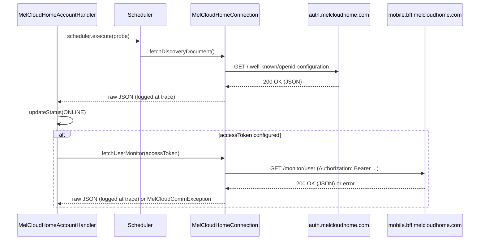

# ADR-001: MELCloud Home Bridge Skeleton for API Discovery and Response Logging

## Status

Accepted

## Context

Mitsubishi's newer "MELCloud Home" mobile app talks to a completely
different backend (`melcloudhome.com`, OpenID Connect Authorization
Code + PKCE, a "Backend for Frontend" REST API, plus a WebSocket push
channel) than the existing `melcloudaccount` bridge, which talks to the legacy
`app.melcloud.com` API with username/password login. The static
reverse-engineering analysis of the MELCloud Home app (see the top-level
`reversed.md` analysis in the `openhab-claude` project) recovered the
authorization flow, the server hosts, the HTTP contract, and the full
request/response data contracts directly from the app's .NET type
metadata. It did **not** recover, with certainty, which HTTP verb and URL
template each endpoint expects, since the app calls generic `HttpClient`
methods on runtime-built strings rather than an attribute-routed SDK.

Before designing the full OIDC Authorization Code + PKCE login flow (which
needs its own ADR — likely built on openHAB core's
`OAuthClientService`/servlet callback pattern, since the mobile app's
`melcloudhome://` custom-scheme redirect cannot be reused by a headless
server), there is value in a minimal, working skeleton that lets a
developer see **real, raw JSON responses** from the MELCloud Home servers
in the openHAB log, to validate the reverse-engineered contract against
reality without needing a separate traffic-capture setup (mitmproxy, a
rooted device, etc.) for the read-only, low-risk parts of the API.

## Decision

We will add a new, separate bridge type `melcloudhomeaccount`, implemented
in a new `org.openhab.binding.melcloud.internal.home` package (kept apart
from the existing flat `api`/`config`/`handler` packages, which remain
dedicated to the legacy MELCloud API), containing:

- `home.config.MelCloudHomeAccountConfig` — a config POJO with a single,
  optional `accessToken` parameter. This is a deliberate, temporary
  stand-in for a real OIDC login: a developer obtains a Bearer token
  out-of-band (e.g. from a browser DevTools session against
  `auth.melcloudhome.com`, or a traffic capture) and pastes it in, so the
  handler can exercise the authenticated REST API before the real login
  flow exists.
- `home.api.MelCloudHomeConnection` — issues two read-only, low-risk calls
  via the existing `org.openhab.core.io.net.http.HttpUtil` helper (already
  used by the legacy `MelCloudConnection`, no new dependency needed):
  the unauthenticated OIDC discovery document
  (`GET https://auth.melcloudhome.com/.well-known/openid-configuration`),
  and, only if `accessToken` is configured, `GET
  https://mobile.bff.melcloudhome.com/monitor/user` with an
  `Authorization: Bearer` header. Both raw response bodies are logged at
  `trace` level, per the project's logging convention.
- `home.handler.MelCloudHomeAccountHandler` — a `BaseBridgeHandler` that
  runs this probe once on `initialize()` (not on a polling schedule yet —
  a periodic refresh loop is deferred until the real login flow and rate
  limits are known) and reflects the outcome in `ThingStatus`.

The existing `internal.exceptions.MelCloudCommException` is reused as-is
(its message is already generic, not legacy-API-specific) rather than
introducing a parallel exception type for this skeleton.

This is explicitly a **throwaway-adjacent, learning-oriented skeleton**,
not the final shape of the MELCloud Home integration. The manual
`accessToken` parameter, the lack of polling, and the absence of any
Thing/channel for actual units are all expected to be replaced once:

1. A live traffic capture (see `reversed.md`) confirms exact verbs/paths.
1. A follow-up ADR designs the real OIDC Authorization Code + PKCE login
   (token acquisition, refresh, and secure storage via
   `org.openhab.core.storage.StorageService` per the project's persistence
   rule).

## Error Escalation Strategy

- `IOException` / `JsonSyntaxException` while calling the discovery
  endpoint → caught, logged at `warn` (unexpected — this endpoint requires
  no credentials and should essentially always succeed if the binding has
  network access), and the bridge is set to `OFFLINE` /
  `ThingStatusDetail.COMMUNICATION_ERROR`.
- Same exceptions while calling `monitor/user` with a configured
  `accessToken` → caught, logged at `debug` (expected/recoverable during
  this skeleton phase — the token is manually supplied and short-lived, so
  failure here is routine, not exceptional), and the bridge falls back to
  `ONLINE` (discovery already succeeded) with a log line explaining that
  the authenticated probe failed; it does not flip the whole bridge
  `OFFLINE` just because the temporary manual token expired.
- No `accessToken` configured → not an error; only the discovery probe
  runs, and the bridge goes `ONLINE` on its success. This is logged at
  `debug` so it is clear from the log why no authenticated response was
  captured.
- Nothing in this handler ever logs the `accessToken` value itself, even
  at `trace` level, per the project's rule to never log credentials.

## Consequences

### Positive

- Lets a developer validate the reverse-engineered OIDC discovery
  document and (with a manually obtained token) at least one real BFF
  response, directly from the openHAB log, without extra tooling.
- Clean separation from the legacy MELCloud code — nothing in
  `internal.home` touches or risks the existing, working
  `melcloudaccount`/`acdevice`/`heatpumpdevice` code path.
- Establishes the package location and naming (`internal.home.*`) that the
  full implementation will grow into, so this is not wasted structure.

### Negative

- The `accessToken` config parameter is not a real authentication
  mechanism and must not be documented as end-user-facing in the README;
  it is a developer-only stopgap and should be called out as such (or
  removed) once the real login flow lands.
- No polling, no Things for actual units, no channels — this ADR
  intentionally does not attempt to design the full binding surface yet.

## Diagram

---
