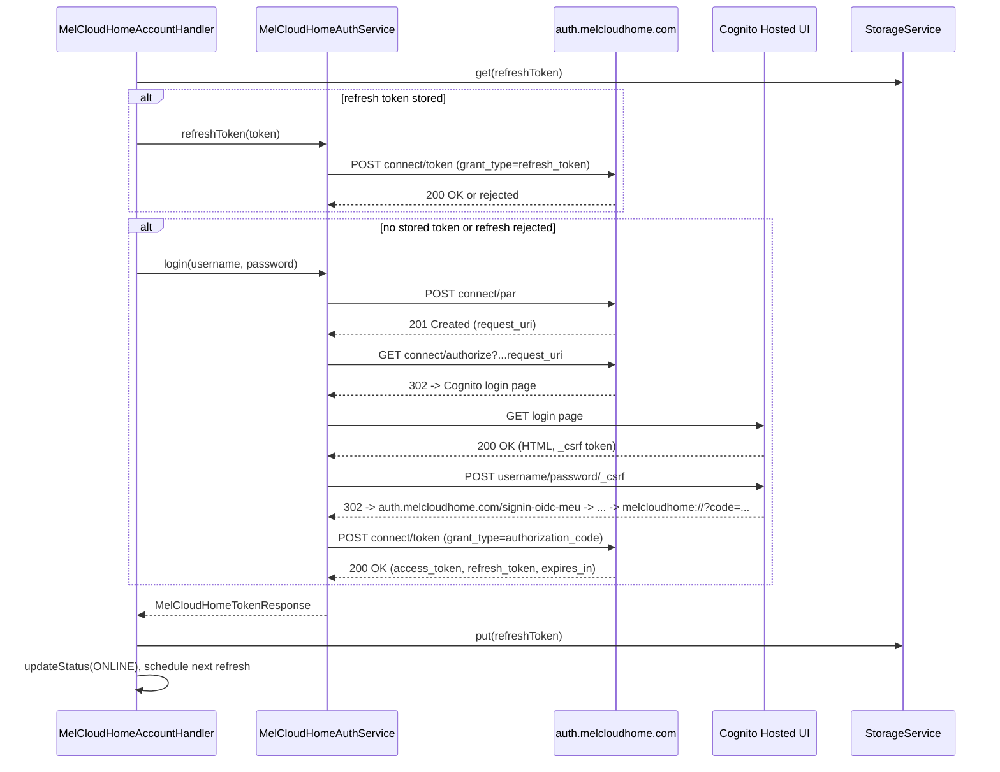

# ADR-002: MELCloud Home OAuth 2.0 PKCE Login (PAR + AWS Cognito Federation)

## Status

Accepted (amended after real-traffic testing — see the note at the end of
Context).

## Context

ADR-001 shipped a discovery/logging skeleton for the `melcloudhomeaccount`
bridge with a developer-only, manually pasted `accessToken` config
parameter, deferring the real OpenID Connect Authorization Code + PKCE login
to a follow-up ADR. It also anticipated that login might need to be built on
openHAB core's `OAuthClientService`/servlet callback pattern, since the
mobile app's `melcloudhome://` custom-scheme redirect cannot be opened by a
headless server the way a phone's browser can.

Two further investigations (documented in the top-level `reversed.md`
analysis in the `openhab-claude` project) changed that picture:

1. A real browser login was captured and showed that `auth.melcloudhome.com`
   does not run its own credential check. It federates authentication to an
   **AWS Cognito Hosted UI** (`live-melcloudhome.auth.eu-west-1.amazoncognito.com`),
   redirecting the browser there and back via the standard ASP.NET Core
   `signin-oidc` callback pattern.
1. A public, MIT-licensed, actively maintained Home Assistant integration
   ([`andrew-blake/melcloudhome`](https://github.com/andrew-blake/melcloudhome))
   implements this exact flow end-to-end in Python, confirming it can be
   done **entirely headlessly, with a plain HTTP client** — no interactive
   browser, no `OAuthClientService` servlet/redirect dance required:
   - A **Pushed Authorization Request (PAR, RFC 9126)** is sent first
     (`POST connect/par`), returning an opaque `request_uri`.
   - `GET connect/authorize?client_id=...&request_uri=...` either redirects
     straight to the app's callback (an existing `auth.melcloudhome.com`
     session) or to the Cognito login page.
   - The Cognito login page's CSRF token is scraped out of its HTML and the
     username/password are `POST`ed to it directly as a plain HTML form,
     with a cookie jar carrying the session between requests.
   - The final redirect to `melcloudhome://...?code=...` is captured by
     inspecting the `Location` header directly, since a plain HTTP client
     (unlike a browser) simply fails to open a non-`http(s)` scheme instead
     of doing anything useful with it — the code is regex-extracted from
     that header, never actually "opened".
   - The code is exchanged at `connect/token` for an access/refresh token
     pair, exactly as assumed in ADR-001.

This means the `OAuthClientService`/servlet approach anticipated by ADR-001
is unnecessary: there is no user-facing redirect step to intercept, because
the whole exchange — PAR, Cognito login, and code capture — runs
server-side inside the binding itself, given only the account's email and
password.

**Amendment (first real-traffic test):** after Cognito accepts the
credentials, it does not always redirect straight back to
`auth.melcloudhome.com/signin-oidc-meu` or `melcloudhome://`. Real traffic
showed an intermediate hop through Duende IdentityServer's "safe redirect"
bounce page, `GET auth.melcloudhome.com/Redirect?RedirectUri=<url-encoded
next hop>` — used to avoid header-based open-redirect issues when returning
from an external IdP. Unlike every other hop in this flow, it answers
**HTTP 200**, not a 3xx, with the real next URL embedded in its own
`RedirectUri` query parameter (URL-encoded once) rather than in a
`Location` header. `MelCloudHomeAuthService` now detects this pattern
(any 200 response whose own URL carries a `RedirectUri` parameter) and
follows it as an additional hop before falling through to the
Cognito-login-page/embedded-code checks.

## Decision

We will replace the ADR-001 `accessToken` stopgap with a real login,
implemented as follows.

- `home.config.MelCloudHomeAccountConfig` now takes `username`/`password`
  (matching the legacy `melcloudaccount` bridge's config shape) instead of
  `accessToken`.
- `home.api.MelCloudHomeAuthService` is a new class that runs the full flow
  described above using `java.net.http.HttpClient` (no new dependency —
  part of the JDK), configured by the handler factory with a
  `CookieHandler` (session cookie across the PAR/authorize/Cognito
  requests) and `HttpClient.Redirect.NEVER` (redirects are followed
  **manually**, one hop at a time, specifically so the final redirect to
  `melcloudhome://` can be intercepted by reading its `Location` header
  instead of the client attempting — and failing — to follow it). It
  exposes `login(username, password)` and `refreshToken(refreshToken)`,
  both returning a `MelCloudHomeTokenResponse` (access token, refresh
  token, `expires_in`).
- `home.handler.MelCloudHomeAccountHandler` orchestrates login on
  `initialize()`: it tries a stored refresh token first, falls back to a
  full `login()` if none is stored or the stored one is rejected, and
  schedules a proactive refresh shortly before the access token's
  `expires_in` elapses (falling back to a full login again if a refresh is
  ever rejected — e.g. after long downtime).
- The refresh token is persisted via `org.openhab.core.storage.StorageService`
  (new `home.handler.MelCloudHomeAuthState` record, keyed by
  `thing.getUID().toString()`, per the project's persistence rule) —
  **not** the access token, which is short-lived and simply re-derived on
  every restart. `StorageService` is injected into `MelCloudHandlerFactory`
  via constructor (`@Activate` + `@Reference`) and passed through to the
  handler.
- The ADR-001 discovery/`monitor/user` logging probe
  (`home.api.MelCloudHomeConnection`) is no longer invoked by the bridge —
  its job (validating login) is now done properly by
  `MelCloudHomeAuthService`. The class itself is left in place as
  scaffolding for the mobile BFF calls a future unit (ATA/ATW) Thing
  handler will need, reached via `MelCloudHomeAccountHandler#getAccessToken()`.
- A new `exceptions.MelCloudHomeAuthException` (extends the existing
  `MelCloudCommException`) distinguishes a rejected login/refresh
  (`CONFIGURATION_ERROR` — the user's credentials are the problem) from a
  generic network/server failure (`COMMUNICATION_ERROR` — worth retrying).

## Error Escalation Strategy

- `username`/`password` blank at `initialize()` → `OFFLINE` /
  `CONFIGURATION_ERROR`, no login attempted.
- `MelCloudHomeAuthException` from `login()` (invalid credentials, CSRF
  extraction failure, unexpected redirect shape) → logged at `warn`
  (actionable — the user likely needs to fix their configuration),
  `OFFLINE` / `CONFIGURATION_ERROR`. No automatic retry: retrying with the
  same wrong credentials would not help and could contribute to Cognito
  rate limiting/lockout.
- `MelCloudCommException` from `login()` that is not a
  `MelCloudHomeAuthException` (network error, 5xx, malformed JSON) →
  logged at `warn`, `OFFLINE` / `COMMUNICATION_ERROR`, and a retry is
  scheduled (`RETRY_DELAY_SECONDS`).
- A stored refresh token rejected by `refreshToken()` → logged at `debug`
  (expected/routine — refresh tokens do eventually rotate out or expire
  after long downtime) and silently falls back to a full `login()`; this is
  not surfaced as a bridge error unless the subsequent full login also
  fails.
- Every successful login/refresh (re-)schedules the next proactive refresh
  at `expires_in - REFRESH_SAFETY_MARGIN_SECONDS`.
- Nothing in `MelCloudHomeAuthService` or the handler ever logs the
  password, the access token, or the refresh token — not even at `trace`
  level. Step names (PAR, authorize, Cognito submission, token exchange)
  are logged at `debug` without payload contents.

## Consequences

### Positive

- No `OAuthClientService`/servlet/redirect-URI-routing complexity: login
  only needs the account's email and password, matching the same UX as the
  legacy `melcloudaccount` bridge and the reference Home Assistant
  integration.
- Refresh-token-first strategy means a running bridge re-authenticates with
  the user's password only rarely (first login, or after a refresh token is
  outright rejected), not on every restart.
- Clean separation of concerns: `MelCloudHomeAuthService` only knows OAuth;
  `MelCloudHomeAccountHandler` only knows Thing lifecycle/status/scheduling;
  future unit handlers only need `getAccessToken()` from the bridge.

### Negative

- **HTML-scraping fragility**: submitting credentials as a raw HTML form
  POST to Cognito's hosted login page depends on undocumented markup (the
  `_csrf` field name/shape) that Mitsubishi/AWS could change without
  notice, unlike a stable, versioned REST endpoint. A markup change would
  surface as a `MelCloudHomeAuthException` ("Failed to extract the CSRF
  token…") rather than a silent failure, but would still require a binding
  update to fix.
- The account's plaintext password is held in memory for the duration of
  each login/re-login call (never persisted, never logged) — an inherent
  property of this flow, not specific to this implementation.
- No polling, no Things for actual units, no channels yet — unchanged from
  ADR-001; still out of scope here.

## Diagram

---
